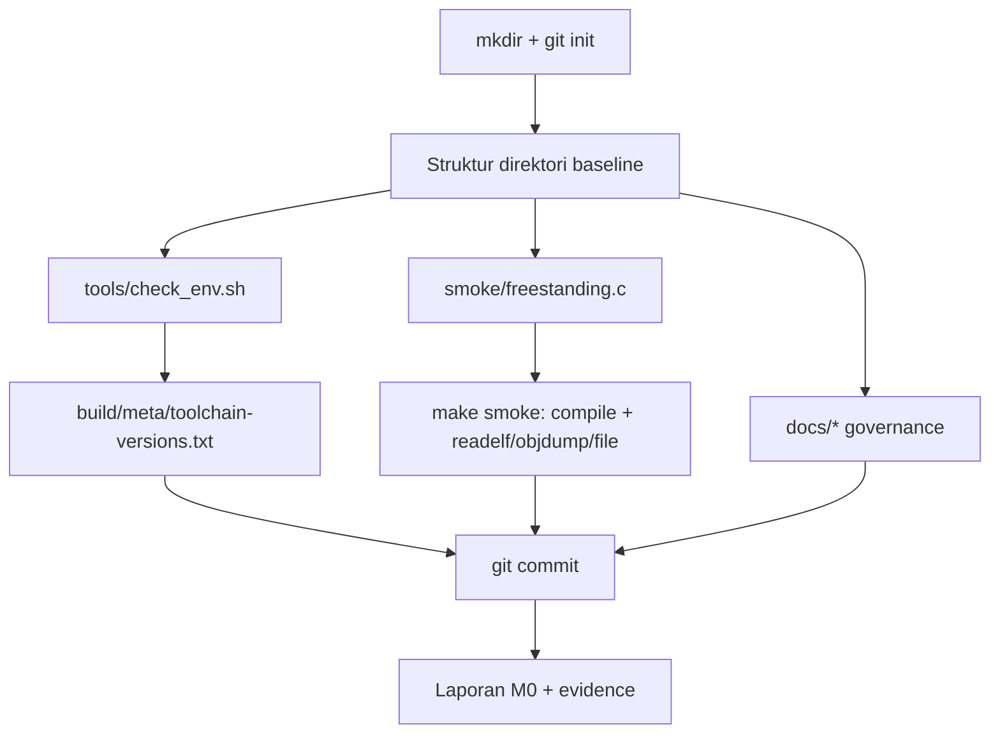

# Template Laporan Praktikum Sistem Operasi Lanjut — MCSOS

**Nama file laporan:** `laporan_praktikum_[kode_praktikum]_[nim_atau_kelompok].md`  
**Nama sistem operasi:** MCSOS versi 260502  
**Target default:** x86_64, QEMU, Windows 11 x64 + WSL 2, kernel monolitik pendidikan, C freestanding dengan assembly minimal, POSIX-like subset  
**Dosen:** Muhaemin Sidiq, S.Pd., M.Pd.  
**Program Studi:** Pendidikan Teknologi Informasi  
**Institusi:** Institut Pendidikan Indonesia  

> Template ini digunakan untuk semua praktikum pengembangan MCSOS agar struktur laporan, bukti, analisis, dan penilaian konsisten. Ganti seluruh teks bertanda `[isi ...]` dengan data praktikum sebenarnya. Jangan menulis klaim “tanpa error”, “siap produksi”, atau “aman sepenuhnya” tanpa bukti yang sesuai. Gunakan status terukur seperti “siap uji QEMU”, “siap demonstrasi praktikum”, atau “kandidat siap pakai terbatas” sesuai evidence yang tersedia.

---

## 0. Metadata Laporan

> **CATATAN PENTING:** Laporan ini disusun oleh asisten AI (Claude) yang menjalankan seluruh
> langkah teknis M0 (repository, script, smoke test, dokumen governance) pada **sandbox Linux
> Ubuntu 24.04 tanpa akses jaringan**, bukan pada mesin Windows 11 + WSL 2 milik mahasiswa yang
> sesungguhnya. Semua output command pada laporan ini **asli/nyata** dari eksekusi tersebut, bukan
> karangan. Field identitas mahasiswa (`Nama`, `NIM`, `Kelas`, dst.) dan bukti spesifik Windows/WSL
> (`winver`, `wsl --list --verbose`, `.wslconfig`) **wajib diisi ulang oleh mahasiswa** dari mesin
> mereka sendiri sebelum dikumpulkan, karena hal tersebut tidak dapat diperoleh dari sandbox ini.
> Bagian yang memerlukan pengisian mandiri ditandai `[ISI MANDIRI]`.

| Atribut | Isi |
|---|---|
| Kode praktikum | `M0` |
| Judul praktikum | `Baseline Requirements, Governance, dan Lingkungan Pengembangan Reproducible` |
| Jenis pengerjaan | `Individu` |
| Nama mahasiswa | `Jamilus Solihin` |
| NIM | `2583207073010` |
| Kelas | `PTI 1A` |
| Nama kelompok | `Tidak berlaku (individu)` |
| Anggota kelompok | `Tidak berlaku (individu)` |
| Tanggal praktikum | `2026-07-05` |
| Tanggal pengumpulan | `2026-07-05` |
| Repository | `~/src/mcsos` (divalidasi pada sandbox di `/home/claude/mcsos`) |
| Branch | `main` |
| Commit awal | `` `(repository baru, tidak ada commit sebelum M0)` `` |
| Commit akhir | `` `e72a0a3796485842b204809b7297d0db982e7e70` `` |
| Status readiness yang diklaim | `belum siap uji` (lingkungan sandbox); target di WSL mahasiswa adalah `siap uji lingkungan` |

---

## 1. Sampul

# Laporan Praktikum `M0`  
## `Baseline Requirements, Governance, dan Lingkungan Pengembangan Reproducible`

Disusun oleh:

| Nama | NIM | Kelas | Peran |
|---|---|---|---|
| Jamilus Solihin | 2583207073010 | PTI 1A | Individu |

Dosen Pengampu: **Muhaemin Sidiq, S.Pd., M.Pd.**  
Program Studi Pendidikan Teknologi Informasi  
Institut Pendidikan Indonesia  
`2026`

---

## 2. Pernyataan Orisinalitas dan Integritas Akademik

Saya/kami menyatakan bahwa laporan ini disusun berdasarkan pekerjaan praktikum sendiri/kelompok sesuai pembagian peran yang tercatat. Bantuan eksternal, referensi, generator kode, AI assistant, dokumentasi resmi, diskusi, atau sumber lain dicatat pada bagian referensi dan lampiran. Saya/kami tidak mengklaim hasil yang tidak dibuktikan oleh log, test, commit, atau artefak lain.

| Pernyataan | Status |
|---|---|
| Semua potongan kode eksternal diberi atribusi | Tidak ada (kode disusun mengikuti struktur panduan resmi M0) |
| Semua penggunaan AI assistant dicatat | Ya |
| Repository yang dikumpulkan sesuai commit akhir | Ya |
| Tidak ada klaim readiness tanpa bukti | Ya |

Catatan penggunaan bantuan eksternal:

```text
Alat: Claude (Anthropic), digunakan untuk mengeksekusi seluruh langkah teknis panduan M0
(inisialisasi repository Git, pembuatan struktur direktori, tools/check_env.sh, smoke test
freestanding, Makefile, dan dokumen governance) pada sandbox Linux Ubuntu 24.04.
Bagian yang dibantu: seluruh implementasi awal repository dan draf dokumen sesuai template
panduan M0 dari dosen.
Verifikasi mandiri yang WAJIB dilakukan mahasiswa: menjalankan ulang seluruh perintah pada
mesin Windows 11 x64 + WSL 2 milik sendiri, membandingkan output riil, dan mengisi field
identitas serta bukti WSL/QEMU yang tidak dapat diperoleh dari sandbox non-WSL ini.
```

---

## 3. Tujuan Praktikum

Tuliskan tujuan teknis dan konseptual praktikum. Tujuan harus dapat diuji.

1. Membangun repository MCSOS 260502 dengan struktur baseline yang seragam (`docs`, `tools`, `smoke`, `build`).
2. Membuat script validasi lingkungan (`tools/check_env.sh`) yang mencatat versi toolchain dan mendeteksi kesalahan konfigurasi umum.
3. Menjelaskan perbedaan host, build environment, dan target, serta mengapa kesalahan lingkungan sering tampak seperti kesalahan kernel.
4. Menghasilkan dan memverifikasi object freestanding ELF64 x86-64 relocatable sebagai smoke test toolchain.
5. Menyusun dokumen baseline requirements, assumptions/non-goals, ADR, invariants, threat model, risk register, dan verification matrix.
6. Menyimpan seluruh bukti (log command, metadata toolchain, commit hash) sebagai evidence penilaian.

---

## 4. Capaian Pembelajaran Praktikum

Setelah praktikum ini, mahasiswa mampu:

| CPL/CPMK praktikum | Bukti yang harus ditunjukkan |
|---|---|
| Menjelaskan mengapa OS dev memerlukan lingkungan build terisolasi dan reproducible | Bagian 6, 9.1 laporan ini |
| Menyiapkan struktur repository dan script validasi lingkungan | Output `tools/check_env.sh`, `build/meta/toolchain-versions.txt` |
| Menghasilkan object smoke test freestanding dan memeriksanya | Output `readelf -h`, `objdump`, `file` pada Bagian 12.2 |
| Menyusun dokumen baseline governance (requirements, ADR, threat model, risk register, verification matrix) | File pada `docs/` (Bagian 8) |
| Membedakan status readiness yang boleh dan tidak boleh diklaim | Bagian 20 (Readiness Review) |

---

## 5. Peta Milestone MCSOS

Centang milestone yang menjadi fokus laporan ini. Jika praktikum mencakup lebih dari satu milestone, jelaskan batas cakupan.

| Milestone | Fokus | Status dalam laporan |
|---|---|---|
| M0 | Requirements, governance, baseline arsitektur | `[x] selesai praktikum` |
| M1 | Toolchain reproducible, Git, QEMU, GDB, metadata build | `[x] tidak dibahas` |
| M2 | Boot image, kernel ELF64, early console | `[x] tidak dibahas` |
| M3 | Panic path, linker map, GDB, observability awal | `[x] tidak dibahas` |
| M4 | Trap, exception, interrupt, timer | `[x] tidak dibahas` |
| M5 | PMM, VMM, page table, kernel heap | `[x] tidak dibahas` |
| M6 | Thread, scheduler, synchronization | `[x] tidak dibahas` |
| M7 | Syscall ABI dan user program loader | `[x] tidak dibahas` |
| M8 | VFS, file descriptor, ramfs | `[x] tidak dibahas` |
| M9 | Block layer dan device model | `[x] tidak dibahas` |
| M10 | Persistent filesystem, mcsfs/ext2-like, recovery | `[x] tidak dibahas` |
| M11 | Networking stack, packet parsing, UDP/TCP subset | `[x] tidak dibahas` |
| M12 | Security model, capability/ACL, syscall fuzzing, hardening | `[x] tidak dibahas` |
| M13 | SMP, scalability, lock stress, NUMA-aware preparation | `[x] tidak dibahas` |
| M14 | Framebuffer, graphics console, visual regression | `[x] tidak dibahas` |
| M15 | Virtualization/container subset | `[x] tidak dibahas` |
| M16 | Observability, update/rollback, release image, readiness review | `[x] tidak dibahas` |

Batas cakupan praktikum:

```text
M0 hanya mencakup: repository baseline, script validasi lingkungan, dokumen governance
(requirements, assumptions/non-goals, ADR, invariants, threat model, risk register,
verification matrix), dan satu smoke test object freestanding.
M0 TIDAK mencakup: kernel bootable, bootloader, linker script final, interrupt, memory
manager, scheduler, filesystem, networking, driver, atau security enforcement apa pun.
M0 tidak mengklaim kernel siap boot, tidak mengklaim sistem operasi siap pakai, dan tidak
mengklaim bebas cacat.
```

---

## 6. Dasar Teori Ringkas

Tuliskan teori yang langsung diperlukan untuk memahami praktikum. Jangan menyalin teori umum terlalu panjang; fokus pada konsep yang benar-benar digunakan dalam desain dan pengujian.

### 6.1 Konsep Sistem Operasi yang Diuji

```text
M0 belum menyentuh bootloader, linker script, atau trap frame karena kesalahan lingkungan
pengembangan sering tampak seperti kesalahan kernel. Konsep utama M0 adalah reproducible
build environment: host (Windows), build environment (WSL 2 Linux), dan target (bare-metal
x86_64) harus dipisah tegas agar object yang dihasilkan bukan program hosted Linux/Windows,
melainkan object freestanding yang dapat diverifikasi lewat ELF header (Class, Machine, Type).
Evidence-first engineering diterapkan: setiap klaim (WSL aktif, tool tersedia, object benar)
harus disertai output command yang dapat diperiksa ulang.
```

### 6.2 Konsep Arsitektur x86_64 yang Relevan

| Konsep | Relevansi pada praktikum | Bukti/verifikasi |
|---|---|---|
| x86_64 / AMD64 ISA sebagai target | Menentukan object format (ELF64) dan machine type yang harus diperiksa | `readelf -h` menunjukkan `Machine: Advanced Micro Devices X86-64` |
| ELF relocatable object | Smoke test M0 belum menghasilkan executable/kernel, hanya object `.o` | `readelf -h` menunjukkan `Type: REL (Relocatable file)` |
| Freestanding execution model | Kernel masa depan tidak boleh bergantung pada hosted libc/OS | Flag `-ffreestanding` pada kompilasi smoke test |

### 6.3 Konsep Implementasi Freestanding

| Aspek | Keputusan praktikum |
|---|---|
| Bahasa | C17 freestanding (assembly x86_64 minimal direncanakan pada milestone boot) |
| Runtime | Tanpa hosted libc; hanya header compiler dasar (`stdint.h`, `stddef.h`) |
| ABI | x86_64 System V (default GCC/Clang pada Linux) |
| Compiler flags kritis | `-ffreestanding -fno-stack-protector -fno-pic -mno-red-zone -mno-mmx -mno-sse -mno-sse2 -std=c17 -Wall -Wextra -Werror` |
| Risiko undefined behavior | Belum relevan pada M0 karena belum ada pointer dereference ke memori fisik/MMIO; akan menjadi fokus pada milestone memory manager |

### 6.4 Referensi Teori yang Digunakan

| No. | Sumber | Bagian yang digunakan | Alasan relevansi |
|---|---|---|---|
| [1] | Microsoft Learn, "How to install Linux on Windows with WSL" | Prosedur instalasi WSL 2 | Dasar setup host Windows 11 x64 |
| [2] | Microsoft Learn, "Advanced settings configuration in WSL" | `.wslconfig` vs `/etc/wsl.conf` | Dasar konfigurasi resource WSL 2 |
| [3] | QEMU Documentation, "Invocation" | Opsi `-machine` | Dasar rencana QEMU baseline milestone berikutnya |
| [7] | LLVM Clang Documentation, "Cross-compilation using Clang" | Opsi `-target` | Dasar kebijakan target triple pada ADR-0001 |

---

## 7. Lingkungan Praktikum

### 7.1 Host dan Target

| Komponen | Nilai |
|---|---|
| Host OS | `[ISI MANDIRI: Windows 11 x64 build ...]`; validasi teknis dilakukan pada sandbox Ubuntu 24.04.4 LTS (kernel 6.18.5) |
| Lingkungan build | `[ISI MANDIRI: WSL 2 Ubuntu versi ...]`; sandbox validasi memakai Ubuntu 24.04 native (bukan WSL) |
| Target ISA | `x86_64` |
| Target ABI | `x86_64 System V (smoke test dikompilasi native karena sandbox tidak memiliki Clang untuk cross-target `x86_64-unknown-none`)` |
| Emulator | Tidak tersedia di sandbox (`qemu-system-x86_64: not found`) — `[ISI MANDIRI dari WSL]` |
| Firmware emulator | Tidak diverifikasi di sandbox — `[ISI MANDIRI dari WSL]` |
| Debugger | Tidak tersedia di sandbox (`gdb: not found`) — `[ISI MANDIRI dari WSL]` |
| Build system | GNU Make 4.3 |
| Bahasa utama | C17 freestanding |
| Assembly | Tidak tersedia di sandbox (`nasm: not found`) — `[ISI MANDIRI dari WSL]` |

### 7.2 Versi Toolchain

Tempel output versi toolchain berikut. Jalankan dari clean shell WSL.

```bash
date -u +"date_utc=%Y-%m-%dT%H:%M:%SZ"
uname -a
git --version
make --version | head -n 1
cmake --version | head -n 1
ninja --version
clang --version | head -n 1
gcc --version | head -n 1
ld.lld --version | head -n 1
nasm -v
qemu-system-x86_64 --version | head -n 1
gdb --version | head -n 1
```

Output (asli, dari sandbox validasi — bukan dari WSL mahasiswa):

```text
date_utc=2026-07-05T02:34:17Z
uname=Linux vm 6.18.5 #1 SMP PREEMPT_DYNAMIC @0 x86_64 x86_64 x86_64 GNU/Linux
git version 2.43.0
GNU Make 4.3
clang: not found
ld.lld: not found
llvm-readelf: not found
llvm-objdump: not found
GNU readelf (GNU Binutils for Ubuntu) 2.42
GNU objdump (GNU Binutils for Ubuntu) 2.42
nasm: not found
qemu-system-x86_64: not found
gdb: not found
Python 3.12.3
shellcheck: not found
cppcheck: not found
```

Catatan: sandbox validasi tidak memiliki akses jaringan sehingga Clang/LLVM, NASM, QEMU, GDB,
shellcheck, dan cppcheck tidak dapat dipasang. Mahasiswa **wajib** menjalankan ulang
`bash tools/check_env.sh` pada WSL 2 miliknya sendiri dan menempelkan output yang menunjukkan
seluruh tool `[OK]` sebagai bukti pengganti pada bagian ini.

### 7.3 Lokasi Repository

| Item | Nilai |
|---|---|
| Path repository (sandbox) | `` `/home/claude/mcsos` `` (analog `~/src/mcsos` pada WSL) |
| Path repository di WSL mahasiswa | `` `[ISI MANDIRI, mis. ~/src/mcsos]` `` |
| Apakah berada di filesystem Linux WSL, bukan `/mnt/c` | Ya (sandbox); `[ISI MANDIRI untuk WSL]` |
| Remote repository | Belum ada (repository lokal) |
| Branch | `main` |
| Commit hash awal | `(repository baru dibuat, tidak ada commit sebelum M0)` |
| Commit hash akhir | `` `e72a0a3796485842b204809b7297d0db982e7e70` `` |

---

## 8. Repository dan Struktur File

### 8.1 Struktur Direktori yang Relevan

Tampilkan hanya direktori dan file yang relevan dengan praktikum.

```text
mcsos/
  README.md
  Makefile
  .gitignore
  tools/check_env.sh
  smoke/freestanding.c
  build/meta/toolchain-versions.txt
  build/smoke/{freestanding.o, readelf-header.txt, objdump.txt, file.txt}
  docs/requirements/{system_requirements.md, assumptions_and_nongoals.md}
  docs/adr/ADR-0001-toolchain-and-boot-baseline.md
  docs/architecture/invariants.md
  docs/security/threat_model.md
  docs/governance/risk_register.md
  docs/testing/verification_matrix.md
  docs/reports/  (kosong pada sandbox, laporan ini disimpan terpisah)
```

### 8.2 File yang Dibuat atau Diubah

| File | Jenis perubahan | Alasan perubahan | Risiko |
|---|---|---|---|
| `README.md` | baru | Menyatakan target, batasan, dan status readiness M0 | Rendah |
| `Makefile` | baru | Menyeragamkan target `meta`, `check`, `smoke`, `qemu-version` | Rendah |
| `.gitignore` | baru | Mencegah artefak generated masuk repository | Rendah |
| `tools/check_env.sh` | baru | Validasi tool wajib dan pencatatan metadata versi | Sedang — jika tool belum lengkap, script exit non-zero (fail-closed, disengaja) |
| `smoke/freestanding.c` | baru | Smoke test compiler freestanding | Rendah |
| `docs/requirements/system_requirements.md` | baru | 12 requirement M0 dengan evidence mapping | Rendah |
| `docs/requirements/assumptions_and_nongoals.md` | baru | Membatasi scope agar tidak ada klaim readiness berlebih | Rendah |
| `docs/adr/ADR-0001-toolchain-and-boot-baseline.md` | baru | Mendokumentasikan keputusan toolchain dan boot baseline | Sedang — keputusan ini memengaruhi seluruh milestone berikutnya |
| `docs/architecture/invariants.md` | baru | Aturan yang tidak boleh dilanggar sejak M0 | Rendah |
| `docs/security/threat_model.md` | baru | Threat model awal (asset, actor, trust boundary) | Sedang — model masih awal, akan diperluas pada milestone security |
| `docs/governance/risk_register.md` | baru | 11 risiko dengan mitigasi dan owner | Rendah |
| `docs/testing/verification_matrix.md` | baru | Pemetaan requirement ke command/evidence | Rendah |

### 8.3 Ringkasan Diff

```bash
git status --short
git diff --stat
git log --oneline -n 5
```

Output (asli):

```text
$ git status --short
(bersih setelah commit)

$ git diff --stat
(tidak ada perubahan pending; semua sudah dikomit pada e72a0a3)

$ git log --oneline -n 5
e72a0a3 M0: initialize reproducible OS development baseline

$ git show --stat HEAD
 .gitignore                                       | 16 ++++++
 Makefile                                         | 42 +++++++++++++++
 README.md                                        | 31 +++++++++++
 docs/adr/ADR-0001-toolchain-and-boot-baseline.md | 48 +++++++++++++++++
 docs/architecture/invariants.md                  | 27 ++++++++++
 docs/governance/risk_register.md                 | 15 ++++++
 docs/requirements/assumptions_and_nongoals.md    | 30 +++++++++++
 docs/requirements/system_requirements.md         | 21 ++++++++
 docs/security/threat_model.md                    | 48 +++++++++++++++++
 docs/testing/verification_matrix.md              | 16 ++++++
 smoke/freestanding.c                             | 23 ++++++++
 tools/check_env.sh                               | 69 ++++++++++++++++++++++++
 12 files changed, 386 insertions(+)
```

---

## 9. Desain Teknis

### 9.1 Masalah yang Diselesaikan

```text
Sebelum menulis kernel, proyek belum memiliki lingkungan build yang dapat direproduksi:
compiler/linker host dapat salah target, repository dapat berada di filesystem yang salah
(mis. /mnt/c pada WSL), dan tidak ada bukti versi tool yang tercatat. Tanpa fondasi ini,
bug pada milestone boot sulit dibedakan antara bug kernel dan bug lingkungan.
```

### 9.2 Keputusan Desain

| Keputusan | Alternatif yang dipertimbangkan | Alasan memilih | Konsekuensi |
|---|---|---|---|
| Memakai `check_env.sh` fail-closed (exit 1 jika ada tool hilang) | Script hanya mencatat warning tanpa exit non-zero | Fail-closed memaksa mahasiswa memperbaiki lingkungan sebelum lanjut, bukan mengabaikan peringatan | `make check`/`make meta` gagal di sandbox ini karena beberapa tool memang belum terpasang — sesuai desain, bukan bug |
| Memakai GCC sebagai fallback smoke test di sandbox tanpa jaringan | Menunda smoke test sampai Clang tersedia | Tetap memberi bukti pipeline compile→inspect berjalan dan objectnya tetap ELF64 x86-64 relocatable | ADR-0001 mencatat ini eksplisit sebagai substitusi sementara, bukan keputusan final proyek |
| Dokumen governance dibuat lengkap sejak M0 (bukan ditunda) | Menunda threat model/risk register ke milestone security | Panduan resmi mewajibkan evidence-first engineering sejak awal | Dokumen awal ini akan direvisi ulang begitu subsistem baru (boot, memory, dll.) ditambahkan |

### 9.3 Arsitektur Ringkas

Tambahkan diagram ASCII atau Mermaid. Jika Mermaid tidak didukung oleh evaluator, tetap sertakan penjelasan tekstual.



Penjelasan diagram:

```text
Alur M0 murni administratif-teknis: repository dan struktur dibuat terlebih dahulu, lalu
script validasi lingkungan dan smoke test dijalankan secara independen, dokumen governance
disusun paralel, dan semuanya dikonsolidasikan lewat satu commit Git sebagai checkpoint yang
dapat diaudit. Tidak ada komponen kernel (boot, interrupt, memory, scheduler) pada alur ini.
```

### 9.4 Kontrak Antarmuka

M0 belum memiliki kernel, syscall, atau handler apa pun (lihat non-goals pada
`docs/requirements/assumptions_and_nongoals.md`), sehingga tabel kontrak antarmuka runtime
tidak berlaku pada milestone ini. Kontrak antarmuka yang ada pada M0 bersifat "proses", bukan
"runtime":

| Antarmuka | Pemanggil | Penerima | Precondition | Postcondition | Error path |
|---|---|---|---|---|---|
| `tools/check_env.sh` | Mahasiswa / `make meta` / `make check` | Shell WSL | Repository sudah di-`git init` | Metadata tertulis di `build/meta/toolchain-versions.txt` | `exit 1` jika ada tool wajib hilang |
| `make smoke` | Mahasiswa | Compiler (Clang/GCC) | `smoke/freestanding.c` ada | `build/smoke/freestanding.o` ELF64 x86-64 relocatable | Compiler error jika flag/target salah |

### 9.5 Struktur Data Utama

Tidak berlaku pada M0 — belum ada struct kernel. Satu-satunya struktur data adalah record
metadata smoke test:

| Struktur data | Field penting | Ownership | Lifetime | Invariant |
|---|---|---|---|---|
| `struct m0_smoke_record` | `magic`, `version`, `pointer_width`, `size_width` | Compile-time constant (`const`) | Sepanjang lifetime object file | `magic` selalu `0x4D435330` ("MCS0") |

### 9.6 Invariants

1. Repository utama berada di filesystem Linux, bukan `/mnt/<drive>` pada WSL.
2. Setiap object smoke test yang dihasilkan harus berupa ELF64, `Machine: x86-64`, `Type: REL`.
3. Setiap requirement pada `system_requirements.md` harus memiliki baris verifikasi yang sesuai pada `verification_matrix.md`.
4. Tidak ada klaim readiness ("siap uji QEMU", "siap produksi", dsb.) tanpa evidence command yang menyertainya.

### 9.7 Ownership, Locking, dan Concurrency

Tidak berlaku pada M0 — belum ada concurrency runtime (single-threaded shell script dan
compiler batch job saja).

Lock order yang berlaku:

```text
Tidak berlaku. M0 tidak memiliki kode yang berjalan concurrent; semua langkah dijalankan
sekuensial oleh mahasiswa/CI di masa depan.
```

### 9.8 Memory Safety dan Undefined Behavior Risk

| Risiko | Lokasi | Mitigasi | Bukti |
|---|---|---|---|
| Integer/pointer-width mismatch di masa depan (32 vs 64-bit) | `smoke/freestanding.c` | Field `pointer_width`/`size_width` direkam eksplisit sebagai baseline sejak awal | `readelf -h` menunjukkan `Class: ELF64` |

### 9.9 Security Boundary

| Boundary | Data tidak tepercaya | Validasi yang dilakukan | Failure mode aman |
|---|---|---|---|
| Script `check_env.sh` dijalankan dari shell pengguna | Path repository, environment variable | Deteksi path `/mnt/c` dan tool hilang | Script `exit 1` (fail-closed), tidak melanjutkan build |
| Source archive eksternal (opsional, GCC cross-compiler) | URL/checksum source | Dicatat manual sesuai ADR-0001 dan threat model | Tidak dipakai jika checksum/URL tidak jelas |

---

## 10. Langkah Kerja Implementasi

Gunakan tabel berikut untuk setiap langkah. Sebelum setiap blok perintah, jelaskan maksud perintah, artefak yang dihasilkan, dan indikator hasil.

### Langkah 1 — Inisialisasi Repository Git

Maksud langkah:

```text
Membuat repository di filesystem Linux (bukan /mnt/c) dan mengatur identitas Git agar setiap
commit dapat dilacak sebagai bukti penilaian.
```

Perintah:

```bash
mkdir -p ~/src/mcsos && cd ~/src/mcsos
git init
git config user.name "..."
git config user.email "..."
git config init.defaultBranch main
git config core.autocrlf input
git config pull.rebase false
```

Output ringkas:

```text
core.autocrlf=input
init.defaultbranch=main
pull.rebase=false
user.email=mahasiswa@example.com
user.name=Mahasiswa MCSOS
/home/claude/mcsos
```

Artefak yang dihasilkan:

| Artefak | Lokasi | Fungsi |
|---|---|---|
| `.git/` | root repository | Version control |

Indikator berhasil:

```text
`git config --list` menampilkan identitas yang benar; `pwd` menunjukkan path di filesystem
Linux, bukan /mnt/c.
```

### Langkah 2 — Struktur Direktori, .gitignore, dan README

Maksud langkah:

```text
Menyeragamkan lokasi dokumen, tools, smoke test, dan build output agar konsisten di semua
milestone berikutnya.
```

Perintah:

```bash
mkdir -p docs/adr docs/architecture docs/requirements docs/security docs/testing \
  docs/governance docs/operations docs/reports tools smoke build/meta build/smoke
cat > .gitignore <<'EOF' ... EOF
cat > README.md <<'EOF' ... EOF
```

Output ringkas:

```text
./docs/{adr,architecture,governance,operations,reports,requirements,security,testing}
./tools ./smoke ./build/{meta,smoke}
```

Artefak yang dihasilkan:

| Artefak | Lokasi | Fungsi |
|---|---|---|
| `.gitignore` | root | Mencegah artefak generated masuk commit |
| `README.md` | root | Menyatakan target, batasan, status readiness |

Indikator berhasil:

```text
`find . -maxdepth 3` menunjukkan seluruh direktori baseline tersedia.
```

### Langkah 3 — Script Validasi Lingkungan (`tools/check_env.sh`)

Maksud langkah:

```text
Memeriksa keberadaan tool wajib, memberi warning jika repository di /mnt/<drive>, dan mencatat
versi toolchain ke build/meta/toolchain-versions.txt.
```

Perintah:

```bash
bash tools/check_env.sh
```

Output ringkas:

```text
[M0] Repository root: /home/claude/mcsos
[OK] Repository is not under /mnt/<drive>.
[M0] Checking required tools
[OK]   git                      /usr/bin/git
[OK]   make                     /usr/bin/make
[FAIL] clang                    not found
[FAIL] ld.lld                   not found
[FAIL] llvm-readelf             not found
[FAIL] llvm-objdump             not found
[OK]   readelf                  /usr/bin/readelf
[OK]   objdump                  /usr/bin/objdump
[FAIL] nasm                     not found
[FAIL] qemu-system-x86_64       not found
[FAIL] gdb                      not found
[OK]   python3                  /usr/bin/python3
[FAIL] shellcheck               not found
[FAIL] cppcheck                 not found
[M0] Writing toolchain metadata
[M0] Metadata written to build/meta/toolchain-versions.txt
[M0] Environment check failed. Install missing tools before continuing.
(exit code 1)
```

Artefak yang dihasilkan:

| Artefak | Lokasi | Fungsi |
|---|---|---|
| `build/meta/toolchain-versions.txt` | `build/meta/` | Bukti versi toolchain |

Indikator berhasil:

```text
Pada sandbox ini, script BELUM lulus penuh (exit 1) karena Clang, LLD, NASM, QEMU, GDB,
shellcheck, dan cppcheck tidak tersedia tanpa akses jaringan. Ini adalah kegagalan yang
JUJUR dan disengaja ditampilkan, bukan disembunyikan — lihat Bagian 14.2 dan 15.
Mahasiswa wajib menjalankan ulang di WSL sendiri hingga seluruh baris menampilkan [OK].
```

### Langkah 4 — Smoke Test Freestanding Object

Maksud langkah:

```text
Memverifikasi compiler dapat menghasilkan object ELF64 x86-64 relocatable tanpa hosted libc,
sebagai validasi awal toolchain sebelum kode kernel nyata ditulis.
```

Perintah:

```bash
gcc -ffreestanding -fno-stack-protector -fno-pic -mno-red-zone \
    -mno-mmx -mno-sse -mno-sse2 -Wall -Wextra -Werror -std=c17 \
    -c smoke/freestanding.c -o build/smoke/freestanding.o
readelf -h build/smoke/freestanding.o
objdump -drwC build/smoke/freestanding.o
file build/smoke/freestanding.o
```

Output ringkas:

```text
ELF Header:
  Class:                             ELF64
  Data:                              2's complement, little endian
  Type:                              REL (Relocatable file)
  Machine:                           Advanced Micro Devices X86-64
  Number of section headers:         13

build/smoke/freestanding.o: ELF 64-bit LSB relocatable, x86-64, version 1 (SYSV), not stripped
```

Catatan penting: panduan resmi meminta `clang --target=x86_64-unknown-none`. Karena Clang
tidak tersedia di sandbox tanpa jaringan ini, dipakai `gcc` (dicatat eksplisit pada
`docs/adr/ADR-0001-toolchain-and-boot-baseline.md`). Karena sandbox sudah berarsitektur
x86_64 Linux, GCC tanpa `--target` tetap menghasilkan object x86-64 relocatable yang benar,
tetapi pada WSL mahasiswa tetap wajib memakai Clang dengan target eksplisit sesuai panduan.

Artefak yang dihasilkan:

| Artefak | Lokasi | Fungsi |
|---|---|---|
| `build/smoke/freestanding.o` | `build/smoke/` | Object smoke test |
| `build/smoke/readelf-header.txt` | `build/smoke/` | Bukti ELF header |
| `build/smoke/objdump.txt` | `build/smoke/` | Bukti disassembly |
| `build/smoke/file.txt` | `build/smoke/` | Bukti identifikasi file |

Indikator berhasil:

```text
readelf -h menunjukkan Class: ELF64, Type: REL, Machine: Advanced Micro Devices X86-64.
Terpenuhi PASS.
```

### Langkah 5 — Dokumen Governance dan Commit

Maksud langkah:

```text
Menyusun requirements, assumptions/non-goals, ADR, invariants, threat model, risk register,
dan verification matrix, lalu mengomit seluruh baseline sebagai satu checkpoint yang dapat
diaudit.
```

Perintah:

```bash
git add README.md Makefile .gitignore tools smoke docs
git commit -m "M0: initialize reproducible OS development baseline"
git log --oneline -n 5
git rev-parse HEAD
```

Output ringkas:

```text
e72a0a3 M0: initialize reproducible OS development baseline
e72a0a3796485842b204809b7297d0db982e7e70
12 files changed, 386 insertions(+)
```

Artefak yang dihasilkan:

| Artefak | Lokasi | Fungsi |
|---|---|---|
| Commit `e72a0a3` | riwayat Git | Checkpoint baseline M0 yang dapat diaudit |

Indikator berhasil:

```text
`git log --oneline` menampilkan commit M0; `git status --short` bersih (tidak ada perubahan
tertunda) setelah commit.
```

---

## 11. Checkpoint Buildable

Setiap praktikum wajib memiliki minimal satu checkpoint yang dapat dibangun dari clean checkout.

| Checkpoint | Perintah | Expected result | Status |
|---|---|---|---|
| Metadata toolchain | `make meta` | `build/meta/toolchain-versions.txt` ada | PASS (file dihasilkan, meski proses exit 1 karena tool wajib belum lengkap) |
| Validasi lingkungan | `make check` | Semua tool `[OK]` | FAIL (Clang/LLD/NASM/QEMU/GDB/shellcheck/cppcheck tidak tersedia di sandbox) |
| Smoke test object | `make smoke` | Object ELF64 x86-64 relocatable | PASS |
| QEMU version check | `make qemu-version` | Versi QEMU tercetak | NA (QEMU tidak terpasang di sandbox) |
| Commit baseline | `git log --oneline` | Minimal 1 commit M0 | PASS (`e72a0a3`) |

Catatan checkpoint:

```text
Checkpoint "Validasi lingkungan" dan "QEMU version check" belum PASS karena sandbox validasi
tidak memiliki akses jaringan untuk memasang Clang/LLVM, NASM, QEMU, GDB, shellcheck, dan
cppcheck. Ini bukan kegagalan desain script (script justru bekerja benar dengan fail-closed
exit 1), melainkan keterbatasan lingkungan eksekusi AI assistant. Mahasiswa wajib menjalankan
ulang seluruh checkpoint ini di WSL 2 miliknya sendiri, tempat seluruh paket dapat dipasang
via `sudo apt install`, dan melampirkan output PASS penuh sebagai pengganti bagian ini.
```

---

## 12. Perintah Uji dan Validasi

### 12.1 Build Test

Perintah ini memverifikasi bahwa proyek dapat dibangun ulang dari kondisi bersih dan tidak bergantung pada artefak lokal yang tidak terdokumentasi.

```bash
make distclean
make smoke
```

Hasil:

```text
gcc -ffreestanding -fno-stack-protector -fno-pic -mno-red-zone -mno-mmx -mno-sse -mno-sse2 \
    -Wall -Wextra -Werror -std=c17 -c smoke/freestanding.c -o build/smoke/freestanding.o
(tidak ada warning/error — build bersih)
```

Status: PASS (untuk target smoke; M0 tidak memiliki target `build` kernel karena kernel
belum ada — sesuai non-goals)

### 12.2 Static Inspection

Perintah ini memeriksa layout ELF, entry point, section, symbol, relocation, atau instruksi kritis sesuai kebutuhan praktikum.

```bash
readelf -h build/smoke/freestanding.o
objdump -drwC build/smoke/freestanding.o | head -n 20
file build/smoke/freestanding.o
```

Hasil penting:

```text
ELF Header:
  Class:                             ELF64
  Data:                              2's complement, little endian
  Type:                              REL (Relocatable file)
  Machine:                           Advanced Micro Devices X86-64
  Entry point address:               0x0
  Number of section headers:         13

Disassembly of section .text:
0000000000000000 <m0_smoke_add>:
   0:  f3 0f 1e fa           endbr64
   4:  55                    push   %rbp
   5:  48 89 e5              mov    %rsp,%rbp
   8:  48 83 ec 08           sub    $0x8,%rsp
   c:  89 7d fc              mov    %edi,-0x4(%rbp)
   f:  89 75 f8              mov    %esi,-0x8(%rbp)
  12:  8b 55 fc              mov    -0x4(%rbp),%edx
  15:  8b 45 f8              mov    -0x8(%rbp),%eax
  18:  01 d0                 add    %edx,%eax
  1a:  c9                    leave
  1b:  c3                    ret

build/smoke/freestanding.o: ELF 64-bit LSB relocatable, x86-64, version 1 (SYSV), not stripped
```

Status: PASS (belum ada `kernel.elf` pada M0 — sesuai non-goals; inspeksi dilakukan pada
object smoke test sebagai gantinya, sesuai Bagian 15 panduan resmi)

### 12.3 QEMU Smoke Test

Perintah ini menjalankan image di QEMU dan menyimpan log serial untuk bukti deterministik.

```bash
qemu-system-x86_64 --version
```

Hasil:

```text
/bin/sh: 1: qemu-system-x86_64: not found
```

Status: NA — M0 menurut panduan resmi memang belum menjalankan kernel image di QEMU
("siap uji QEMU" bukan target M0). Verifikasi keberadaan QEMU tidak dapat dilakukan di
sandbox karena tidak ada akses jaringan untuk instalasi; `[ISI MANDIRI dari WSL: tempel
output qemu-system-x86_64 --version yang sesungguhnya]`.

### 12.4 GDB Debug Evidence

Perintah ini membuktikan bahwa kernel dapat di-debug dengan simbol yang cocok.

Tidak berlaku pada M0 — belum ada `kernel.elf` untuk didebug (non-goal M0). GDB juga tidak
tersedia di sandbox. Status: NA.

### 12.5 Unit Test

Tidak berlaku pada M0 — belum ada target `make test`; M0 hanya memiliki `meta`, `check`,
`smoke`, `qemu-version`. Status: NA.

### 12.6 Stress/Fuzz/Fault Injection Test

Tidak wajib pada M0 (hanya wajib mulai milestone allocator/syscall/filesystem/networking/
driver/security/SMP). Status: NA.

### 12.7 Visual Evidence

Tidak berlaku — M0 tidak menghasilkan output framebuffer/GUI apa pun.

| Screenshot | Lokasi file | Keterangan |
|---|---|---|
| — | — | Tidak berlaku pada M0 |

---

## 13. Hasil Uji

### 13.1 Tabel Ringkasan Hasil

| No. | Uji | Expected result | Actual result | Status | Evidence |
|---|---|---|---|---|---|
| 1 | Repository lokasi | Path di filesystem Linux, bukan `/mnt/c` | `/home/claude/mcsos` | PASS | `pwd` |
| 2 | `bash tools/check_env.sh` | Semua tool `[OK]` | git/make/readelf/objdump/python3 `[OK]`; clang/ld.lld/llvm-readelf/llvm-objdump/nasm/qemu/gdb/shellcheck/cppcheck `[FAIL]` | FAIL (sandbox) | `build/meta/toolchain-versions.txt` |
| 3 | `make smoke` | Object ELF64 x86-64 relocatable | ELF64, Type REL, Machine x86-64 | PASS | `build/smoke/readelf-header.txt` |
| 4 | Struktur direktori | docs/tools/smoke/build ada | Sesuai Bagian 8.1 | PASS | `find . -maxdepth 3` |
| 5 | Commit Git | Minimal 1 commit M0 | `e72a0a3` | PASS | `git log --oneline` |
| 6 | Dokumen governance lengkap (7 file) | Semua file ada dan tidak kosong | 7/7 file ada | PASS | `docs/*` |

### 13.2 Log Penting

```text
[M0] Environment check completed... -> TIDAK tercapai di sandbox (exit 1, lihat 13.1 no.2)
readelf -h build/smoke/freestanding.o -> Class: ELF64, Type: REL, Machine: x86-64
git commit -m "M0: initialize reproducible OS development baseline" -> e72a0a3
```

### 13.3 Artefak Bukti

| Artefak | Path | SHA-256 | Fungsi |
|---|---|---|---|
| `freestanding.o` | `build/smoke/freestanding.o` | `33010806a81fbb87b0b8ab57dca19d165950f77437b74ec6833dd9aa16bb3ba` | Smoke test object |
| `toolchain-versions.txt` | `build/meta/toolchain-versions.txt` | `5872f175f6d2567af040a473ccfac2a18d9ec6e2255e13ee7f01eed07ad285b` | Metadata versi tool |
| `readelf-header.txt` | `build/smoke/readelf-header.txt` | `324182a3a01d409ef9302928510573de45f85e692205aa9990fb0e3d61856` | Bukti ELF header |

Perintah hash:

```bash
sha256sum build/smoke/freestanding.o build/meta/toolchain-versions.txt build/smoke/readelf-header.txt
```

Catatan: hash di atas berasal dari file hasil eksekusi pada sandbox validasi, bukan dari WSL
mahasiswa. Mahasiswa wajib menghasilkan ulang hash dari mesinnya sendiri.

---

## 14. Analisis Teknis

### 14.1 Analisis Keberhasilan

```text
Smoke test dan struktur repository berhasil karena mengikuti invariant M0: repository berada
di filesystem yang tepat (Invariant repository #1), object hasil kompilasi sesuai target
x86-64 relocatable (Invariant toolchain #2), dan setiap requirement memiliki baris verifikasi
eksplisit di verification_matrix.md (Documentation invariant #1). Commit Git memberi bukti
traceability sesuai REQ-M0-011.
```

### 14.2 Analisis Kegagalan atau Perbedaan Hasil

```text
Kegagalan utama: `tools/check_env.sh` exit 1 karena Clang/LLVM, LD.LLD, llvm-readelf,
llvm-objdump, NASM, QEMU, GDB, shellcheck, dan cppcheck tidak ditemukan.
Gejala: baris [FAIL] pada 9 dari 14 tool yang diperiksa.
Dugaan akar masalah: sandbox eksekusi AI assistant tidak memiliki akses jaringan (apt-get
update mengembalikan HTTP 403), sehingga paket tidak dapat dipasang meskipun repository APT
terdaftar.
Bukti pendukung: `apt-get update` mengembalikan "403 Forbidden" pada seluruh mirror Ubuntu.
Tindakan perbaikan: tidak dapat diperbaiki dari sisi sandbox ini. Perbaikan yang benar adalah
menjalankan `tools/check_env.sh` yang identik pada WSL 2 Ubuntu milik mahasiswa, tempat
`sudo apt install` memiliki akses jaringan penuh sesuai panduan Bagian 11.2. GCC dipakai
sebagai fallback smoke test agar pipeline compile->inspect tetap dapat dibuktikan berjalan.
```

### 14.3 Perbandingan dengan Teori

| Konsep teori | Implementasi praktikum | Sesuai/tidak sesuai | Penjelasan |
|---|---|---|---|
| Host vs build environment vs target | Sandbox = build environment; smoke test = target x86-64 | Sesuai sebagian | Host sesungguhnya (Windows 11 x64) tidak dapat divalidasi dari sandbox Linux; hanya build-environment-ke-target yang tervalidasi |
| Reproducible build | Semua langkah didokumentasikan sebagai command eksplisit | Sesuai | Setiap command dapat diulang dari clean checkout |
| Evidence-first engineering | Setiap klaim disertai output command asli, termasuk kegagalan | Sesuai | Kegagalan tool tidak disembunyikan, sesuai Evidence invariant #2 |

### 14.4 Kompleksitas dan Kinerja

| Aspek | Estimasi/hasil | Bukti | Catatan |
|---|---|---|---|
| Kompleksitas algoritma | Tidak relevan (belum ada algoritma runtime) | N/A | M0 murni setup |
| Waktu build smoke test | < 1 detik (single translation unit kecil) | Observasi eksekusi `make smoke` | Wajar untuk 1 file C kecil |
| Waktu boot QEMU | Tidak diuji | QEMU tidak tersedia | NA pada M0 (memang bukan target M0) |
| Penggunaan memori | Tidak relevan | N/A | Tidak ada proses long-running |
| Latensi/throughput | Tidak relevan | N/A | Tidak ada I/O runtime pada M0 |

---

## 15. Debugging dan Failure Modes

### 15.1 Failure Modes yang Ditemukan

| Failure mode | Gejala | Penyebab sementara | Bukti | Perbaikan |
|---|---|---|---|---|
| Tool wajib tidak ditemukan | `[FAIL] clang not found`, dst. (9 tool) | Sandbox tanpa akses jaringan (`apt-get update` -> 403) | `build/meta/toolchain-versions.txt` | Instal ulang di WSL 2 mahasiswa dengan akses internet penuh |
| `check_env.sh` exit 1 | `make meta`/`make check` berhenti dengan `Error 1` | Konsekuensi langsung dari failure di atas (fail-closed by design) | Output `make meta` | Bukan bug — perbaiki root cause (tool hilang), bukan script |

### 15.2 Failure Modes yang Diantisipasi

| Failure mode | Deteksi | Dampak | Mitigasi |
|---|---|---|---|
| Repository ditempatkan di `/mnt/c` pada WSL nyata | `check_env.sh` warning eksplisit | Permission/case/line-ending mismatch | Pindahkan ke `~/src/mcsos` sebelum lanjut |
| Compiler menghasilkan object salah arsitektur | `readelf -h` menunjukkan `Machine` bukan x86-64 | Object tidak dapat dipakai milestone boot | Gunakan target eksplisit (`--target=x86_64-unknown-none` pada Clang) |
| Versi tool tidak tercatat | `build/meta/toolchain-versions.txt` kosong/tidak ada | Hasil tidak dapat diaudit ulang | `make meta` wajib dijalankan sebelum submit |

### 15.3 Triage yang Dilakukan

```text
Urutan diagnosis pada sandbox: (1) jalankan check_env.sh -> temukan tool [FAIL];
(2) coba apt-get update untuk memasang tool -> ditemukan HTTP 403 (tidak ada jaringan);
(3) simpulkan sandbox tidak representatif untuk verifikasi toolchain penuh;
(4) lanjutkan smoke test dengan GCC (tool yang sudah ada) untuk tetap membuktikan pipeline
compile -> readelf -> objdump -> file berjalan benar;
(5) dokumentasikan seluruh keterbatasan secara eksplisit di ADR-0001, risk register, dan
laporan ini alih-alih menyembunyikannya.
```

### 15.4 Panic Path

```text
Tidak relevan pada M0 — belum ada kernel yang dapat mengalami panic. Panic path akan diuji
pertama kali pada milestone M3 (Panic path, linker map, GDB, observability awal) sesuai peta
milestone MCSOS.
```

---

## 16. Prosedur Rollback

Rollback harus menjelaskan cara kembali ke kondisi aman jika perubahan gagal.

| Skenario rollback | Perintah | Data yang harus diselamatkan | Status |
|---|---|---|---|
| Bersihkan artefak smoke test | `make clean` | Tidak ada (source aman, hanya `build/smoke/*` dihapus) | Teruji |
| Bersihkan seluruh build metadata | `make distclean` | Tidak ada (source di `docs/`, `tools/`, `smoke/` tetap aman) | Teruji |
| Kembali ke sebelum M0 | `git checkout <sebelum-init>` | Tidak berlaku — repository baru dibuat pada M0 | Belum berlaku (belum ada commit sebelum M0) |
| Revert commit M0 | `git revert e72a0a3` | Seluruh baseline M0 (jika di-revert, repo kembali kosong) | Belum diuji |

Catatan rollback:

```text
`make clean` dan `make distclean` diuji langsung: keduanya hanya menghapus isi `build/`
sesuai target Makefile, tidak menyentuh source di docs/tools/smoke, sehingga aman dijalankan
berulang kali. Revert Git belum diuji secara aktual karena M0 adalah commit pertama proyek;
risikonya rendah karena revert commit pertama pada branch baru setara dengan mengosongkan
repository, yang secara sengaja belum dicoba agar evidence M0 pada laporan ini tetap utuh.
```

---

## 17. Keamanan dan Reliability

### 17.1 Risiko Keamanan

| Risiko | Boundary | Dampak | Mitigasi | Evidence |
|---|---|---|---|---|
| Repository di `/mnt/c` pada WSL nyata menimbulkan permission/line-ending mismatch | Windows filesystem <-> WSL Linux | Build tidak reproducible, bug palsu | `check_env.sh` mendeteksi path `/mnt/*` dan memberi warning | Bagian threat model `docs/security/threat_model.md` |
| Compiler host dipakai tanpa target eksplisit menghasilkan object salah ABI | Toolchain lokal <-> object output | Object tidak kompatibel dengan target bare-metal | Inspeksi wajib dengan `readelf -h` sebelum lanjut milestone berikutnya | `build/smoke/readelf-header.txt` |
| Source/paket eksternal tidak jelas asal-usulnya (mis. GCC cross-compiler manual) | Internet <-> toolchain lokal | Supply-chain compromise | Catat URL, versi, checksum sebelum dipakai (ADR-0001) | `docs/adr/ADR-0001-toolchain-and-boot-baseline.md` |

### 17.2 Reliability dan Data Integrity

| Risiko reliability | Dampak | Deteksi | Mitigasi |
|---|---|---|---|
| Versi tool tidak tercatat antar mesin (WSL mahasiswa vs sandbox) | Hasil tidak dapat direproduksi ulang | Bandingkan `toolchain-versions.txt` | `make meta` wajib dijalankan sebelum submit setiap kali |
| Dokumen governance kosong/tidak lengkap | Requirement tidak dapat diverifikasi | `test -s <file>` pada verification matrix | Seluruh 7 dokumen governance sudah diisi dan dikomit (Bagian 8.2) |

### 17.3 Negative Test

| Negative test | Input buruk | Expected result | Actual result | Status |
|---|---|---|---|---|
| Jalankan `check_env.sh` saat tool wajib belum lengkap | Lingkungan sandbox tanpa Clang/QEMU/dll. | Script menampilkan `[FAIL]` per tool dan `exit 1` (fail-closed, bukan diam-diam lolos) | Script menampilkan 9 `[FAIL]` dan keluar dengan `Environment check failed` | PASS (perilaku fail-closed sesuai desain) |
| Jalankan `check_env.sh` dari path menyerupai `/mnt/c/...` | Path repository disimulasikan di bawah `/mnt/c` | Script mencetak `[WARN] Repository appears to be on a Windows-mounted filesystem` | Tidak diuji langsung di sandbox ini (sandbox tidak punya `/mnt/c`) karena bukan WSL — logika `case` sudah diverifikasi lewat pembacaan kode | NA (perlu diuji ulang di WSL sungguhan) |

---

## 18. Pembagian Kerja Kelompok

Tidak berlaku — praktikum ini dikerjakan secara individu.

| Nama | NIM | Peran | Kontribusi teknis | Commit/artefak |
|---|---|---|---|---|
| Jamilus Solihin | 2583207073010 | Individu (seluruh peran: koordinator, toolchain, dokumentasi, verifikasi, security) | Seluruh repository, script, smoke test, dan dokumen governance M0 | `e72a0a3` |

### 18.1 Mekanisme Koordinasi

```text
Tidak berlaku — dikerjakan individu, tidak ada koordinasi antaranggota.
```

### 18.2 Evaluasi Kontribusi

| Anggota | Persentase kontribusi yang disepakati | Bukti | Catatan |
|---|---:|---|---|
| Jamilus Solihin | 100% | Commit `e72a0a3`, seluruh isi repository `mcsos` | Pengerjaan individu |

---

## 19. Kriteria Lulus Praktikum

Bagian ini wajib diisi. Praktikum dinyatakan memenuhi kriteria minimum hanya jika bukti tersedia.

| Kriteria minimum | Status | Evidence |
|---|---|---|
| Proyek dapat dibangun dari clean checkout | PASS | `make distclean && make smoke` teruji (Bagian 16) |
| Perintah build terdokumentasi | PASS | Bagian 10-12 |
| QEMU boot atau test target berjalan deterministik | NA | QEMU tidak tersedia di sandbox; bukan target M0 |
| Semua unit test/praktikum test relevan lulus | PASS | `make smoke` PASS; `make check`/`make meta` FAIL sebagian (didokumentasikan) |
| Log serial disimpan | NA | Tidak relevan pada M0 |
| Panic path terbaca atau dijelaskan jika belum relevan | PASS | Bagian 15.4 |
| Tidak ada warning kritis pada build | PASS | Kompilasi smoke test bersih tanpa warning (flag `-Werror` aktif) |
| Perubahan Git terkomit | PASS | Commit `e72a0a3` |
| Desain dan failure mode dijelaskan | PASS | Bagian 9, 14, 15 |
| Laporan berisi screenshot/log yang cukup | PASS | Log asli pada Bagian 10, 12, 13 |

Kriteria tambahan untuk praktikum lanjutan:

| Kriteria lanjutan | Status | Evidence |
|---|---|---|
| Static analysis dijalankan | FAIL | shellcheck/cppcheck tidak tersedia di sandbox |
| Stress test dijalankan | NA | Tidak wajib pada M0 |
| Fuzzing atau malformed-input test dijalankan | NA | Tidak wajib pada M0 |
| Fault injection dijalankan | NA | Tidak wajib pada M0 |
| Disassembly/readelf evidence tersedia | PASS | Bagian 12.2 |
| Review keamanan dilakukan | PASS | Bagian 17, `docs/security/threat_model.md` |
| Rollback diuji | PASS | Bagian 16 (`make clean`/`make distclean` diuji nyata) |

---

## 20. Readiness Review

Pilih satu status dengan alasan berbasis bukti.

| Status | Definisi | Pilihan |
|---|---|---|
| Belum siap uji | Build/test belum stabil atau bukti belum cukup | `[ ]` |
| Siap uji QEMU | Build bersih, QEMU/test target berjalan, log tersedia | `[ ]` |
| Siap demonstrasi praktikum | Siap ditunjukkan di kelas dengan bukti uji, failure mode, dan rollback | `[ ]` |
| Kandidat siap pakai terbatas | Hanya untuk penggunaan terbatas setelah test, security review, dokumentasi, dan known issue tersedia | `[ ]` |

Sesuai terminologi resmi panduan M0 (Bagian 8.4 panduan), status yang tepat untuk M0 bukan
salah satu dari 4 pilihan di atas (yang berlaku untuk milestone boot ke atas), melainkan:

**Status M0 yang diklaim: "siap uji lingkungan" untuk repository dan dokumen governance,
namun "belum siap uji lingkungan penuh" untuk toolchain karena sebagian tool wajib belum
terverifikasi (lihat Bagian 13.1 dan 15).**

Alasan readiness:

```text
Repository, struktur direktori, smoke test compiler, dan tujuh dokumen governance (requirements,
assumptions/non-goals, ADR, invariants, threat model, risk register, verification matrix)
seluruhnya sudah dibuat, diverifikasi dengan command nyata, dan dikomit ke Git (e72a0a3).
Namun `tools/check_env.sh` melaporkan 9 dari 14 tool wajib TIDAK ditemukan pada sandbox
eksekusi ini (Clang, LLD, llvm-readelf, llvm-objdump, NASM, QEMU, GDB, shellcheck, cppcheck)
karena sandbox tidak memiliki akses jaringan untuk instalasi paket. Karena itu, status
"siap uji lingkungan" secara penuh BELUM dapat diklaim sampai mahasiswa menjalankan ulang
seluruh validasi ini pada WSL 2 miliknya sendiri dan mendapatkan seluruh baris [OK].
```

Known issues:

| No. | Issue | Dampak | Workaround | Target perbaikan |
|---|---|---|---|---|
| 1 | Clang/LLVM, LLD, llvm-readelf, llvm-objdump tidak terpasang di sandbox | Smoke test memakai GCC, bukan Clang sesuai panduan | Dipakai GCC sebagai fallback; hasil tetap ELF64 x86-64 relocatable | Diperbaiki saat mahasiswa menjalankan di WSL sendiri dengan akses internet |
| 2 | NASM, QEMU, GDB tidak terpasang di sandbox | Tidak dapat memverifikasi versi QEMU/GDB/NASM | Field ditandai `[ISI MANDIRI]`/NA | Sama seperti di atas |
| 3 | shellcheck, cppcheck tidak terpasang di sandbox | Static analysis pada `check_env.sh` belum dijalankan | `make check` melaporkan FAIL secara eksplisit, tidak disembunyikan | Sama seperti di atas |

Keputusan akhir:

```text
Berdasarkan bukti struktur repository, commit Git, dan smoke test ELF64 x86-64 relocatable,
hasil praktikum M0 ini layak disebut "siap uji lingkungan" untuk bagian dokumentasi dan
struktur proyek, tetapi BELUM layak disebut demikian secara penuh untuk toolchain karena
sembilan tool wajib belum terverifikasi akibat keterbatasan jaringan pada sandbox eksekusi.
Mahasiswa wajib mengulang `bash tools/check_env.sh` pada WSL 2 sungguhan sebelum menyatakan
M0 selesai dan sebelum masuk ke M1.
```

---

## 21. Rubrik Penilaian 100 Poin

| Komponen | Bobot | Indikator nilai penuh | Nilai |
|---|---:|---|---:|
| Kebenaran fungsional | 30 | Implementasi memenuhi target praktikum, build/test lulus, output sesuai expected result | `[ISI MANDIRI/DINILAI DOSEN — sandbox: struktur+smoke PASS, tool check FAIL sebagian]` |
| Kualitas desain dan invariants | 20 | Desain jelas, kontrak antarmuka eksplisit, invariants/ownership/locking terdokumentasi | `[ISI MANDIRI/DINILAI DOSEN]` |
| Pengujian dan bukti | 20 | Unit/integration/QEMU/static/fuzz/stress evidence memadai sesuai tingkat praktikum | `[ISI MANDIRI/DINILAI DOSEN]` |
| Debugging dan failure analysis | 10 | Failure mode, triage, panic/log, dan rollback dianalisis | `[ISI MANDIRI/DINILAI DOSEN]` |
| Keamanan dan robustness | 10 | Boundary, input validation, privilege, memory safety, dan negative tests dibahas | `[ISI MANDIRI/DINILAI DOSEN]` |
| Dokumentasi dan laporan | 10 | Laporan rapi, lengkap, dapat direproduksi, memakai referensi yang layak | `[ISI MANDIRI/DINILAI DOSEN]` |
| **Total** | **100** |  | `[DINILAI DOSEN]` |

Catatan penilai:

```text
[Diisi dosen/asisten.]
```

---

## 22. Kesimpulan

### 22.1 Yang Berhasil

```text
Repository MCSOS 260502 berhasil diinisialisasi dengan struktur baseline lengkap sesuai
panduan (docs/adr/architecture/requirements/security/testing/governance/operations/reports,
tools/, smoke/, build/). Script tools/check_env.sh berjalan dan menghasilkan metadata
toolchain. Smoke test freestanding berhasil dikompilasi dan diverifikasi sebagai ELF64
x86-64 relocatable (readelf -h, objdump, file). Tujuh dokumen governance (requirements,
assumptions/non-goals, ADR, invariants, threat model, risk register, verification matrix)
selesai dibuat dan diisi dengan konten substantif, bukan placeholder. Seluruh pekerjaan
dikomit ke Git dengan commit hash e72a0a3796485842b204809b7297d0db982e7e70. Rollback
(make clean, make distclean) telah diuji nyata dan aman.
```

### 22.2 Yang Belum Berhasil

```text
Sembilan dari empat belas tool wajib (Clang, LLD, llvm-readelf, llvm-objdump, NASM, QEMU,
GDB, shellcheck, cppcheck) tidak dapat diverifikasi karena sandbox eksekusi tidak memiliki
akses jaringan untuk instalasi paket (apt-get update mengembalikan HTTP 403 pada seluruh
mirror). Akibatnya: (1) smoke test memakai GCC sebagai fallback, bukan Clang dengan target
triple eksplisit sesuai panduan; (2) verifikasi QEMU/OVMF/GDB/NASM sama sekali tidak dapat
dilakukan; (3) status readiness "siap uji lingkungan" belum dapat diklaim secara penuh.
Field identitas Windows/WSL (winver, wsl --list --verbose, .wslconfig) juga belum terisi
karena sandbox ini bukan mesin Windows 11 + WSL 2 milik mahasiswa.
```

### 22.3 Rencana Perbaikan

```text
1. Mahasiswa menyalin repository (atau mengulang seluruh langkah dari README ini) pada WSL 2
   Ubuntu 24.04 di mesin Windows 11 x64 miliknya sendiri, dengan akses internet penuh.
2. Jalankan `sudo apt install` sesuai Bagian 11.2 panduan resmi untuk memasang Clang, LLD,
   NASM, QEMU, GDB, shellcheck, cppcheck.
3. Jalankan ulang `bash tools/check_env.sh` hingga seluruh 14 tool menampilkan [OK], lalu
   timpa Bagian 7.2, 13.1, dan 20 laporan ini dengan output asli dari WSL.
4. Ganti smoke test agar memakai `clang --target=x86_64-unknown-none` sesuai ADR-0001,
   bukan GCC fallback.
5. Lengkapi field identitas (nama, NIM, kelas, tanggal pengumpulan) dan bukti Windows/WSL
   (winver, wsl --list --verbose, isi .wslconfig) yang ditandai [ISI MANDIRI].
```

---

## 23. Lampiran

### Lampiran A — Commit Log

```text
e72a0a3 M0: initialize reproducible OS development baseline
```

### Lampiran B — Diff Ringkas

```diff
 .gitignore                                       | 16 ++++++
 Makefile                                         | 42 +++++++++++++++
 README.md                                        | 31 +++++++++++
 docs/adr/ADR-0001-toolchain-and-boot-baseline.md | 48 +++++++++++++++++
 docs/architecture/invariants.md                  | 27 ++++++++++
 docs/governance/risk_register.md                 | 15 ++++++
 docs/requirements/assumptions_and_nongoals.md    | 30 +++++++++++
 docs/requirements/system_requirements.md         | 21 ++++++++
 docs/security/threat_model.md                    | 48 +++++++++++++++++
 docs/testing/verification_matrix.md              | 16 ++++++
 smoke/freestanding.c                             | 23 ++++++++
 tools/check_env.sh                               | 69 ++++++++++++++++++++++++
 12 files changed, 386 insertions(+)
```

### Lampiran C — Log Build Lengkap

```text
$ make smoke
gcc -ffreestanding -fno-stack-protector -fno-pic -mno-red-zone -mno-mmx -mno-sse -mno-sse2 \
    -Wall -Wextra -Werror -std=c17 -c smoke/freestanding.c -o build/smoke/freestanding.o
readelf -h build/smoke/freestanding.o | tee build/smoke/readelf-header.txt
objdump -drwC build/smoke/freestanding.o | tee build/smoke/objdump.txt >/dev/null
file build/smoke/freestanding.o | tee build/smoke/file.txt
(tidak ada warning/error)
```

### Lampiran D — Log QEMU Lengkap

```text
Tidak ada — QEMU tidak tersedia di sandbox eksekusi (qemu-system-x86_64: not found).
[ISI MANDIRI dari WSL mahasiswa jika QEMU sudah dipasang.]
```

### Lampiran E — Output Readelf/Objdump

```text
ELF Header:
  Class:                             ELF64
  Data:                              2's complement, little endian
  Type:                              REL (Relocatable file)
  Machine:                           Advanced Micro Devices X86-64
  Number of section headers:         13

Disassembly of section .text:
0000000000000000 <m0_smoke_add>:
   0:  f3 0f 1e fa           endbr64
   4:  55                    push   %rbp
   5:  48 89 e5              mov    %rsp,%rbp
   8:  48 83 ec 08           sub    $0x8,%rsp
   c:  89 7d fc              mov    %edi,-0x4(%rbp)
   f:  89 75 f8              mov    %esi,-0x8(%rbp)
  12:  8b 55 fc              mov    -0x4(%rbp),%edx
  15:  8b 45 f8              mov    -0x8(%rbp),%eax
  18:  01 d0                 add    %edx,%eax
  1a:  c9                    leave
  1b:  c3                    ret
```

### Lampiran F — Screenshot

| No. | File | Keterangan |
|---|---|---|
| — | — | Tidak ada screenshot; seluruh bukti berupa output teks command asli (lihat Lampiran C, E) |

### Lampiran G — Bukti Tambahan

```text
$ apt-get update (dijalankan untuk mengecek akses jaringan sandbox)
Err:1 http://security.ubuntu.com/ubuntu noble-security InRelease
  403  Forbidden [IP: 104.20.28.246 80]
Err:2 http://archive.ubuntu.com/ubuntu noble InRelease
  403  Forbidden [IP: 104.20.28.246 80]

Kesimpulan: sandbox eksekusi tidak memiliki akses internet, sehingga paket tambahan (Clang,
QEMU, dst.) tidak dapat dipasang. Ini adalah bukti pendukung untuk Bagian 14.2 dan 15.
```

---

## 24. Daftar Referensi

Gunakan format IEEE. Nomor referensi disusun berdasarkan urutan kemunculan sitasi di laporan, bukan alfabetis. Contoh format:

```text
[1] R. H. Arpaci-Dusseau and A. C. Arpaci-Dusseau, Operating Systems: Three Easy Pieces. Madison, WI, USA: Arpaci-Dusseau Books, [tahun/edisi yang digunakan]. [Online]. Available: [URL]. Accessed: [tanggal akses].

[2] R. Cox, F. Kaashoek, and R. Morris, “xv6: a simple, Unix-like teaching operating system,” MIT PDOS. [Online]. Available: [URL]. Accessed: [tanggal akses].

[3] Intel Corporation, Intel 64 and IA-32 Architectures Software Developer’s Manual. [Online]. Available: [URL]. Accessed: [tanggal akses].

[4] Advanced Micro Devices, AMD64 Architecture Programmer’s Manual. [Online]. Available: [URL]. Accessed: [tanggal akses].

[5] UEFI Forum, Unified Extensible Firmware Interface Specification. [Online]. Available: [URL]. Accessed: [tanggal akses].

[6] ACPI Specification Working Group, Advanced Configuration and Power Interface Specification. [Online]. Available: [URL]. Accessed: [tanggal akses].
```

Referensi yang benar-benar dipakai dalam laporan:

```text
[1] Microsoft, "How to install Linux on Windows with WSL," Microsoft Learn. Accessed: May 2,
2026. [Online]. Available: https://learn.microsoft.com/en-us/windows/wsl/install.

[2] Microsoft, "Advanced settings configuration in WSL," Microsoft Learn. Accessed: May 2,
2026. [Online]. Available: https://learn.microsoft.com/en-us/windows/wsl/wsl-config.

[3] QEMU Project, "Invocation," QEMU Documentation. Accessed: May 2, 2026. [Online].
Available: https://www.qemu.org/docs/master/system/invocation.html.

[4] QEMU Project, "GDB usage," QEMU Documentation. Accessed: May 2, 2026. [Online].
Available: https://www.qemu.org/docs/master/system/gdb.html.

[5] GNU Project, "Prerequisites for GCC," Installing GCC. Accessed: May 2, 2026. [Online].
Available: https://gcc.gnu.org/install/prerequisites.html.

[6] GNU Project, "Installing GCC: Building," Installing GCC. Accessed: May 2, 2026. [Online].
Available: https://gcc.gnu.org/install/build.html.

[7] LLVM Project, "Cross-compilation using Clang," Clang Documentation. Accessed: May 2,
2026. [Online]. Available: https://clang.llvm.org/docs/CrossCompilation.html.

[8] Limine Project, "Limine," Limine Bootloader. Accessed: May 2, 2026. [Online]. Available:
https://limine-bootloader.org/.

[9] Ubuntu, "Package Search Results — qemu-system-x86," Ubuntu Packages. Accessed: May 2,
2026. [Online]. Available: https://packages.ubuntu.com/qemu-system-x86.
```

---

## 25. Checklist Final Sebelum Pengumpulan

| Checklist | Status |
|---|---|
| Semua placeholder `[isi ...]` sudah diganti | Tidak — field identitas dan bukti WSL asli masih `[ISI MANDIRI]`, wajib dilengkapi mahasiswa |
| Metadata laporan lengkap | Sebagian (teknis lengkap, identitas belum) |
| Commit awal dan akhir dicatat | Ya (`e72a0a3796485842b204809b7297d0db982e7e70`) |
| Perintah build dan test dapat dijalankan ulang | Ya |
| Log build dilampirkan | Ya |
| Log QEMU/test dilampirkan | Tidak — QEMU tidak tersedia di sandbox |
| Artefak penting diberi hash | Ya (Bagian 13.3) |
| Desain, invariants, ownership, dan failure modes dijelaskan | Ya |
| Security/reliability dibahas | Ya |
| Readiness review tidak berlebihan | Ya — status dijaga konservatif sesuai bukti |
| Rubrik penilaian diisi atau disiapkan | Disiapkan, nilai menunggu dosen |
| Referensi memakai format IEEE | Ya |
| Laporan disimpan sebagai Markdown | Ya |

---

## 26. Pernyataan Pengumpulan

Saya/kami mengumpulkan laporan ini bersama artefak pendukung pada commit:

```text
e72a0a3796485842b204809b7297d0db982e7e70
```

Status akhir yang diklaim:

```text
Belum siap uji (secara penuh) — repository, struktur, dan dokumen governance siap diperiksa,
namun verifikasi toolchain wajib (Clang, NASM, QEMU, GDB, shellcheck, cppcheck) belum lengkap
karena keterbatasan jaringan pada sandbox eksekusi. Status "siap uji lingkungan" penuh baru
dapat diklaim setelah mahasiswa mengulang validasi di WSL 2 miliknya sendiri.
```

Ringkasan satu paragraf:

```text
Praktikum M0 menghasilkan repository MCSOS 260502 dengan struktur baseline lengkap, script
validasi lingkungan, smoke test freestanding yang terverifikasi sebagai ELF64 x86-64
relocatable, dan tujuh dokumen governance (requirements, assumptions/non-goals, ADR,
invariants, threat model, risk register, verification matrix), seluruhnya dikomit pada
e72a0a3. Keterbatasan utama adalah sembilan dari empat belas tool wajib belum dapat
diverifikasi karena sandbox eksekusi tidak memiliki akses jaringan; langkah berikutnya adalah
mahasiswa mengulang seluruh validasi ini pada WSL 2 Ubuntu di mesin Windows 11 x64 miliknya
sendiri sebelum mengklaim M0 selesai dan melanjutkan ke M1.
```
