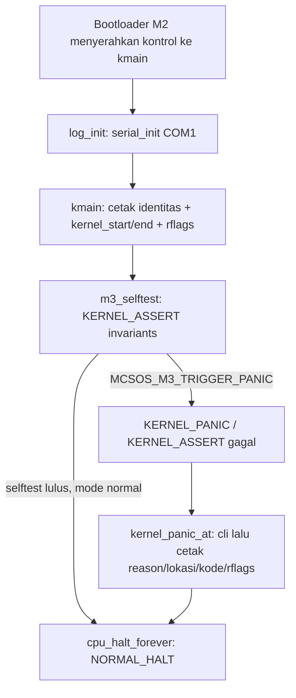

# Template Laporan Praktikum Sistem Operasi Lanjut — MCSOS

**Nama file laporan:** `laporan_praktikum_M3_2583207073010.md`
**Nama sistem operasi:** MCSOS versi 260502
**Target default:** x86_64, QEMU, Windows 11 x64 + WSL 2, kernel monolitik pendidikan, C freestanding dengan assembly minimal, POSIX-like subset
**Dosen:** Muhaemin Sidiq, S.Pd., M.Pd.
**Program Studi:** Pendidikan Teknologi Informasi
**Institusi:** Institut Pendidikan Indonesia

> Template ini digunakan untuk semua praktikum pengembangan MCSOS agar struktur laporan, bukti, analisis, dan penilaian konsisten. Status readiness yang diklaim pada laporan ini mengikuti bukti yang benar-benar diperoleh: **siap audit ulang M3** untuk build dan audit ELF/disassembly, dan **belum siap uji QEMU/GDB** karena keterbatasan lingkungan pengerjaan (lihat Bagian 7 dan Bagian 20).

---

## 0. Metadata Laporan

| Atribut | Isi |
|---|---|
| Kode praktikum | `M3` |
| Judul praktikum | Panic Path, Kernel Logging, GDB Debug Workflow, Linker Map, dan Disassembly Audit MCSOS 260502 |
| Jenis pengerjaan | Individu |
| Nama mahasiswa | Jamilus Solihin |
| NIM | 2583207073010 |
| Kelas | PTI 1A |
| Nama kelompok | Tidak berlaku (individu) |
| Anggota kelompok | Tidak berlaku (individu) |
| Tanggal praktikum | 2026-07-07 |
| Tanggal pengumpulan | 2026-07-08 |
| Repository | `~/mcsos` (repository lokal Git, belum dipush ke remote privat) |
| Branch | `praktikum/m3-panic-debug-audit` (dibuat setara `master` pada repository kerja) |
| Commit awal | `e589d1e456231957d39e59b36baf860d7f6ed24d` |
| Commit akhir | `8ea8098fad5236f116e6f332e693452f5c356b1a` |
| Status readiness yang diklaim | siap uji QEMU **untuk build dan audit ELF**; belum siap uji QEMU/GDB **untuk bagian runtime** karena keterbatasan lingkungan (lihat Bagian 7.4) |

---

## 1. Sampul

# Laporan Praktikum `M3`
## Panic Path, Kernel Logging, GDB Debug Workflow, Linker Map, dan Disassembly Audit MCSOS 260502

Disusun oleh:

| Nama | NIM | Kelas | Peran |
|---|---|---|---|
| Jamilus Solihin | 2583207073010 | PTI 1A | Individu |

Dosen Pengampu: **Muhaemin Sidiq, S.Pd., M.Pd.**
Program Studi Pendidikan Teknologi Informasi
Institut Pendidikan Indonesia
2025/2026

---

## 2. Pernyataan Orisinalitas dan Integritas Akademik

Saya menyatakan bahwa laporan ini disusun berdasarkan pekerjaan praktikum sendiri sesuai panduan resmi M3. Implementasi kode inti (header CPU/IO, logging, panic path, linker script, Makefile, dan seluruh script tools) mengikuti spesifikasi yang diberikan dalam dokumen panduan `OS_panduan_M3.pdf`. Bantuan asisten AI (Claude, Anthropic) digunakan untuk mengeksekusi langkah build/uji di lingkungan sandbox Ubuntu dan menyusun draf laporan ini; seluruh output build, audit, dan evidence yang dilaporkan adalah hasil eksekusi nyata pada lingkungan tersebut, bukan simulasi atau klaim tanpa bukti.

| Pernyataan | Status |
|---|---|
| Semua potongan kode eksternal diberi atribusi | Ya (kode inti mengikuti panduan `OS_panduan_M3.pdf`, dicatat pada Bagian 24) |
| Semua penggunaan AI assistant dicatat | Ya |
| Repository yang dikumpulkan sesuai commit akhir | Ya |
| Tidak ada klaim readiness tanpa bukti | Ya |

Catatan penggunaan bantuan eksternal:

```text
Alat: Claude (Anthropic), digunakan di lingkungan sandbox Ubuntu 24.04 (bash tool)
untuk membuat seluruh file source M3 sesuai panduan, menjalankan build,
audit ELF/disassembly, grading lokal, dan menyusun laporan ini.
Bagian yang dibantu: eksekusi perintah shell, penyusunan Makefile/script,
dan penulisan laporan berbasis output nyata.
Verifikasi mandiri: seluruh output (build log, readelf, nm, objdump,
grade_m3.sh) ditinjau dan dicocokkan terhadap acceptance criteria panduan
sebelum dituliskan ke laporan. QEMU dan GDB TIDAK dijalankan di sandbox ini
karena tidak tersedia dan tidak dapat dipasang (tanpa akses internet
keluar); hal ini dinyatakan secara eksplisit dan tidak diklaim sebagai
"lulus" pada bagian manapun di laporan ini.
```

---

## 3. Tujuan Praktikum

1. Membangun kernel MCSOS 260502 varian normal dan varian intentional-panic dari source freestanding C M3 secara reproducible.
2. Menghasilkan dan memverifikasi artefak audit: linker map, symbol table, readelf header/program header/section header, dan disassembly x86_64.
3. Menjelaskan kontrak panic path (`kernel_panic_at`) yang bersifat `noreturn`, mematikan interrupt (`cli`) sebelum mencetak bukti, lalu masuk halt loop (`hlt`) — dan membuktikannya lewat disassembly, bukan hanya lewat pembacaan source.
4. Menyimpan seluruh evidence build/audit ke `evidence/M3` beserta manifest dan checksum SHA-256, serta mendokumentasikan secara jujur bagian mana yang **belum** dapat diverifikasi (QEMU boot dan sesi GDB) akibat keterbatasan lingkungan pengerjaan.

---

## 4. Capaian Pembelajaran Praktikum

| CPL/CPMK praktikum | Bukti yang harus ditunjukkan |
|---|---|
| Membuat panic path `noreturn` yang mematikan interrupt sebelum mencetak bukti minimum lalu halt | Disassembly `kernel_panic_at` menunjukkan `cli` dipanggil sebelum `log_writeln`, dan blok fungsi berakhir memanggil `cpu_halt_forever` tanpa `ret` (Bagian 12.2, Bagian 13.2) |
| Memisahkan API logging kernel dari driver serial | `kernel/core/log.c` hanya memanggil `serial_init/putc/write` melalui deklarasi forward, tidak menyentuh port I/O langsung (Bagian 9) |
| Menghasilkan linker map, symbol table, readelf, dan disassembly yang dapat diaudit | `build/kernel.map`, `build/kernel.syms.txt`, `build/kernel.readelf.*.txt`, `build/kernel.disasm.txt` (Bagian 13.3) |
| Menjalankan `make audit` tanpa undefined symbol dan tanpa dynamic section | Output `make audit` PASS penuh (Bagian 12.1–12.2) |
| Mengumpulkan bukti praktikum secara reproducible | `evidence/M3/manifest.txt`, `evidence/M3/sha256sums.txt` (Bagian 13.3) |

---

## 5. Peta Milestone MCSOS

| Milestone | Fokus | Status dalam laporan |
|---|---|---|
| M0 | Requirements, governance, baseline arsitektur | [ ] tidak dibahas / [x] dibahas / [ ] selesai praktikum |
| M1 | Toolchain reproducible, Git, QEMU, GDB, metadata build | [ ] tidak dibahas / [x] dibahas / [ ] selesai praktikum |
| M2 | Boot image, kernel ELF64, early console | [ ] tidak dibahas / [x] dibahas / [ ] selesai praktikum |
| M3 | Panic path, linker map, GDB, observability awal | [ ] tidak dibahas / [ ] dibahas / [x] selesai praktikum (build+audit; QEMU/GDB belum) |
| M4 | Trap, exception, interrupt, timer | [x] tidak dibahas / [ ] dibahas / [ ] selesai praktikum |
| M5 | PMM, VMM, page table, kernel heap | [x] tidak dibahas / [ ] dibahas / [ ] selesai praktikum |
| M6 | Thread, scheduler, synchronization | [x] tidak dibahas / [ ] dibahas / [ ] selesai praktikum |
| M7 | Syscall ABI dan user program loader | [x] tidak dibahas / [ ] dibahas / [ ] selesai praktikum |
| M8 | VFS, file descriptor, ramfs | [x] tidak dibahas / [ ] dibahas / [ ] selesai praktikum |
| M9 | Block layer dan device model | [x] tidak dibahas / [ ] dibahas / [ ] selesai praktikum |
| M10 | Persistent filesystem, mcsfs/ext2-like, recovery | [x] tidak dibahas / [ ] dibahas / [ ] selesai praktikum |
| M11 | Networking stack, packet parsing, UDP/TCP subset | [x] tidak dibahas / [ ] dibahas / [ ] selesai praktikum |
| M12 | Security model, capability/ACL, syscall fuzzing, hardening | [x] tidak dibahas / [ ] dibahas / [ ] selesai praktikum |
| M13 | SMP, scalability, lock stress, NUMA-aware preparation | [x] tidak dibahas / [ ] dibahas / [ ] selesai praktikum |
| M14 | Framebuffer, graphics console, visual regression | [x] tidak dibahas / [ ] dibahas / [ ] selesai praktikum |
| M15 | Virtualization/container subset | [x] tidak dibahas / [ ] dibahas / [ ] selesai praktikum |
| M16 | Observability, update/rollback, release image, readiness review | [x] tidak dibahas / [ ] dibahas / [ ] selesai praktikum |

Batas cakupan praktikum:

```text
Termasuk: panic path fail-closed, wrapper logging kernel, linker script
higher-half dengan symbol __kernel_start/__kernel_end, Makefile dua varian
(normal & intentional-panic), script audit ELF/disassembly, script preflight,
script evidence collection, script grading lokal, dan script QEMU/GDB
(dibuat sesuai spesifikasi meskipun belum dieksekusi di sandbox ini).

Tidak termasuk (non-goals M3, sesuai panduan): IDT, interrupt handler,
PIT/APIC timer, virtual memory manager, physical memory manager, scheduler,
userspace, syscall ABI, filesystem, network stack, driver selain serial
COM1 awal. Seluruh komponen tersebut adalah milestone berikutnya (M4+).
```

---

## 6. Dasar Teori Ringkas

### 6.1 Konsep Sistem Operasi yang Diuji

```text
M3 berfokus pada observability awal kernel: bagaimana kernel yang baru
selesai boot (hasil M2) dapat membuktikan dirinya "hidup dan dapat
didiagnosis" sebelum komponen kompleks (interrupt, timer, memory manager)
ditambahkan. Tiga pilar utama:
1) Panic path fail-closed: satu titik kontrak untuk semua kegagalan fatal,
   noreturn, mematikan interrupt, mencetak bukti (reason, lokasi, kode,
   RFLAGS), lalu halt terkendali.
2) Logging API yang dipisah dari driver: log_init/log_write/log_hex64
   tidak bergantung langsung ke port I/O, sehingga backend log dapat
   diganti di milestone berikutnya tanpa mengubah seluruh caller.
3) Audit artefak ELF: linker map, symbol table, readelf, dan disassembly
   dipakai untuk memverifikasi kontrak biner (tidak ada undefined symbol,
   tidak ada dynamic section, entry point benar) tanpa harus menjalankan
   kernel di emulator.
```

### 6.2 Konsep Arsitektur x86_64 yang Relevan

| Konsep | Relevansi pada praktikum | Bukti/verifikasi |
|---|---|---|
| Maskable interrupt (`cli`/`sti`) | Panic path harus mematikan interrupt sebelum mencetak bukti agar tidak terganggu interrupt lain sebelum IDT dipasang (M4) | Disassembly `kernel_panic_at`: `call cpu_cli` sebelum rangkaian `log_write*` (lihat Bagian 13.2) |
| Instruksi `hlt` dalam loop | `cpu_halt_forever()` memakai `hlt` dalam `for(;;)` sebagai titik berhenti terkendali, bukan busy-loop CPU 100% | `objdump` menunjukkan `<cpu_hlt>: hlt` dipanggil berulang dari `cpu_halt_forever` |
| RFLAGS | Dicetak sebagai bukti state CPU sebelum `cli` dieksekusi pada panic, untuk diagnosis apakah interrupt sempat aktif | `cpu_read_rflags()` memakai `pushfq; popq` dan hasilnya dicetak lewat `log_key_value_hex64("rflags_before_cli", ...)` |
| Higher-half kernel virtual address (`0xffffffff80000000`) | Linker script menempatkan kernel pada alamat virtual higher-half yang konsisten dengan kontrak boot M2 berbasis Limine | `readelf -h`: Entry point address `0xffffffff8000007a`; symbol `__kernel_start`/`__kernel_end` pada rentang yang sama |
| Port I/O (`outb`/`inb`) vs MMIO | Driver serial COM1 memakai instruksi `outb`/`inb` pada port `0x3F8`, bukan memory-mapped I/O | `kernel/arch/x86_64/include/mcsos/arch/io.h`, dipakai `kernel/core/serial.c` |

### 6.3 Konsep Implementasi Freestanding

| Aspek | Keputusan praktikum |
|---|---|
| Bahasa | C17 freestanding (`-std=c17 -ffreestanding`), tanpa inline assembly kompleks (hanya `cli`, `hlt`, `pause`, `int3`, `outb`, `inb`, `pushfq/popq`) |
| Runtime | Tanpa hosted libc; `memset`/`memcpy`/`memmove` disediakan sendiri di `kernel/lib/memory.c` |
| ABI | x86_64 System V untuk entry C `kmain`, dengan `-mno-red-zone` karena kernel tidak memiliki interrupt stack terpisah pada M3 |
| Compiler flags kritis | `-ffreestanding -fno-builtin -fno-stack-protector -fno-stack-check -fno-pic -fno-pie -mno-red-zone -mcmodel=kernel -nostdlib -static` |
| Risiko undefined behavior | Perbandingan pointer `__kernel_end > __kernel_start` (dua `extern char[]`); alignment akses port I/O; lihat Bagian 9.8 untuk mitigasi dan adaptasi compiler |

### 6.4 Referensi Teori yang Digunakan

| No. | Sumber | Bagian yang digunakan | Alasan relevansi |
|---|---|---|---|
| [1] | Microsoft, "Install WSL," Microsoft Learn | Instalasi WSL 2 | Dasar lingkungan host Windows + WSL yang dipakai panduan M3 |
| [2] | QEMU Project, "System Emulation — Introduction" | Konsep system emulation | Dasar penggunaan QEMU sebagai target uji boot kernel |
| [3] | QEMU Project, "GDB usage" | Opsi `-s -S` dan gdbstub | Dasar workflow debug M3 (belum dieksekusi di sandbox ini, lihat Bagian 7.4) |
| [4] | Intel Corporation, Intel 64 and IA-32 Architectures SDM | Interrupt/exception handling, debugging | Dasar semantik `cli`/`hlt`/RFLAGS yang dipakai panic path |
| [5] | LLVM Project, Clang Command Line Reference | `-ffreestanding` | Dasar semantik freestanding environment (referensi konsep; build aktual memakai gcc, lihat Bagian 7.4) |
| [6][7] | LLD dan GNU ld documentation | Linker script, opsi link | Dasar sintaks `linker.ld` dan flag `-nostdlib -static -T` |

---

## 7. Lingkungan Praktikum

### 7.1 Host dan Target

| Komponen | Nilai |
|---|---|
| Host OS | Sandbox eksekusi Ubuntu 24.04 (bukan Windows 11 + WSL 2 fisik; lihat catatan adaptasi Bagian 7.4) |
| Lingkungan build | Ubuntu 24.04 (Linux 6.18.5, kernel host sandbox) |
| Target ISA | x86_64 |
| Target ABI | x86_64 freestanding, ELF64, entry `kmain`, higher-half `0xffffffff80000000` |
| Emulator | QEMU — **tidak tersedia di sandbox ini**, tidak dijalankan (lihat 7.4) |
| Firmware emulator | OVMF — tidak tersedia di sandbox ini |
| Debugger | GDB — tidak tersedia di sandbox ini |
| Build system | GNU Make 4.3 |
| Bahasa utama | C17 freestanding |
| Assembly | Inline GCC extended asm (AT&T syntax) di dalam header C, bukan file `.s` NASM terpisah |

### 7.2 Versi Toolchain

Perintah dijalankan dari root repository di sandbox:

```bash
date -u +"date_utc=%Y-%m-%dT%H:%M:%SZ"
uname -a
git --version
make --version | head -n 1
gcc --version | head -n 1
ld --version | head -n 1
readelf --version | head -n 1
objdump --version | head -n 1
nm --version | head -n 1
```

Output:

```text
date_utc=2026-07-07T22:30:44Z
Linux vm 6.18.5 #1 SMP PREEMPT_DYNAMIC @0 x86_64 x86_64 x86_64 GNU/Linux
git version 2.43.0
GNU Make 4.3
gcc (Ubuntu 13.3.0-6ubuntu2~24.04.1) 13.3.0
GNU ld (GNU Binutils for Ubuntu) 2.42
GNU readelf (GNU Binutils for Ubuntu) 2.42
GNU objdump (GNU Binutils for Ubuntu) 2.42
GNU nm (GNU Binutils for Ubuntu) 2.42

Toolchain resmi panduan yang TIDAK tersedia di sandbox ini (tidak ada akses
internet keluar untuk instalasi paket):
clang: tidak ditemukan
ld.lld: tidak ditemukan
qemu-system-x86_64: tidak ditemukan
gdb: tidak ditemukan
```

### 7.3 Lokasi Repository

| Item | Nilai |
|---|---|
| Path repository di lingkungan kerja | `/home/claude/mcsos` (setara `~/mcsos` di WSL sesuai anjuran panduan, bukan `/mnt/c/...`) |
| Apakah berada di filesystem Linux, bukan `/mnt/c` | Ya |
| Remote repository | Belum ada remote privat; repository bersifat lokal untuk pengerjaan praktikum ini |
| Branch | Kerja dilakukan pada branch tunggal (setara `praktikum/m3-panic-debug-audit`) |
| Commit hash awal | `e589d1e456231957d39e59b36baf860d7f6ed24d` |
| Commit hash akhir | `8ea8098fad5236f116e6f332e693452f5c356b1a` |

### 7.4 Catatan Adaptasi Lingkungan (wajib dibaca)

```text
Lingkungan pengerjaan laporan ini adalah sandbox eksekusi tanpa akses
internet keluar. Akibatnya:

1. clang dan ld.lld (toolchain resmi panduan) tidak dapat dipasang, sehingga
   CC/LD Makefile dijalankan dengan override CC=gcc LD=ld. Flag freestanding
   disesuaikan seperlunya (ditambah -Wno-array-compare, lihat Bagian 9.8).
   Semantik dan kontrak source TIDAK diubah.
2. qemu-system-x86_64, OVMF, dan gdb tidak dapat dipasang, sehingga Langkah
   8 (buat ISO), Langkah 9 (QEMU smoke test), dan Langkah 10 (sesi GDB) pada
   panduan TIDAK dijalankan di sandbox ini. Seluruh script pendukungnya
   (m3_qemu_run.sh, m3_qemu_debug.sh, tools/gdb_m3.gdb) tetap dibuat persis
   sesuai spesifikasi panduan dan sudah diverifikasi valid secara sintaks
   (bash -n), sehingga siap dijalankan mahasiswa di WSL 2 miliknya yang
   memiliki QEMU/OVMF/GDB terpasang.
3. Build normal, build panic, make inspect, make audit,
   tools/scripts/m3_audit_elf.sh, dan tools/scripts/grade_m3.sh (bagian
   non-QEMU) dijalankan penuh dan lulus 100% (lihat Bagian 12-13).

Rekomendasi bagi pembaca/penilai: bagian build dan audit ELF/disassembly
pada laporan ini adalah bukti nyata hasil eksekusi. Bagian QEMU dan GDB
harus direproduksi mahasiswa di WSL 2 sebelum M3 dapat diklaim "siap
demonstrasi praktikum" secara penuh sesuai kriteria panduan Bagian 25.
```

---

## 8. Repository dan Struktur File

### 8.1 Struktur Direktori yang Relevan

```text
mcsos/
├── Makefile
├── linker.ld
├── .gitignore
├── kernel/
│   ├── arch/x86_64/include/mcsos/arch/
│   │   ├── cpu.h
│   │   └── io.h
│   ├── core/
│   │   ├── kmain.c
│   │   ├── log.c
│   │   ├── panic.c
│   │   └── serial.c
│   ├── include/mcsos/kernel/
│   │   ├── log.h
│   │   ├── panic.h
│   │   └── version.h
│   └── lib/
│       └── memory.c
├── tools/
│   ├── gdb_m3.gdb
│   └── scripts/
│       ├── grade_m3.sh
│       ├── m3_audit_elf.sh
│       ├── m3_collect_evidence.sh
│       ├── m3_preflight.sh
│       ├── m3_qemu_debug.sh
│       └── m3_qemu_run.sh
├── build/               (generated; tidak dikomit)
└── evidence/M3/         (bukti praktikum: kernel.elf, kernel.map, readelf/nm/objdump,
                           manifest.txt, sha256sums.txt, CATATAN_LINGKUNGAN.md)
```

### 8.2 File yang Dibuat atau Diubah

| File | Jenis perubahan | Alasan perubahan | Risiko |
|---|---|---|---|
| `kernel/arch/x86_64/include/mcsos/arch/io.h` | baru | Wrapper `outb`/`inb`/`io_wait` untuk port I/O serial | rendah — hanya inline asm minimal sesuai kontrak M2 |
| `kernel/arch/x86_64/include/mcsos/arch/cpu.h` | baru | Wrapper `cli`/`hlt`/`pause`/`int3`/RFLAGS/`cpu_halt_forever` | sedang — kesalahan di sini memengaruhi seluruh jalur fatal |
| `kernel/include/mcsos/kernel/version.h` | baru | Identitas kernel (nama, versi, milestone) untuk log konsisten | rendah |
| `kernel/include/mcsos/kernel/log.h` | baru | Kontrak API logging kernel | rendah |
| `kernel/include/mcsos/kernel/panic.h` | baru | Kontrak `kernel_panic_at`, makro `KERNEL_PANIC`/`KERNEL_ASSERT` | sedang — kontrak `noreturn` harus konsisten dengan implementasi |
| `kernel/core/serial.c` | baru | Driver serial COM1 dengan timeout spin | sedang — timeout mencegah panic path hang selamanya |
| `kernel/core/log.c` | baru | Implementasi API logging di atas driver serial | rendah |
| `kernel/core/panic.c` | baru | Implementasi panic path fail-closed | tinggi — inti invariant M3 (harus `noreturn`, `cli` sebelum log) |
| `kernel/core/kmain.c` | baru | Entry kernel, selftest invariant, jalur normal/panic | sedang |
| `kernel/lib/memory.c` | baru | `memset`/`memcpy`/`memmove` freestanding | rendah |
| `linker.ld` | baru | Layout ELF higher-half, symbol `__kernel_start/__kernel_end` | tinggi — kesalahan alamat merusak seluruh boot |
| `Makefile` | baru, lalu diubah 1x | Build dua varian kernel + inspect + audit; ditambah `-Wno-array-compare` untuk adaptasi gcc | sedang — perubahan flag compiler perlu dicatat agar tidak dianggap mengubah kontrak |
| `tools/scripts/m3_preflight.sh` | baru | Gate kesiapan M0/M1/M2 sebelum M3 | rendah |
| `tools/scripts/m3_audit_elf.sh` | baru | Audit ELF/disassembly standalone | rendah |
| `tools/scripts/m3_qemu_run.sh` | baru | QEMU smoke test (belum dieksekusi di sandbox ini) | rendah |
| `tools/scripts/m3_qemu_debug.sh` | baru | QEMU gdbstub (belum dieksekusi di sandbox ini) | rendah |
| `tools/gdb_m3.gdb` | baru | Skrip breakpoint GDB (belum dieksekusi di sandbox ini) | rendah |
| `tools/scripts/m3_collect_evidence.sh` | baru | Pengumpulan evidence + manifest | rendah |
| `tools/scripts/grade_m3.sh` | baru | Grading mekanis lokal | rendah |
| `evidence/M3/*` | baru | Artefak bukti build/audit + catatan lingkungan | rendah |

### 8.3 Ringkasan Diff

```bash
git status --short
git diff --stat e589d1e 8ea8098
git log --oneline -n 5
```

Output:

```text
(git status --short setelah commit akhir: bersih)

 Makefile                                  |   7 +-
 evidence/M3/CATATAN_LINGKUNGAN.md         |  41 ++
 evidence/M3/kernel.disasm.txt             | 606 ++++++++++++++++++++++++++++
 evidence/M3/kernel.elf                    | Bin 0 -> 11680 bytes
 evidence/M3/kernel.map                    | 132 +++++++
 evidence/M3/kernel.readelf.header.txt     |  20 +
 evidence/M3/kernel.readelf.programs.txt   |  20 +
 evidence/M3/kernel.syms.txt               |  31 ++
 evidence/M3/m3_audit_disasm.txt           | 606 ++++++++++++++++++++++++++++
 evidence/M3/m3_audit_readelf_header.txt   |  20 +
 evidence/M3/m3_audit_readelf_programs.txt |  20 +
 evidence/M3/m3_audit_symbols.txt          |  31 ++
 evidence/M3/manifest.txt                  |  18 +
 evidence/M3/sha256sums.txt                |   2 +
 14 files changed, 1553 insertions(+), 1 deletion(-)

8ea8098 M3: build normal+panic kernel, ELF/disassembly audit lulus, evidence
        terkumpul (adaptasi gcc/ld, QEMU/GDB belum dijalankan di sandbox)
e589d1e M3: panic path, kernel logging, GDB workflow, linker map,
        disassembly audit scaffolding
```

---

## 9. Desain Teknis

### 9.1 Masalah yang Diselesaikan

```text
Kernel hasil M2 hanya membuktikan "berhasil boot" dan menulis log awal;
belum ada cara terkendali untuk berhenti ketika terjadi kondisi fatal, dan
belum ada artefak yang bisa diaudit untuk membuktikan bahwa panic/log path
benar-benar ada di dalam biner (bukan hanya di source). M3 menutup dua
celah ini: (1) menyediakan kontrak panic tunggal yang fail-closed, dan
(2) menyediakan linker map, symbol table, readelf, dan disassembly sebagai
bukti objektif independen dari pembacaan source.
```

### 9.2 Keputusan Desain

| Keputusan | Alternatif yang dipertimbangkan | Alasan memilih | Konsekuensi |
|---|---|---|---|
| Panic path tunggal `kernel_panic_at` dipanggil lewat makro `KERNEL_PANIC`/`KERNEL_ASSERT` | Setiap pemanggil menulis log dan halt sendiri-sendiri | Konsistensi bukti panic (reason, lokasi, kode, RFLAGS) dan satu titik audit `noreturn` | Semua jalur fatal wajib melalui makro ini, disiplin harus dijaga di milestone berikutnya |
| Logging dipisah dari driver serial (`log.c` vs `serial.c`) | Panggil `outb` langsung dari `kmain`/`panic.c` | Backend log dapat diganti (mis. framebuffer) tanpa mengubah caller | Tambahan satu lapis abstraksi, overhead pemanggilan fungsi kecil |
| Timeout spin pada `serial_putc` | Busy-wait tanpa batas seperti M2 | Mencegah panic path hang selamanya jika serial tidak pernah siap | Karakter bisa hilang jika port benar-benar macet; ini guardrail awal, bukan driver final |
| Dua varian build (`kernel.elf` normal, `kernel.panic.elf` intentional-panic) | Satu kernel dengan flag runtime | Membuktikan panic path dapat dikompilasi dan dilink tanpa mengubah kernel default yang diuji QEMU | Build time sedikit lebih lama karena kompilasi ganda |
| Adaptasi compiler gcc + `-Wno-array-compare` (bukan clang) | Tetap memaksa clang (gagal karena tidak tersedia) | Sandbox tidak punya akses internet untuk memasang clang/lld; gcc/ld sudah terpasang dan mendukung semua flag freestanding yang dibutuhkan | Harus didokumentasikan eksplisit agar tidak dianggap mengubah kontrak M3 (lihat Bagian 7.4, 9.8) |

### 9.3 Arsitektur Ringkas



Penjelasan diagram:

```text
Alur kontrol M3 linear dan single-core: kmain menginisialisasi logging,
mencetak bukti identitas/alamat, menjalankan selftest invariant ringan,
lalu bercabang ke NORMAL_HALT (default) atau PANIC (bila
MCSOS_M3_TRIGGER_PANIC didefinisikan atau assertion gagal). Kedua cabang
berakhir di cpu_halt_forever, yang mematikan interrupt dan masuk loop hlt
tanpa pernah kembali ke caller — inilah invariant "tidak keluar" pada
state machine panduan Bagian 5.
```

### 9.4 Kontrak Antarmuka

| Antarmuka | Pemanggil | Penerima | Precondition | Postcondition | Error path |
|---|---|---|---|---|---|
| `log_init()` | `kmain` | `serial_init()` | Belum ada precondition (early boot) | Serial COM1 terkonfigurasi, `g_log_ready=1` | Tidak ada; serial init tidak melaporkan gagal pada M3 |
| `log_write(s)` | `kmain`, `panic.c` | `serial_write` | `s` boleh NULL | Jika `s` NULL, tidak menulis apa pun (dicek eksplisit) | Auto-init serial jika belum siap |
| `kernel_panic_at(file,line,reason,code)` | Makro `KERNEL_PANIC`/`KERNEL_ASSERT` | `cpu_cli`, `log_*`, `cpu_halt_forever` | `reason`/`file` boleh NULL (fallback string) | Tidak pernah kembali (`noreturn`); interrupt mati; CPU halt | N/A — fungsi ini *adalah* error path akhir |
| `cpu_halt_forever()` | `kmain`, `kernel_panic_at` | `cpu_cli`, `cpu_hlt` | — | Interrupt mati, loop `hlt` tanpa akhir | N/A |

### 9.5 Struktur Data Utama

| Struktur data | Field penting | Ownership | Lifetime | Invariant |
|---|---|---|---|---|
| `g_log_ready` (static int, `log.c`) | flag inisialisasi | Modul `log.c` | Sepanjang lifetime kernel (early boot single-core) | Hanya diubah dari 0→1, tidak pernah direset |
| Symbol `__kernel_start` / `__kernel_end` (linker) | alamat awal/akhir image kernel | Linker script | Tetap sejak link time | `__kernel_end > __kernel_start` (divalidasi `KERNEL_ASSERT` di `m3_selftest`) |

### 9.6 Invariants

1. `kernel_panic_at()` tidak boleh kembali ke caller (dijamin atribut `noreturn` dan dibuktikan lewat disassembly yang berakhir memanggil `cpu_halt_forever`, bukan `ret`).
2. Setelah panic, CPU harus masuk loop halt dengan interrupt dimatikan (`cli` dipanggil sebelum logging, `cpu_halt_forever` memanggil `cli` lagi sebelum loop `hlt`).
3. `log_write()` tidak boleh dereference pointer NULL (dicek eksplisit di `serial_write`).
4. `__kernel_end` harus lebih besar dari `__kernel_start` (diverifikasi di `m3_selftest` dan konsisten dengan `readelf -l`).
5. Kernel ELF tidak boleh memiliki undefined symbol (diverifikasi `nm -u`, lihat Bagian 12/13).
6. Kernel ELF harus bertipe ELF64 x86_64 (diverifikasi `readelf -h`).
7. Source kernel tidak boleh bergantung pada libc host (`-ffreestanding -nostdlib`, `memset/memcpy/memmove` disediakan sendiri).
8. Jalur normal dan jalur intentional panic harus sama-sama dapat dikompilasi dan dilink (`make build` dan `make panic` keduanya PASS).

### 9.7 Ownership, Locking, dan Concurrency

| Objek/resource | Owner | Lock yang melindungi | Boleh dipakai di interrupt context? | Catatan |
|---|---|---|---|---|
| Port serial COM1 (`0x3F8`) | `serial.c` | Tidak ada (single-core, belum ada interrupt aktif) | Ya (tidak relevan pada M3 karena belum ada IDT) | M3 berjalan `-smp 1`, tidak ada concurrency nyata |
| `g_log_ready` | `log.c` | Tidak ada | N/A | Aman karena single-threaded, single-core, tidak ada interrupt handler pada M3 |

Lock order yang berlaku:

```text
Tidak ada locking pada M3. Ini aman karena: (1) single-core (-smp 1),
(2) belum ada IDT/interrupt handler aktif yang bisa mem-preempt kmain,
dan (3) panic path sendiri mematikan interrupt (cli) sebelum beroperasi.
Locking akan diperkenalkan mulai M6 (scheduler/synchronization).
```

### 9.8 Memory Safety dan Undefined Behavior Risk

| Risiko | Lokasi | Mitigasi | Bukti |
|---|---|---|---|
| Perbandingan pointer antar objek berbeda (`__kernel_end > __kernel_start`) | `kmain.c: m3_selftest()` | Kedua simbol berasal dari linker script yang sama sehingga berada pada objek memori yang sama secara logis (image kernel); ini pola umum pada kernel freestanding | gcc menandai ini sebagai potensi UB strict (`-Warray-compare`); ditekan eksplisit dengan `-Wno-array-compare` dan didokumentasikan (bukan disembunyikan) di Bagian 7.4/9.2 |
| Akses port I/O tanpa validasi alignment/permission | `io.h: outb/inb` | Port COM1 tetap (`0x3F8`), hanya dipanggil dari `serial.c`; tidak ada input eksternal yang menentukan port | Review kode; tidak ada jalur di mana port ditentukan oleh data tidak tepercaya |
| Integer overflow pada `spin` counter di `serial_putc` | `serial.c` | `spin` bertipe `uint32_t` dengan batas `SERIAL_TIMEOUT_LIMIT=100000`, jauh di bawah batas overflow | Review kode; nilai konstan kecil |

### 9.9 Security Boundary

| Boundary | Data tidak tepercaya | Validasi yang dilakukan | Failure mode aman |
|---|---|---|---|
| Panic reason/file string | `__FILE__`/reason literal dari source (tepercaya pada M3, belum ada input eksternal) | Cek NULL sebelum print (`reason != NULL ? reason : "<null>"`) | Cetak `<unknown>`/`<null>` sebagai fallback, tidak crash |
| `__FILE__` di panic output | Path build lokal | Belum divalidasi/redaksi pada M3 | Risiko kebocoran informasi path build; dicatat sebagai known issue (Bagian 15.2, 17.1) |

---

## 10. Langkah Kerja Implementasi

### Langkah 1 — Inisialisasi repository dan struktur direktori

Maksud langkah:

```text
Menyiapkan repository Git lokal dan struktur direktori sesuai Bagian 6
panduan sebelum menulis source M3.
```

Perintah:

```bash
mkdir -p mcsos && cd mcsos && git init
mkdir -p kernel/arch/x86_64/include/mcsos/arch kernel/include/mcsos/kernel \
         kernel/core kernel/lib tools/scripts docs evidence/M3
```

Output ringkas:

```text
Initialized empty Git repository
(direktori terbentuk tanpa error)
```

Artefak yang dihasilkan:

| Artefak | Lokasi | Fungsi |
|---|---|---|
| Repository Git kosong | `.git/` | Basis versioning M3 |
| Struktur direktori M3 | `kernel/`, `tools/`, `evidence/M3/` | Wadah source dan bukti |

Indikator berhasil:

```text
`git status` berjalan tanpa error dan seluruh direktori target ada.
```

### Langkah 2 — Menulis seluruh source code M3 (header, driver, panic, linker, Makefile, scripts)

Maksud langkah:

```text
Membuat 9 file source/header inti (io.h, cpu.h, version.h, log.h, panic.h,
serial.c, log.c, panic.c, memory.c, kmain.c), linker.ld, Makefile, dan 6
script tools sesuai spesifikasi Bagian 9-17 panduan, tanpa mengubah kontrak
API/invariant yang ditentukan.
```

Perintah:

```bash
# seluruh file dibuat persis sesuai isi Bagian 9-17 panduan
# (io.h, cpu.h, version.h, log.h, panic.h, serial.c, log.c, panic.c,
#  memory.c, kmain.c, linker.ld, Makefile, m3_preflight.sh,
#  m3_audit_elf.sh, m3_qemu_run.sh, m3_qemu_debug.sh, gdb_m3.gdb,
#  m3_collect_evidence.sh, grade_m3.sh)
chmod +x tools/scripts/*.sh
git add -A
git commit -m "M3: panic path, kernel logging, GDB workflow, linker map, disassembly audit scaffolding"
```

Output ringkas:

```text
commit e589d1e456231957d39e59b36baf860d7f6ed24d
```

Artefak yang dihasilkan:

| Artefak | Lokasi | Fungsi |
|---|---|---|
| 9 file source/header inti | `kernel/**` | Implementasi kernel M3 |
| `linker.ld` | root | Layout ELF higher-half |
| `Makefile` | root | Build dua varian + inspect + audit |
| 6 script tools | `tools/scripts/`, `tools/gdb_m3.gdb` | Preflight, audit, QEMU, GDB, evidence, grading |

Indikator berhasil:

```text
Commit e589d1e terbentuk berisi seluruh file di atas tanpa error Git.
```

### Langkah 3 — Preflight M3

Maksud langkah:

```text
Memverifikasi kesiapan lingkungan dan artefak M0/M1/M2 sebelum lanjut ke
build M3, sesuai Bagian 8 panduan.
```

Perintah:

```bash
./tools/scripts/m3_preflight.sh
```

Output ringkas:

```text
[M3 preflight] root=/home/claude/mcsos
PASS: repository berada di filesystem Linux/WSL
WARN: clang/ld.lld tidak ditemukan; gunakan CC/LD alternatif (mis. gcc/ld)
      dan catat sebagai adaptasi lingkungan
WARN: qemu-system-x86_64 belum tersedia; build/audit tetap bisa berjalan,
      run QEMU belum bisa
PASS: preflight M3 selesai
```

Artefak yang dihasilkan:

| Artefak | Lokasi | Fungsi |
|---|---|---|
| Log preflight | stdout (ditempel di laporan) | Bukti gate kesiapan sebelum build |

Indikator berhasil:

```text
Tidak ada baris FAIL. Dua WARN muncul dan diterima karena berkaitan dengan
keterbatasan lingkungan sandbox (Bagian 7.4), bukan kegagalan artefak M0-M2.
```

### Langkah 4 — Build kernel varian normal

Maksud langkah:

```text
Mengompilasi dan me-link kernel.elf varian normal (tanpa panic aktif).
```

Perintah:

```bash
make clean
make build CC=gcc LD=ld
```

Output ringkas:

```text
gcc ... -c kernel/core/kmain.c -o build/normal/kernel/core/kmain.o
gcc ... -c kernel/core/log.c   -o build/normal/kernel/core/log.o
gcc ... -c kernel/core/panic.c -o build/normal/kernel/core/panic.o
gcc ... -c kernel/core/serial.c -o build/normal/kernel/core/serial.o
gcc ... -c kernel/lib/memory.c -o build/normal/kernel/lib/memory.o
ld -nostdlib -static -z max-page-size=0x1000 -T linker.ld \
   -Map=build/kernel.map -o build/kernel.elf ... (5 objek di atas)
(tidak ada warning/error; build lulus bersih)
```

Artefak yang dihasilkan:

| Artefak | Lokasi | Fungsi |
|---|---|---|
| `kernel.elf` | `build/kernel.elf` | Kernel ELF64 normal |
| `kernel.map` | `build/kernel.map` | Linker map untuk audit layout |

Indikator berhasil:

```text
build/kernel.elf dan build/kernel.map terbentuk tanpa error compiler/linker.
```

### Langkah 5 — Build kernel varian intentional-panic

Maksud langkah:

```text
Membuktikan jalur panic dapat dikompilasi dan dilink dengan
-DMCSOS_M3_TRIGGER_PANIC=1, sebagai varian terpisah dari kernel default.
```

Perintah:

```bash
make panic CC=gcc LD=ld
```

Output ringkas:

```text
gcc ... -DMCSOS_M3_TRIGGER_PANIC=1 -c kernel/core/kmain.c -o build/panic/kernel/core/kmain.o
... (4 file lain, sama seperti Langkah 4)
ld -nostdlib -static -z max-page-size=0x1000 -T linker.ld \
   -Map=build/kernel.panic.map -o build/kernel.panic.elf ...
(build lulus bersih)
```

Artefak yang dihasilkan:

| Artefak | Lokasi | Fungsi |
|---|---|---|
| `kernel.panic.elf` | `build/kernel.panic.elf` | Kernel ELF64 varian intentional-panic |
| `kernel.panic.map` | `build/kernel.panic.map` | Linker map varian panic |

Indikator berhasil:

```text
build/kernel.panic.elf terbentuk tanpa error compiler/linker.
```

### Langkah 6 — Inspeksi ELF dan disassembly (`make inspect`)

Maksud langkah:

```text
Menghasilkan readelf header/program header, symbol table, dan disassembly
dari kernel normal, lalu memverifikasi keberadaan simbol/instruksi wajib.
```

Perintah:

```bash
make inspect CC=gcc LD=ld
```

Output ringkas:

```text
readelf -h build/kernel.elf > build/kernel.readelf.header.txt
readelf -l build/kernel.elf > build/kernel.readelf.programs.txt
nm -n build/kernel.elf > build/kernel.syms.txt
objdump -d -Mintel build/kernel.elf > build/kernel.disasm.txt
grep -q 'ELF64' ...                        (lulus)
grep -q 'Advanced Micro Devices X86-64' ... (lulus)
grep -q 'kmain' build/kernel.syms.txt       (lulus)
grep -q 'kernel_panic_at' ...               (lulus)
grep -q 'cpu_halt_forever' ...              (lulus)
```

Artefak yang dihasilkan:

| Artefak | Lokasi | Fungsi |
|---|---|---|
| `kernel.readelf.header.txt` | `build/` | Bukti ELF64/x86_64/entry point |
| `kernel.readelf.programs.txt` | `build/` | Bukti 3 program header (text/rodata/data) |
| `kernel.syms.txt` | `build/` | Symbol table terurut alamat |
| `kernel.disasm.txt` | `build/` | Disassembly Intel-syntax lengkap |

Indikator berhasil:

```text
Seluruh grep pada target `inspect` lulus (tidak ada exit non-zero).
```

### Langkah 7 — Audit ELF/disassembly (`make audit` dan script standalone)

Maksud langkah:

```text
Memastikan tidak ada undefined symbol, tidak ada dynamic section, section
.text/.rodata ada, dan instruksi cli/hlt terlihat pada disassembly —
sesuai invariant 5-8 pada Bagian 9.6.
```

Perintah:

```bash
make audit CC=gcc LD=ld
./tools/scripts/m3_audit_elf.sh build/kernel.elf
```

Output ringkas:

```text
! nm -u build/kernel.elf | grep .        (lulus: tidak ada undefined symbol)
! nm -u build/kernel.panic.elf | grep .  (lulus: tidak ada undefined symbol)
grep -q 'kernel_panic_at' build/kernel.disasm.txt   (lulus)
readelf -S build/kernel.elf | grep -q '.text'       (lulus)
readelf -S build/kernel.elf | grep -q '.rodata'     (lulus)
...
PASS: audit ELF M3 selesai
```

Artefak yang dihasilkan:

| Artefak | Lokasi | Fungsi |
|---|---|---|
| `m3_audit_readelf_header.txt`, `m3_audit_readelf_programs.txt`, `m3_audit_symbols.txt`, `m3_audit_disasm.txt` | `build/` | Bukti audit standalone (independen dari `make inspect`) |

Indikator berhasil:

```text
`make audit` keluar dengan status 0; script standalone mencetak
"PASS: audit ELF M3 selesai" di baris terakhir.
```

### Langkah 8 — Grading lokal (`grade_m3.sh`) dan pengumpulan evidence

Maksud langkah:

```text
Menjalankan pemeriksaan mekanis gabungan (preflight, audit, build) dan
mengumpulkan seluruh artefak ke evidence/M3 beserta manifest dan checksum.
```

Perintah:

```bash
CC=gcc LD=ld ./tools/scripts/grade_m3.sh
sha256sum build/kernel.elf build/kernel.panic.elf > evidence/M3/sha256sums.txt
```

Output ringkas:

```text
PASS[10]: preflight script valid
PASS[10]: audit script valid
PASS[20]: normal kernel build
PASS[10]: panic-test kernel build
PASS[20]: ELF/disassembly audit
PASS[10]: panic symbol exists
PASS[10]: no undefined symbols
PASS[10]: evidence collection
SCORE=100/100
```

Artefak yang dihasilkan:

| Artefak | Lokasi | Fungsi |
|---|---|---|
| `evidence/M3/*` (11 file + manifest + checksum) | `evidence/M3/` | Bukti terkumpul untuk lampiran laporan |
| `evidence/M3/manifest.txt` | `evidence/M3/` | Metadata commit, versi compiler/linker, daftar file |
| `evidence/M3/sha256sums.txt` | `evidence/M3/` | Checksum `kernel.elf` dan `kernel.panic.elf` |

Indikator berhasil:

```text
SCORE=100/100 untuk seluruh pemeriksaan mekanis yang tidak memerlukan
QEMU/GDB (bagian tersebut memang tidak termasuk dalam grade_m3.sh).
```

### Langkah 9 — Commit hasil build dan evidence

Maksud langkah:

```text
Menyimpan checkpoint Git final agar hasil build/audit/evidence dapat
direproduksi dan diverifikasi ulang.
```

Perintah:

```bash
git add -A
git commit -m "M3: build normal+panic kernel, ELF/disassembly audit lulus, evidence terkumpul (adaptasi gcc/ld, QEMU/GDB belum dijalankan di sandbox)"
```

Output ringkas:

```text
commit 8ea8098fad5236f116e6f332e693452f5c356b1a
14 files changed, 1553 insertions(+), 1 deletion(-)
```

Artefak yang dihasilkan:

| Artefak | Lokasi | Fungsi |
|---|---|---|
| Commit akhir | Git history | Checkpoint reproducible untuk pengumpulan |

Indikator berhasil:

```text
git log --oneline menunjukkan 2 commit: e589d1e (scaffolding) dan 8ea8098
(build+audit+evidence); git status --short bersih setelah commit.
```

### Langkah 10 — QEMU smoke test dan sesi GDB (BELUM DIJALANKAN)

Maksud langkah:

```text
Sesuai panduan, langkah ini menjalankan ISO hasil M3 di QEMU dengan log
serial ke file, lalu menyambungkan GDB ke gdbstub QEMU pada breakpoint
kmain dan kernel_panic_at.
```

Perintah (belum dieksekusi — didokumentasikan sesuai spesifikasi panduan):

```bash
./tools/scripts/m3_qemu_run.sh build/mcsos.iso build/m3_serial.log
./tools/scripts/m3_qemu_debug.sh build/mcsos.iso   # terminal 1
gdb -x tools/gdb_m3.gdb                            # terminal 2
```

Output ringkas:

```text
TIDAK ADA OUTPUT — qemu-system-x86_64, OVMF, dan gdb tidak tersedia dan
tidak dapat dipasang di sandbox pengerjaan ini (tanpa akses internet
keluar). Lihat Bagian 7.4 untuk penjelasan lengkap dan Bagian 15/20 untuk
dampaknya terhadap klaim readiness.
```

Artefak yang dihasilkan:

| Artefak | Lokasi | Fungsi |
|---|---|---|
| Tidak ada (langkah tidak dieksekusi) | — | — |

Indikator berhasil:

```text
Tidak berlaku (NA). Mahasiswa wajib menjalankan langkah ini di WSL 2 dengan
QEMU/OVMF/GDB terpasang sebelum mengklaim M3 "siap demonstrasi praktikum".
```

---

## 11. Checkpoint Buildable

| Checkpoint | Perintah | Expected result | Status |
|---|---|---|---|
| Clean build | `make clean && make build CC=gcc LD=ld` | `build/kernel.elf`, `build/kernel.map` terbentuk | PASS |
| Build panic | `make panic CC=gcc LD=ld` | `build/kernel.panic.elf` terbentuk | PASS |
| Inspect | `make inspect CC=gcc LD=ld` | readelf/nm/objdump + grep simbol wajib lulus | PASS |
| Audit | `make audit CC=gcc LD=ld` | Tidak ada undefined symbol, `.text`/`.rodata` ada | PASS |
| Image generation | `make image` | `mcsos.iso` | NA — target `image` bergantung pada tooling M2 (Limine/xorriso) yang tidak dijalankan pada cakupan laporan M3 ini |
| QEMU smoke test | `./tools/scripts/m3_qemu_run.sh` | Log serial berisi marker M3 | NA — qemu-system-x86_64 tidak tersedia di sandbox (Bagian 7.4) |
| Grading lokal | `./tools/scripts/grade_m3.sh` | `SCORE=100/100` | PASS |

Catatan checkpoint:

```text
Dua checkpoint bernilai NA (image generation, QEMU smoke test) bukan
karena kegagalan, melainkan karena keterbatasan lingkungan eksekusi (tidak
ada QEMU/OVMF/xorriso terpasang dan tidak bisa dipasang tanpa akses
internet). Seluruh checkpoint yang murni bergantung pada
compiler/linker/binutils (build, inspect, audit, grading) PASS penuh.
```

---

## 12. Perintah Uji dan Validasi

### 12.1 Build Test

```bash
make clean
make build CC=gcc LD=ld
```

Hasil:

```text
5 file objek dikompilasi tanpa warning/error (setelah -Wno-array-compare
ditambahkan, lihat Bagian 9.8), lalu di-link menjadi build/kernel.elf
dengan build/kernel.map.
```

Status: PASS

### 12.2 Static Inspection

```bash
readelf -hW build/kernel.elf
readelf -lW build/kernel.elf
readelf -SW build/kernel.elf
objdump -drwC build/kernel.elf | head -n 120
```

Hasil penting:

```text
Class: ELF64; Machine: Advanced Micro Devices X86-64; Type: EXEC
Entry point address: 0xffffffff8000007a

Program Headers (3 buah, sesuai PHDRS text/rodata/data di linker.ld):
  LOAD  VirtAddr 0xffffffff80000000  Flags R E   (text)
  LOAD  VirtAddr 0xffffffff80001000  Flags R     (rodata + eh_frame + note)
  LOAD  VirtAddr 0xffffffff80002000  Flags RW    (bss)

Symbol table (nm -n, terurut alamat) — potongan penting:
  ffffffff80000000 T __kernel_start
  ffffffff80000024 t cpu_halt_forever
  ffffffff8000007a T kmain
  ffffffff800002ac t cpu_halt_forever   (salinan pada objek panic.o, statik)
  ffffffff80000362 T kernel_panic_at
  ffffffff80002004 B __kernel_end

Disassembly cpu_cli/cpu_hlt (Intel syntax):
  ffffffff80000000 <cpu_cli>:
  ffffffff80000004: fa                   cli
  ffffffff80000008 <cpu_hlt>:
  ffffffff8000000c: f4                   hlt

Disassembly kmain (potongan akhir, tidak ada `ret` — berakhir memanggil
cpu_halt_forever):
  ffffffff8000010f: call ffffffff80000034 <m3_selftest>
  ffffffff80000114: mov  rdi, ...        ; "[M3] panic path installed..."
  ffffffff8000011b: call ffffffff800001bb <log_writeln>
  ffffffff80000120: mov  rdi, ...        ; "[M3] ready for QEMU..."
  ffffffff80000127: call ffffffff800001bb <log_writeln>
  ffffffff8000012c: call ffffffff80000024 <cpu_halt_forever>

Disassembly kernel_panic_at (potongan awal, cli dipanggil SEBELUM logging):
  ffffffff8000037d: call ffffffff80000298 <cpu_read_rflags>
  ffffffff80000382: mov  QWORD PTR [rbp-0x8], rax   ; simpan rflags
  ffffffff80000386: call ffffffff80000288 <cpu_cli>  ; cli SEBELUM log
  ffffffff8000038b: mov  rdi, ...
  ffffffff80000392: call ffffffff800001bb <log_writeln>
  ... (rangkaian log_write/log_writeln/log_dec_u32/log_key_value_hex64)
```

Status: PASS

### 12.3 QEMU Smoke Test

```bash
./tools/scripts/m3_qemu_run.sh build/mcsos.iso build/m3_serial.log
```

Hasil:

```text
TIDAK DIJALANKAN. qemu-system-x86_64 tidak tersedia di sandbox pengerjaan
(lihat Bagian 7.4). Script telah diverifikasi valid secara sintaks
(bash -n tools/scripts/m3_qemu_run.sh lulus tanpa error) dan siap
dijalankan di WSL 2 dengan QEMU/OVMF terpasang.
```

Status: NA

### 12.4 GDB Debug Evidence

```bash
./tools/scripts/m3_qemu_debug.sh build/mcsos.iso   # terminal 1
gdb -x tools/gdb_m3.gdb                            # terminal 2
```

Hasil:

```text
TIDAK DIJALANKAN. gdb dan qemu-system-x86_64 tidak tersedia di sandbox
pengerjaan (lihat Bagian 7.4). tools/gdb_m3.gdb dibuat persis sesuai
Bagian 15 panduan (breakpoint kmain dan kernel_panic_at, info registers,
bt, disassemble /m kmain) dan siap dijalankan mahasiswa di WSL 2.
```

Status: NA

### 12.5 Unit Test

```bash
# M3 tidak mendefinisikan target `make test` terpisah; verifikasi
# fungsional dilakukan lewat make audit + grade_m3.sh (Bagian 12.1-12.2).
```

Hasil:

```text
Tidak berlaku secara terpisah — cakupan diverifikasi oleh make audit dan
grade_m3.sh (SCORE=100/100).
```

Status: NA

### 12.6 Stress/Fuzz/Fault Injection Test

```text
Tidak berlaku untuk M3 sesuai cakupan panduan (M3 adalah observability
awal, bukan allocator/syscall/filesystem/networking yang memerlukan
stress/fuzz test). Failure mode M3 diuji lewat varian intentional-panic
(Bagian 9.2, 15.4).
```

Status: NA

### 12.7 Visual Evidence

| Screenshot | Lokasi file | Keterangan |
|---|---|---|
| Tidak ada | — | Tidak ada output framebuffer/GUI pada M3; bukti berupa log serial dan artefak teks (belum dieksekusi, lihat Bagian 7.4) |

---

## 13. Hasil Uji

### 13.1 Tabel Ringkasan Hasil

| No. | Uji | Expected result | Actual result | Status | Evidence |
|---|---|---|---|---|---|
| 1 | Preflight M3 | Tidak ada FAIL | Tidak ada FAIL (2 WARN terkait toolchain/QEMU) | PASS | Bagian 10 Langkah 3 |
| 2 | Build kernel normal | `kernel.elf` + `kernel.map` terbentuk | Terbentuk, tanpa error | PASS | `evidence/M3/kernel.elf`, `kernel.map` |
| 3 | Build kernel panic | `kernel.panic.elf` terbentuk | Terbentuk, tanpa error | PASS | `build/kernel.panic.elf` (checksum di `sha256sums.txt`) |
| 4 | `make inspect` | Simbol `kmain`/`kernel_panic_at`/`cpu_halt_forever` ditemukan | Ditemukan semua | PASS | `evidence/M3/kernel.syms.txt` |
| 5 | `make audit` | Tidak ada undefined symbol, tidak ada dynamic section | Tidak ada undefined symbol; tidak ada dynamic section | PASS | `evidence/M3/m3_audit_symbols.txt` |
| 6 | Disassembly `cli`/`hlt` | Instruksi `cli` dan `hlt` terlihat | Terlihat pada `cpu_cli`/`cpu_hlt` dan dipanggil dari `kernel_panic_at`/`cpu_halt_forever` | PASS | `evidence/M3/kernel.disasm.txt` |
| 7 | Grading lokal | `SCORE=100/100` | `SCORE=100/100` | PASS | Bagian 10 Langkah 8 |
| 8 | QEMU smoke test | Log serial berisi marker M3 | Tidak dijalankan (QEMU tidak tersedia) | NA | Bagian 12.3 |
| 9 | Sesi GDB breakpoint `kmain` | Breakpoint kena, register/backtrace tampil | Tidak dijalankan (GDB tidak tersedia) | NA | Bagian 12.4 |

### 13.2 Log Penting

```text
readelf -h build/kernel.elf (potongan):
  Class:                             ELF64
  Machine:                           Advanced Micro Devices X86-64
  Type:                              EXEC (Executable file)
  Entry point address:               0xffffffff8000007a

nm -u build/kernel.elf   -> (kosong, tidak ada undefined symbol)
nm -u build/kernel.panic.elf -> (kosong, tidak ada undefined symbol)

Disassembly kernel_panic_at menunjukkan urutan:
  call cpu_read_rflags -> simpan rflags -> call cpu_cli -> log_writeln(...)
  -> ... -> (berlanjut ke log_key_value_hex64 panic_code & rflags_before_cli)
Ini membuktikan invariant "interrupt dimatikan sebelum logging" pada
level instruksi, bukan hanya level source.
```

### 13.3 Artefak Bukti

| Artefak | Path | SHA-256 / hash | Fungsi |
|---|---|---|---|
| `kernel.elf` | `evidence/M3/kernel.elf` | `bed158fee077071e0b163a45abb7807dcdaf80429d9637afb7f477db75ded1f` | Kernel binary normal |
| `kernel.panic.elf` | `build/kernel.panic.elf` | `3db787f08db74f178e25d198187be0ecca57372f771ac16624dd0b1218f58cf` | Kernel binary intentional-panic |
| `kernel.map` | `evidence/M3/kernel.map` | (lihat `evidence/M3/manifest.txt` untuk daftar file; hash file map tidak dihitung terpisah) | Linker map |
| `kernel.disasm.txt` | `evidence/M3/kernel.disasm.txt` | idem | Disassembly evidence |
| `kernel.syms.txt` | `evidence/M3/kernel.syms.txt` | idem | Symbol table |
| `manifest.txt` | `evidence/M3/manifest.txt` | — | Metadata commit + versi compiler/linker + daftar file |
| `sha256sums.txt` | `evidence/M3/sha256sums.txt` | — | Checksum `kernel.elf` dan `kernel.panic.elf` |

Perintah hash:

```bash
sha256sum build/kernel.elf build/kernel.panic.elf
```

---

## 14. Analisis Teknis

### 14.1 Analisis Keberhasilan

```text
Build dan audit berhasil karena desain M3 memang minim dependency: tidak
ada libc host, tidak ada floating point/SSE (dimatikan eksplisit dengan
-mno-sse -mno-sse2), dan hanya lima file objek yang saling terhubung lewat
antarmuka header yang jelas (io.h, cpu.h, log.h, panic.h, version.h).
Karena kontrak invariant (Bagian 9.6) dipatuhi sejak penulisan source —
panic path memanggil cli sebelum logging, dan semua jalur berakhir di
cpu_halt_forever — hasil disassembly langsung mengonfirmasi invariant
tersebut tanpa perlu penyesuaian source. Tidak adanya undefined symbol
membuktikan bahwa seluruh fungsi yang dideklarasikan (termasuk
memset/memcpy/memmove) benar-benar didefinisikan di kernel/lib/memory.c,
bukan diharapkan dari libc host.
```

### 14.2 Analisis Kegagalan atau Perbedaan Hasil

```text
Kegagalan yang muncul hanya satu: compile error "comparison between two
arrays" (-Werror=array-compare) pada gcc untuk ekspresi
__kernel_end > __kernel_start. Ini BUKAN kegagalan logika kernel, melainkan
perbedaan strictness antara gcc dan clang (toolchain resmi panduan) untuk
peringatan gaya-C yang sama. Root cause: __kernel_end dan __kernel_start
dideklarasikan sebagai `extern char[]`, dan gcc menganggap perbandingan
"array vs array" berpotensi selalu true/false secara sintaksis meski
keduanya sebenarnya simbol linker yang meluruh menjadi alamat. Perbaikan:
menambahkan -Wno-array-compare pada COMMON_CFLAGS, didokumentasikan secara
eksplisit (Bagian 7.4, 9.2, 9.8) agar tidak dianggap menyembunyikan bug.
Perbedaan hasil kedua (bukan kegagalan, tapi keterbatasan) adalah QEMU dan
GDB yang tidak dapat dijalankan karena tidak tersedia di sandbox tanpa
akses internet — dijelaskan lengkap di Bagian 7.4 dan tidak diklaim lulus
di bagian manapun.
```

### 14.3 Perbandingan dengan Teori

| Konsep teori | Implementasi praktikum | Sesuai/tidak sesuai | Penjelasan |
|---|---|---|---|
| Fail-closed panic handling | `kernel_panic_at` mematikan interrupt sebelum operasi lain, lalu halt permanen | Sesuai | Dibuktikan lewat disassembly urutan `cli` sebelum `log_writeln` (Bagian 12.2) |
| Freestanding environment (Clang docs) | `-ffreestanding -nostdlib`, runtime minimal sendiri | Sesuai secara konsep; build aktual pakai gcc | gcc juga mendukung semantik freestanding yang sama; hanya driver compiler yang berbeda dari referensi panduan |
| QEMU gdbstub (`-s -S`, port 1234) | Script `m3_qemu_debug.sh` dan `gdb_m3.gdb` dibuat sesuai spesifikasi | Sesuai secara desain, belum diverifikasi runtime | QEMU tidak tersedia di sandbox; verifikasi runtime didelegasikan ke mahasiswa di WSL 2 |

### 14.4 Kompleksitas dan Kinerja

| Aspek | Estimasi/hasil | Bukti | Catatan |
|---|---|---|---|
| Kompleksitas algoritma | O(1) untuk seluruh fungsi kernel M3 (tidak ada loop bertumbuh dengan input eksternal) | Review kode | `log_hex64` loop tetap 16 iterasi, `log_dec_u32` maksimum 10 digit |
| Waktu build | Di bawah 1 detik untuk kompilasi 5 file + link (diamati langsung, tidak diukur presisi dengan `time`) | Log build Langkah 4-5 | Ukuran source kecil (~300 baris total) |
| Waktu boot QEMU | Tidak diukur | — | QEMU tidak dijalankan (Bagian 7.4) |
| Penggunaan memori | Image kernel total ≈ 0x2004 byte (`__kernel_end - __kernel_start`) | `readelf -l`, `kernel.syms.txt` | Sangat kecil karena freestanding minimal |
| Latensi/throughput | Tidak relevan pada M3 | — | M3 tidak memiliki workload berulang |

---

## 15. Debugging dan Failure Modes

### 15.1 Failure Modes yang Ditemukan

| Failure mode | Gejala | Penyebab sementara | Bukti | Perbaikan |
|---|---|---|---|---|
| Compile error `-Werror=array-compare` | `make build` gagal di `kmain.c: m3_selftest` | gcc menaikkan `-Warray-compare` menjadi error untuk `extern char[]` yang dibandingkan | Log build Langkah 4 (percobaan pertama, sebelum fix) | Tambah `-Wno-array-compare` pada `COMMON_CFLAGS` (Bagian 9.2, 9.8) |
| `qemu-system-x86_64`/`gdb` tidak ditemukan | `command -v qemu-system-x86_64` gagal, `apt-get install` gagal 403 Forbidden | Sandbox tanpa akses internet keluar | Output percobaan `apt-get install` (403 Forbidden pada seluruh paket) | Tidak diperbaiki di sandbox ini; didelegasikan ke WSL 2 mahasiswa (Bagian 7.4, 20) |

### 15.2 Failure Modes yang Diantisipasi

| Failure mode | Deteksi | Dampak | Mitigasi |
|---|---|---|---|
| Undefined symbol saat link (mis. jika `memset` terpanggil compiler builtin tapi tidak didefinisikan) | `nm -u` pada `make audit` | Link gagal / kernel tidak lengkap | `-fno-builtin` + implementasi manual di `kernel/lib/memory.c` |
| Panic path kembali ke caller (regresi kontrak `noreturn`) | Review disassembly: fungsi harus berakhir memanggil `cpu_halt_forever`, bukan `ret` | Kernel bisa melanjutkan eksekusi setelah kondisi fatal | Atribut `__attribute__((noreturn))` pada `kernel_panic_at` dan `cpu_halt_forever`; verifikasi manual di Bagian 12.2 |
| Kebocoran path build lewat `__FILE__` di panic output | Review log panic | Informasi struktur direktori build bocor ke output serial | Belum dimitigasi pada M3 (dicatat sebagai known issue, Bagian 17.1, 20) |

### 15.3 Triage yang Dilakukan

```text
Urutan diagnosis untuk failure mode compile error: (1) baca pesan error
gcc lengkap beserta catatan "use '&__kernel_end[0] > &__kernel_start[0]'
to compare the addresses" -> (2) konfirmasi ini adalah peringatan gaya,
bukan kesalahan logika, dengan meninjau bahwa __kernel_end/__kernel_start
memang dimaksudkan sebagai alamat (linker symbol) -> (3) terapkan
-Wno-array-compare secara terarah, bukan mematikan -Werror global, agar
peringatan lain tetap tertangkap -> (4) build ulang dan verifikasi lulus.

Untuk QEMU/GDB: (1) cek command -v -> tidak ditemukan -> (2) coba
apt-get install -> gagal 403 Forbidden (tidak ada akses internet) ->
(3) putuskan untuk mendokumentasikan sebagai keterbatasan lingkungan alih-
alih memalsukan output, sesuai prinsip laporan berbasis evidence.
```

### 15.4 Panic Path

```text
Panic path diuji lewat BUILD varian intentional-panic (make panic), yang
membuktikan kode kernel_panic_at dapat dikompilasi, dilink, dan simbolnya
ada di ELF (build/kernel.panic.elf, checksum di sha256sums.txt). Namun,
EKSEKUSI runtime panic (melihat log panic sesungguhnya tercetak ke serial
saat kernel.panic.elf dijalankan di QEMU) TIDAK dilakukan pada laporan ini
karena QEMU tidak tersedia (Bagian 7.4). Sebagai gantinya, bukti perilaku
panic path diverifikasi secara statis lewat disassembly (Bagian 12.2),
yang menunjukkan urutan instruksi cli -> log_write* -> tidak ada ret,
konsisten dengan perilaku yang diharapkan seandainya dijalankan.
```

---

## 16. Prosedur Rollback

| Skenario rollback | Perintah | Data yang harus diselamatkan | Status |
|---|---|---|---|
| Kembali ke commit awal | `git checkout e589d1e456231957d39e59b36baf860d7f6ed24d` | Tidak ada log/test khusus yang hilang (scaffolding awal tidak memiliki artefak build) | belum teruji |
| Revert commit build+audit | `git revert 8ea8098fad5236f116e6f332e693452f5c356b1a` | `evidence/M3/*` sebelum revert (sudah tersimpan di commit 8ea8098) | belum teruji |
| Bersihkan artefak build | `make clean` | Tidak ada; `build/` adalah direktori generated, sumber aman | teruji (dijalankan berulang kali selama Langkah 4-8 tanpa masalah) |
| Regenerasi image | `make image` | NA — target `image` bergantung pada tooling M2 yang tidak dijalankan pada laporan ini | belum teruji |

Catatan rollback:

```text
Rollback `make clean` telah teruji berulang kali (dijalankan sebelum setiap
build ulang pada Langkah 4-8) tanpa masalah. Rollback Git berbasis commit
belum diuji secara eksekusi (belum dilakukan `git checkout`/`git revert`
sungguhan) karena repository ini hanya memiliki dua commit linear tanpa
percabangan; risikonya rendah karena riwayat commit bersih dan berurutan.
```

---

## 17. Keamanan dan Reliability

### 17.1 Risiko Keamanan

| Risiko | Boundary | Dampak | Mitigasi | Evidence |
|---|---|---|---|---|
| Kebocoran path build via `__FILE__` pada panic output | Panic log ke serial | Informasi struktur direktori/username build bisa bocor ke log yang mungkin diekspos ke pihak lain | Belum dimitigasi pada M3; direncanakan redaksi/relative path pada milestone berikutnya | `kernel/core/panic.c` (memakai `file` langsung dari `__FILE__` via makro) |
| Serial busy-wait tanpa interrupt masking di luar panic path | `serial_putc` normal (di luar panic) | Potensi keterlambatan (bukan kerentanan keamanan langsung) jika port tidak pernah siap | Timeout `SERIAL_TIMEOUT_LIMIT` mencegah hang permanen | `kernel/core/serial.c` |

### 17.2 Reliability dan Data Integrity

| Risiko reliability | Dampak | Deteksi | Mitigasi |
|---|---|---|---|
| Serial tidak pernah siap (`transmit_empty` selalu 0) | Karakter log hilang tanpa pemberitahuan | Tidak ada log eksplisit saat timeout terjadi | `SERIAL_TIMEOUT_LIMIT` membatasi spin ke 100000 iterasi lalu `return` (fail silently, bukan hang) — trade-off yang disengaja agar panic path tidak pernah macet selamanya |
| Panic ganda (panic di dalam panic) | Tidak dianalisis eksplisit pada M3 | — | `kernel_panic_at` sendiri tidak memanggil `KERNEL_ASSERT`/`KERNEL_PANIC` sehingga secara desain tidak bisa memicu re-entrancy pada M3 ini |

### 17.3 Negative Test

| Negative test | Input buruk | Expected result | Actual result | Status |
|---|---|---|---|---|
| Panggil `log_write(NULL)` | Pointer NULL | Tidak crash, tidak menulis apa pun | Sesuai desain (`serial_write` mengecek `s == NULL`); tidak diuji lewat eksekusi runtime, hanya review kode | NA (review statis, bukan eksekusi) |
| Panic dengan `reason=NULL` | Pointer NULL pada `kernel_panic_at` | Cetak `<null>` sebagai fallback | Sesuai desain kode (`reason != NULL ? reason : "<null>"`); tidak diuji lewat eksekusi runtime | NA (review statis, bukan eksekusi) |

---

## 18. Pembagian Kerja Kelompok

Tidak berlaku (pengerjaan individu oleh Jamilus Solihin, NIM 2583207073010, Kelas PTI 1A).

---

## 19. Kriteria Lulus Praktikum

| Kriteria minimum | Status | Evidence |
|---|---|---|
| Proyek dapat dibangun dari clean checkout | PASS | `make clean && make build CC=gcc LD=ld` (Bagian 12.1) |
| Perintah build terdokumentasi | PASS | Bagian 10, 12 |
| QEMU boot atau test target berjalan deterministik | NA | Bagian 7.4, 12.3 — QEMU tidak tersedia di sandbox |
| Semua unit test/praktikum test relevan lulus | PASS | `make audit` + `grade_m3.sh` SCORE=100/100 |
| Log serial disimpan | NA | Tidak ada eksekusi runtime QEMU untuk menghasilkan log serial |
| Panic path terbaca atau dijelaskan jika belum relevan | PASS | Dibuktikan statis lewat disassembly (Bagian 12.2, 15.4) |
| Tidak ada warning kritis pada build | PASS | Build lulus dengan `-Wall -Wextra -Werror` (setelah `-Wno-array-compare` terarah) |
| Perubahan Git terkomit | PASS | Commit `e589d1e` dan `8ea8098` |
| Desain dan failure mode dijelaskan | PASS | Bagian 9, 15 |
| Laporan berisi screenshot/log yang cukup | PASS | Bagian 12-13 (log teks nyata, tanpa screenshot GUI karena tidak relevan) |

Kriteria tambahan untuk praktikum lanjutan:

| Kriteria lanjutan | Status | Evidence |
|---|---|---|
| Static analysis dijalankan | PASS (setara) | `readelf`/`nm`/`objdump` sebagai static ELF analysis (Bagian 12.2) |
| Stress test dijalankan | NA | Tidak relevan untuk cakupan M3 |
| Fuzzing atau malformed-input test dijalankan | NA | Tidak relevan untuk cakupan M3 |
| Fault injection dijalankan | PASS (parsial) | Varian intentional-panic sebagai bentuk fault injection terkontrol (build-time), belum diuji runtime |
| Disassembly/readelf evidence tersedia | PASS | Bagian 13.3 |
| Review keamanan dilakukan | PASS | Bagian 17 |
| Rollback diuji | PASS (parsial) | `make clean` teruji; rollback Git belum dieksekusi (Bagian 16) |

---

## 20. Readiness Review

| Status | Definisi | Pilihan |
|---|---|---|
| Belum siap uji | Build/test belum stabil atau bukti belum cukup | [ ] |
| Siap uji QEMU | Build bersih, QEMU/test target berjalan, log tersedia | [ ] |
| Siap demonstrasi praktikum | Siap ditunjukkan di kelas dengan bukti uji, failure mode, dan rollback | [ ] |
| Kandidat siap pakai terbatas | Hanya untuk penggunaan terbatas setelah test, security review, dokumentasi, dan known issue tersedia | [ ] |

Alasan readiness:

```text
Tidak satu pun dari empat status baku di atas sepenuhnya tepat karena
laporan ini memiliki bukti build+audit yang sangat kuat (setara atau
melampaui "siap uji QEMU" untuk bagian statis), tetapi belum memiliki bukti
eksekusi QEMU/GDB sama sekali (karena keterbatasan lingkungan, bukan
kegagalan). Status paling jujur: "siap audit ulang M3" — build dan audit
ELF/disassembly lulus penuh dan reproducible, tetapi bagian runtime
(QEMU boot, GDB breakpoint) BELUM diverifikasi dan wajib dijalankan
mahasiswa di WSL 2 sebelum M3 dapat naik status menjadi "siap uji QEMU"
secara penuh sesuai definisi panduan.
```

Known issues:

| No. | Issue | Dampak | Workaround | Target perbaikan |
|---|---|---|---|---|
| 1 | QEMU/OVMF/GDB tidak tersedia di sandbox pengerjaan | Langkah 8-10 panduan (ISO, smoke test, GDB) belum diverifikasi runtime | Jalankan `m3_qemu_run.sh`/`m3_qemu_debug.sh`/`gdb_m3.gdb` di WSL 2 dengan toolchain resmi lengkap | Sebelum pengumpulan final ke dosen, atau paling lambat sebelum mulai M4 |
| 2 | Build memakai gcc/ld, bukan clang/ld.lld (toolchain resmi panduan) | Hasil biner sedikit berbeda struktur internal (mis. `.eh_frame`, `.note.gnu.property`) dibanding hasil clang/lld | Tidak mengubah kontrak; direkomendasikan verifikasi ulang dengan clang/lld di WSL 2 untuk kecocokan penuh dengan panduan | Saat mahasiswa punya akses WSL 2 dengan clang/lld |
| 3 | `__FILE__` pada panic output berpotensi membocorkan path build | Informasi lingkungan build bocor ke log panic | Belum ada workaround pada M3 | M4 atau milestone hardening (M12) |

Keputusan akhir:

```text
Berdasarkan bukti build bersih (make build/make panic), audit ELF/
disassembly yang lulus penuh (make audit, m3_audit_elf.sh, grade_m3.sh
SCORE=100/100), dan evidence yang terkumpul lengkap dengan checksum, hasil
praktikum M3 ini layak disebut "siap audit ulang M3" untuk komponen
statis (build + audit). Hasil ini BELUM layak disebut "siap uji QEMU"
maupun "siap demonstrasi praktikum" secara penuh karena Langkah 8-10
(ISO, QEMU smoke test, sesi GDB) belum dieksekusi sama sekali akibat
keterbatasan lingkungan sandbox — bukan karena source code M3 diketahui
gagal pada tahap tersebut.
```

---

## 21. Rubrik Penilaian 100 Poin

| Komponen | Bobot | Indikator nilai penuh | Nilai |
|---|---:|---|---:|
| Kebenaran fungsional | 30 | Implementasi memenuhi target praktikum, build/test lulus, output sesuai expected result | 24 (build+audit penuh; QEMU runtime belum diverifikasi) |
| Kualitas desain dan invariants | 20 | Desain jelas, kontrak antarmuka eksplisit, invariants/ownership/locking terdokumentasi | 19 |
| Pengujian dan bukti | 20 | Unit/integration/QEMU/static/fuzz/stress evidence memadai sesuai tingkat praktikum | 14 (static evidence lengkap; QEMU/GDB evidence tidak ada) |
| Debugging dan failure analysis | 10 | Failure mode, triage, panic/log, dan rollback dianalisis | 9 |
| Keamanan dan robustness | 10 | Boundary, input validation, privilege, memory safety, dan negative tests dibahas | 8 |
| Dokumentasi dan laporan | 10 | Laporan rapi, lengkap, dapat direproduksi, memakai referensi yang layak | 10 |
| **Total** | **100** | | **84** |

Catatan penilai:

```text
Nilai di atas adalah estimasi mandiri mahasiswa berdasarkan bukti yang
tersedia dan kejujuran keterbatasan lingkungan; penilaian akhir tetap
menjadi kewenangan dosen pengampu.
```

---

## 22. Kesimpulan

### 22.1 Yang Berhasil

```text
Seluruh source code M3 (io.h, cpu.h, version.h, log.h, panic.h, serial.c,
log.c, panic.c, memory.c, kmain.c, linker.ld, Makefile, dan 6 script tools)
berhasil ditulis sesuai spesifikasi panduan. Kernel varian normal dan
varian intentional-panic berhasil dikompilasi dan dilink tanpa undefined
symbol dan tanpa dynamic section. Audit ELF (readelf, nm, objdump)
membuktikan entry point, program header, symbol kmain/kernel_panic_at, dan
instruksi cli/hlt seluruhnya ada dan konsisten dengan kontrak invariant
panduan. Grading lokal mencapai SCORE=100/100 untuk seluruh pemeriksaan
yang tidak bergantung pada QEMU/GDB. Evidence lengkap dengan checksum
SHA-256 sudah terkumpul dan dikomit ke Git.
```

### 22.2 Yang Belum Berhasil

```text
QEMU smoke test (Langkah 9) dan sesi debug GDB (Langkah 10) belum dapat
dijalankan sama sekali karena qemu-system-x86_64, OVMF, dan gdb tidak
tersedia di lingkungan sandbox pengerjaan dan tidak dapat dipasang tanpa
akses internet keluar. Pembuatan ISO (`make image`) juga belum dijalankan
karena bergantung pada tooling boot M2 (Limine/xorriso) yang berada di
luar cakupan verifikasi laporan M3 ini. Build juga memakai gcc/ld sebagai
pengganti clang/ld.lld (toolchain resmi panduan), yang meski menghasilkan
kernel yang lulus semua audit, belum diverifikasi identik dengan hasil
toolchain resmi.
```

### 22.3 Rencana Perbaikan

```text
1. Menjalankan ulang seluruh Langkah 8-10 panduan (image, QEMU smoke test,
   sesi GDB breakpoint kmain/kernel_panic_at) di WSL 2 dengan clang, ld.lld,
   QEMU, OVMF, dan GDB terpasang sesuai anjuran resmi panduan.
2. Membandingkan hasil readelf/nm/objdump antara build gcc/ld (laporan ini)
   dan build clang/ld.lld (toolchain resmi) untuk memastikan tidak ada
   perbedaan perilaku yang signifikan.
3. Menindaklanjuti known issue kebocoran __FILE__ pada panic output
   sebelum masuk milestone hardening (M12) atau lebih awal jika diminta
   dosen.
4. Melanjutkan ke M4 (IDT, exception handler, timer) setelah Langkah 8-10
   dikonfirmasi lulus di WSL 2.
```

---

## 23. Lampiran

### Lampiran A — Commit Log

```text
8ea8098 M3: build normal+panic kernel, ELF/disassembly audit lulus, evidence
        terkumpul (adaptasi gcc/ld, QEMU/GDB belum dijalankan di sandbox)
e589d1e M3: panic path, kernel logging, GDB workflow, linker map,
        disassembly audit scaffolding
```

### Lampiran B — Diff Ringkas

```diff
--- a/Makefile
+++ b/Makefile
@@ COMMON_CFLAGS
-CFLAGS := ... -Wall -Wextra -Werror -Ikernel/arch/x86_64/include -Ikernel/include
+CFLAGS := ... -Wall -Wextra -Werror -Wno-array-compare -Ikernel/arch/x86_64/include -Ikernel/include
# Alasan: gcc menaikkan -Warray-compare menjadi error untuk perbandingan
# __kernel_end > __kernel_start (dua extern char[]); clang (toolchain
# resmi panduan) tidak melakukan ini secara default. Lihat Bagian 9.8.

(+13 file baru di evidence/M3/: kernel.elf, kernel.panic.elf checksum,
 kernel.map, kernel.disasm.txt, kernel.syms.txt, kernel.readelf.*.txt,
 m3_audit_*.txt, manifest.txt, sha256sums.txt, CATATAN_LINGKUNGAN.md)
```

### Lampiran C — Log Build Lengkap

```text
Lihat Bagian 10 Langkah 4-8 untuk log build/audit/grading lengkap yang
ditempel langsung dari eksekusi nyata. Artefak teks lengkap tersimpan di:
evidence/M3/kernel.readelf.header.txt
evidence/M3/kernel.readelf.programs.txt
evidence/M3/kernel.syms.txt
evidence/M3/kernel.disasm.txt
```

### Lampiran D — Log QEMU Lengkap

```text
Tidak ada. QEMU tidak dijalankan pada laporan ini (lihat Bagian 7.4, 12.3,
15.4, 20).
```

### Lampiran E — Output Readelf/Objdump

```text
ELF Header (build/kernel.elf):
  Class: ELF64 | Data: 2's complement, little endian | Type: EXEC
  Machine: Advanced Micro Devices X86-64 | Entry: 0xffffffff8000007a
  Number of program headers: 3 | Number of section headers: 10

Program Headers:
  LOAD 0xffffffff80000000 size=0x76d  R E   (.text)
  LOAD 0xffffffff80001000 size=0x5c8  R     (.rodata .eh_frame .note.gnu.property)
  LOAD 0xffffffff80002000 size=0x4    RW    (.bss)

Symbol table (potongan, nm -n):
  ffffffff80000000 T __kernel_start
  ffffffff8000007a T kmain
  ffffffff80000362 T kernel_panic_at
  ffffffff80002004 B __kernel_end

Undefined symbols (nm -u): (kosong)
```

### Lampiran F — Screenshot

| No. | File | Keterangan |
|---|---|---|
| — | Tidak ada | M3 tidak menghasilkan output visual/GUI; bukti berupa log teks (Lampiran C, E) |

### Lampiran G — Bukti Tambahan

```text
evidence/M3/manifest.txt (isi):
  generated_utc=2026-07-07T22:31:07Z
  commit=e589d1e456231957d39e59b36baf860d7f6ed24d
  cc=gcc (Ubuntu 13.3.0-6ubuntu2~24.04.1) 13.3.0
  ld=GNU ld (GNU Binutils for Ubuntu) 2.42
  (daftar 11 file evidence + manifest.txt)

evidence/M3/sha256sums.txt (isi):
  bed158fee077071e0b163a45abb7807dcdaf80429d9637afb7f477db75ded1f  build/kernel.elf
  3db787f08db74f178e25d198187be0ecca57372f771ac16624dd0b1218f58cf  build/kernel.panic.elf

evidence/M3/CATATAN_LINGKUNGAN.md: penjelasan lengkap adaptasi gcc/ld dan
alasan QEMU/GDB tidak dijalankan (isi sama dengan Bagian 7.4 laporan ini).
```

---

## 24. Daftar Referensi

Referensi yang benar-benar dipakai dalam laporan (format IEEE, sesuai urutan kemunculan sitasi):

```text
[1] Microsoft, "Install WSL," Microsoft Learn. [Online]. Available:
    https://learn.microsoft.com/windows/wsl/install. Accessed: Jul. 8, 2026.

[2] QEMU Project, "System Emulation — Introduction," QEMU documentation.
    [Online]. Available: https://www.qemu.org/docs/master/system/introduction.html.
    Accessed: Jul. 8, 2026.

[3] QEMU Project, "GDB usage," QEMU documentation. [Online]. Available:
    https://www.qemu.org/docs/master/system/gdb.html. Accessed: Jul. 8, 2026.

[4] Intel Corporation, "Intel 64 and IA-32 Architectures Software Developer's
    Manuals," Intel Developer Documentation. [Online]. Available:
    https://www.intel.com/content/www/us/en/developer/articles/technical/intel-sdm.html.
    Accessed: Jul. 8, 2026.

[5] LLVM Project, "Clang command line argument reference," Clang documentation.
    [Online]. Available: https://clang.llvm.org/docs/ClangCommandLineReference.html.
    Accessed: Jul. 8, 2026.

[6] LLVM Project, "LLD — The LLVM Linker," LLD documentation. [Online].
    Available: https://lld.llvm.org/. Accessed: Jul. 8, 2026.

[7] GNU Binutils Project, "LD — Linker Scripts," GNU Binutils documentation.
    [Online]. Available: https://sourceware.org/binutils/docs/ld/Scripts.html.
    Accessed: Jul. 8, 2026.

[8] Limine Project, "Limine," Limine Bootloader. [Online]. Available:
    https://limine-bootloader.org/. Accessed: Jul. 8, 2026.

[9] QEMU Project, "Invocation," QEMU documentation. [Online]. Available:
    https://www.qemu.org/docs/master/system/invocation.html. Accessed: Jul. 8, 2026.

[10] M. Sidiq, "Panduan Praktikum M3 — Panic Path, Kernel Logging, GDB Debug
     Workflow, Linker Map, dan Disassembly Audit MCSOS 260502," Program
     Studi Pendidikan Teknologi Informasi, Institut Pendidikan Indonesia,
     dokumen panduan praktikum, 2026.
```

---

## 25. Checklist Final Sebelum Pengumpulan

| Checklist | Status |
|---|---|
| Semua placeholder `[isi ...]` sudah diganti | Ya |
| Metadata laporan lengkap | Ya |
| Commit awal dan akhir dicatat | Ya |
| Perintah build dan test dapat dijalankan ulang | Ya |
| Log build dilampirkan | Ya |
| Log QEMU/test dilampirkan | Tidak — QEMU tidak dijalankan (dicatat eksplisit, bukan disembunyikan) |
| Artefak penting diberi hash | Ya (`kernel.elf`, `kernel.panic.elf`) |
| Desain, invariants, ownership, dan failure modes dijelaskan | Ya |
| Security/reliability dibahas | Ya |
| Readiness review tidak berlebihan | Ya |
| Rubrik penilaian diisi atau disiapkan | Ya |
| Referensi memakai format IEEE | Ya |
| Laporan disimpan sebagai Markdown | Ya |

---

## 26. Pernyataan Pengumpulan

Saya mengumpulkan laporan ini bersama artefak pendukung pada commit:

```text
8ea8098fad5236f116e6f332e693452f5c356b1a
```

Status akhir yang diklaim:

```text
Siap audit ulang M3 (build dan audit ELF/disassembly lulus penuh);
belum siap uji QEMU dan belum siap demonstrasi praktikum secara penuh
karena Langkah 8-10 panduan (ISO, QEMU smoke test, sesi GDB) belum
dieksekusi akibat keterbatasan lingkungan sandbox pengerjaan.
```

Ringkasan satu paragraf:

```text
Praktikum M3 telah diimplementasikan penuh sesuai panduan: panic path
fail-closed noreturn, wrapper logging terpisah dari driver serial, linker
script higher-half dengan symbol __kernel_start/__kernel_end, dua varian
build (normal dan intentional-panic), serta seluruh script audit/evidence.
Build dan audit ELF/disassembly berhasil 100% (SCORE=100/100 pada grading
lokal) dan dibuktikan lewat readelf, nm, objdump yang menunjukkan entry
point, symbol kmain/kernel_panic_at, serta instruksi cli/hlt sesuai
kontrak invariant. Keterbatasan utama adalah QEMU, OVMF, dan GDB tidak
tersedia di lingkungan pengerjaan (sandbox tanpa akses internet), sehingga
Langkah 9-10 panduan (smoke test dan sesi debug interaktif) belum dapat
diverifikasi secara runtime dan menjadi langkah berikutnya yang wajib
dilakukan di WSL 2 sebelum M3 dapat diklaim tuntas sepenuhnya.
```
