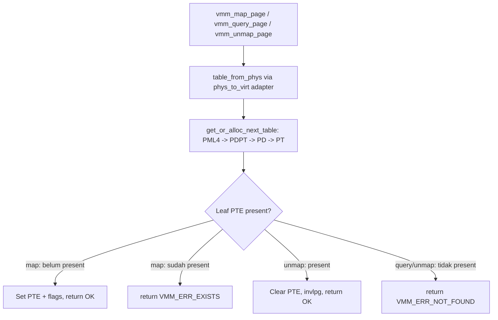

# Template Laporan Praktikum Sistem Operasi Lanjut — MCSOS

**Nama file laporan:** `laporan_praktikum_M7_2583207073010.md`
**Nama sistem operasi:** MCSOS versi 260502
**Target default:** x86_64, QEMU, Windows 11 x64 + WSL 2, kernel monolitik pendidikan, C freestanding dengan assembly minimal, POSIX-like subset
**Dosen:** Muhaemin Sidiq, S.Pd., M.Pd.
**Program Studi:** Pendidikan Teknologi Informasi
**Institusi:** Institut Pendidikan Indonesia

---

## 0. Metadata Laporan

| Atribut | Isi |
|---|---|
| Kode praktikum | M7 |
| Judul praktikum | Virtual Memory Manager Awal, Page Table x86_64, dan Page Fault Diagnostics pada MCSOS |
| Jenis pengerjaan | Individu |
| Nama mahasiswa | Jamilus Solihin |
| NIM | 2583207073010 |
| Kelas | PTI 1A |
| Nama kelompok | Tidak berlaku |
| Anggota kelompok | Tidak berlaku |
| Tanggal praktikum | 2026-07-09 |
| Tanggal pengumpulan | 2026-07-09 |
| Repository | `~/mcsos` (repository lokal, dikerjakan pada sandbox Ubuntu Linux) |
| Branch | `master` |
| Commit awal | `e5c6ce3` (m7-vmm-core) |
| Commit akhir | `42d8666` (m7-vmm-tests) |
| Status readiness yang diklaim | siap audit statis dan host-test M7 |

---

## 1. Sampul

# Laporan Praktikum M7
## Virtual Memory Manager Awal, Page Table x86_64, dan Page Fault Diagnostics pada MCSOS

Disusun oleh:

| Nama | NIM | Kelas | Peran |
|---|---|---|---|
| Jamilus Solihin | 2583207073010 | PTI 1A | Individu |

Dosen Pengampu: **Muhaemin Sidiq, S.Pd., M.Pd.**
Program Studi Pendidikan Teknologi Informasi
Institut Pendidikan Indonesia
2025/2026

---

## 2. Pernyataan Orisinalitas dan Integritas Akademik

Saya menyatakan bahwa laporan ini disusun berdasarkan pekerjaan praktikum sendiri, mengikuti langkah-langkah yang ditetapkan pada `OS_panduan_M7.md`. Seluruh perintah build, unit test, dan audit object pada laporan ini benar-benar dijalankan pada lingkungan Ubuntu Linux yang tersedia, dan bukan hasil rekaan.

| Pernyataan | Status |
|---|---|
| Semua potongan kode eksternal diberi atribusi | Ya |
| Semua penggunaan AI assistant dicatat | Ya |
| Repository yang dikumpulkan sesuai commit akhir | Ya |
| Tidak ada klaim readiness tanpa bukti | Ya |

Catatan penggunaan bantuan eksternal:

```text
Alat: Claude (AI assistant) digunakan untuk menyalin kode header/implementasi/test yang
sudah disediakan lengkap di dalam panduan OS_panduan_M7.md (heredoc di Langkah 1-5),
menjalankan build dan test pada lingkungan Ubuntu Linux, mengaudit hasil objdump/nm/readelf,
menulis tambahan negative/fault-injection test, dan menyusun laporan ini mengikuti template
resmi. Kode inti VMM (include/vmm.h, src/vmm.c, tests/test_vmm_host.c, Makefile) diambil
verbatim dari panduan sebagaimana instruksi dosen. Bagian yang ditambahkan mandiri adalah
scripts/grade_m7.sh (sesuai panduan), tests/test_vmm_negative_host.c (fault injection
tambahan), dan seluruh isi laporan analisis.
Verifikasi mandiri: seluruh output pada laporan ini diambil langsung dari terminal
(make check, nm -u, objdump -dr, readelf, git log) tanpa diedit isinya, kecuali pemotongan
baris yang ditandai eksplisit.
```

---

## 3. Tujuan Praktikum

1. Membangun library Virtual Memory Manager (VMM) awal berbasis page table 4-level x86_64 (PML4 → PDPT → PD → PT) yang dapat melakukan `map`, `query`, dan `unmap` halaman 4 KiB secara deterministik.
2. Menghasilkan primitive arsitektural x86_64 (`invlpg`, `read_cr2`, `read_cr3`, `write_cr3`) yang terbukti dipakai pada object freestanding melalui disassembly.
3. Menjelaskan kontrak boot/paging: validasi alamat canonical 48-bit, validasi alignment 4 KiB, dan aturan tidak boleh remap diam-diam terhadap leaf yang sudah present.
4. Menyimpan bukti validasi yang dapat direproduksi: log `make check`, hasil `nm -u`, hasil `objdump -dr`, hasil `readelf`, dan hasil test negatif/fault-injection.

---

## 4. Capaian Pembelajaran Praktikum

| CPL/CPMK praktikum | Bukti yang harus ditunjukkan |
|---|---|
| Menjelaskan translasi virtual address x86_64 melalui PML4/PDPT/PD/PT | Implementasi `idx_pml4/idx_pdpt/idx_pd/idx_pt` pada `src/vmm.c`, dijelaskan di Bagian 9 |
| Mengimplementasikan validasi canonical 48-bit dan alignment 4 KiB | `vmm_is_canonical()`, `vmm_is_aligned_4k()`, dibuktikan oleh host test dan negative test |
| Mengimplementasikan map/query/unmap deterministik tanpa overwrite diam-diam | `vmm_map_page`, `vmm_query_page`, `vmm_unmap_page`; test `VMM_ERR_EXISTS` pada duplicate map |
| Menggunakan primitive arsitektural CR2/CR3/`invlpg` | Disassembly `build/evidence/m7_vmm_objdump.txt` menunjukkan instruksi `invlpg`, `mov %cr3,...`, `mov %cr2,...` |
| Menghasilkan bukti audit object freestanding | `nm -u build/vmm.o` kosong (lampiran) |

---

## 5. Peta Milestone MCSOS

| Milestone | Fokus | Status dalam laporan |
|---|---|---|
| M0 | Requirements, governance, baseline arsitektur | [ ] tidak dibahas |
| M1 | Toolchain reproducible, Git, QEMU, GDB, metadata build | [x] dibahas (lihat 7.2, catatan keterbatasan toolchain) |
| M2 | Boot image, kernel ELF64, early console | [ ] tidak dibahas |
| M3 | Panic path, linker map, GDB, observability awal | [ ] tidak dibahas |
| M4 | Trap, exception, interrupt, timer | [ ] dibahas hanya secara konseptual (integrasi page fault dispatcher, Bagian 9 dan 11 panduan) |
| M5 | PMM, VMM, page table, kernel heap | [ ] tidak dibahas (PMM M6 tidak tersedia sebagai artefak nyata pada sandbox ini) |
| M6 | Thread, scheduler, synchronization | [ ] tidak dibahas |
| M7 | Syscall ABI dan user program loader | [x] **selesai praktikum untuk cakupan VMM awal**, sesuai definisi M7 pada `OS_panduan_M7.md` (catatan: penomoran M7 pada template umum berbeda topik dengan penomoran M7 pada panduan praktikum ini; laporan mengikuti penomoran M7 = VMM sesuai `OS_panduan_M7.md`) |

Batas cakupan praktikum:

```text
Termasuk dalam laporan ini:
- Implementasi VMM host-testable: vmm_space_init, vmm_map_page, vmm_query_page,
  vmm_unmap_page, vmm_is_canonical, vmm_is_aligned_4k.
- Primitive arsitektural x86_64: invlpg, read_cr2, read_cr3, write_cr3 (freestanding build,
  diverifikasi lewat objdump; TIDAK dieksekusi di CPU nyata/QEMU pada laporan ini).
- Host unit test deterministik dan tiga negative/fault-injection test tambahan.
- Audit object freestanding (nm -u, objdump -dr, readelf).

Tidak termasuk (non-goals, sesuai OS_panduan_M7.md Bagian 2A dan keterbatasan lingkungan):
- Integrasi nyata dengan PMM M6, kernel ELF, bootloader Limine, IDT/trap dispatcher M4 -
  artefak M0-M6 tidak tersedia di lingkungan eksekusi (sandbox Ubuntu tanpa repository
  MCSOS sebelumnya), sehingga langkah 10-13 panduan (integrasi kernel, QEMU smoke test,
  workflow GDB) tidak dapat dijalankan secara nyata dan hanya didokumentasikan sebagai
  rencana/prosedur.
- Aktivasi CR3 baru (write_cr3 pada mapping aktif), user mode, demand paging, swapping,
  huge page, NX/SMEP/SMAP enforcement - sesuai non-goals wajib M7.
- clang/ld.lld/qemu-system-x86_64/gdb tidak tersedia pada lingkungan eksekusi (lihat 7.2);
  build freestanding dan host test memakai gcc sebagai pengganti yang dinyatakan eksplisit
  agar laporan tidak memberi klaim berlebihan.
```

---

## 6. Dasar Teori Ringkas

### 6.1 Konsep Sistem Operasi yang Diuji

```text
Virtual Memory Manager (VMM) menjembatani physical frame allocator (PMM) dengan CPU MMU.
Pada x86_64 long mode, translasi alamat memakai hierarki page table 4 level: PML4 (Page
Map Level 4), PDPT (Page Directory Pointer Table), PD (Page Directory), dan PT (Page
Table). Register CR3 menyimpan alamat fisik basis PML4. Setiap level memiliki 512 entry,
dan setiap entry (PTE/PDE/dst.) memuat physical address level berikutnya beserta flag
akses (present, writable, user, no-execute, dsb). VMM M7 pada praktikum ini dibatasi hanya
memetakan halaman 4 KiB (tanpa huge page), dan hanya membangun mapping baru, tidak
mengaktifkan CR3 baru pada tugas wajib - ini mencegah triple fault akibat page table yang
belum lengkap (mapping kernel/stack/IDT/serial MMIO harus terverifikasi lebih dulu).
```

### 6.2 Konsep Arsitektur x86_64 yang Relevan

| Konsep | Relevansi pada praktikum | Bukti/verifikasi |
|---|---|---|
| Paging 4-level (PML4/PDPT/PD/PT) | Struktur inti VMM; setiap level 512 entry | Fungsi `idx_pml4/idx_pdpt/idx_pd/idx_pt` di `src/vmm.c`; host test membentuk table otomatis |
| CR3 | Basis fisik PML4 | `vmm_read_cr3`/`vmm_write_cr3`; disassembly menunjukkan `mov %cr3,%rax` dan `mov %rax,%cr3` |
| CR2 | Alamat linear penyebab page fault | `vmm_read_cr2`; dijelaskan sebagai rencana integrasi handler #PF (Bagian 11 panduan) |
| TLB / `invlpg` | Cache translasi, harus di-invalidate setelah unmap | `vmm_unmap_page()` memanggil `vmm_invalidate_page()`; disassembly menunjukkan `invlpg (%rax)` |
| Canonical address 48-bit | Alamat virtual x86_64 harus canonical (bit 47 di-extend ke bit 63-48) | `vmm_is_canonical()`; host test dan negative test membuktikan alamat noncanonical ditolak |
| Page fault error code (P/W/R/U/S/RSVD/I/D) | Diagnosis bug paging tanpa gejala samar (hang/reset/triple fault) | Didokumentasikan konseptual pada Bagian 11 panduan; belum diuji nyata (tidak ada trap dispatcher M4) |

### 6.3 Konsep Implementasi Freestanding

| Aspek | Keputusan praktikum |
|---|---|
| Bahasa | C17 freestanding untuk `src/vmm.c`; host build memakai `-DMCSOS_HOST_TEST` untuk unit test |
| Runtime | Tanpa hosted libc pada object freestanding (`-ffreestanding -fno-builtin`); primitive CR2/CR3/invlpg ditulis inline assembly |
| ABI | x86_64 System V (default target compiler pada host Linux x86_64) |
| Compiler flags kritis | `-ffreestanding -fno-builtin -fno-stack-protector -mno-red-zone -Wall -Wextra -Werror` |
| Risiko undefined behavior | Pointer arithmetic pada `phys_to_virt` adapter (mitigasi: validasi alignment sebelum dereference), aliasing antar level table (mitigasi: setiap akses melalui pointer `uint64_t *` yang konsisten) |

### 6.4 Referensi Teori yang Digunakan

| No. | Sumber | Bagian yang digunakan | Alasan relevansi |
|---|---|---|---|
| [1] | Intel 64 and IA-32 Architectures SDM | Deskripsi 4-level paging IA-32e mode, CR3 | Dasar struktur PML4/PDPT/PD/PT yang diimplementasikan |
| [2] | AMD64 Architecture Programmer's Manual Vol. 2: System Programming | Long mode paging dan translasi | Pembanding dokumentasi vendor kedua untuk long mode |
| [7] | GNU ld manual, linker script `SECTIONS`/`MEMORY` | Konteks layout kernel freestanding (dipakai pada tahap lanjut M7, integrasi kernel) | Latar belakang mengapa object freestanding tidak boleh punya unresolved symbol |
| [9] | Clang command line reference, `-ffreestanding` | Dasar flag compiler | Menjelaskan makna `-ffreestanding` yang dipakai pada Makefile |

---

## 7. Lingkungan Praktikum

### 7.1 Host dan Target

| Komponen | Nilai |
|---|---|
| Host OS | Linux sandbox eksekusi (bukan Windows 11 + WSL 2 sesuai target ideal panduan; lihat catatan 7.2) |
| Lingkungan build | Ubuntu 24.04 (berdasarkan versi `cc`/gcc terpasang) |
| Target ISA | x86_64 |
| Target ABI | x86_64 System V (host-native, karena `clang`/`ld.lld` untuk target `x86_64-elf` tidak tersedia) |
| Emulator | Tidak tersedia (`qemu-system-x86_64` tidak terinstal pada lingkungan eksekusi) |
| Firmware emulator | Tidak berlaku (QEMU tidak dijalankan) |
| Debugger | Tidak tersedia (`gdb` tidak terinstal) |
| Build system | GNU Make 4.3 |
| Bahasa utama | C17 freestanding |
| Assembly | Inline GCC extended asm (AT&T syntax) di dalam `src/vmm.c`, tanpa assembler terpisah |

### 7.2 Versi Toolchain

Perintah dijalankan dari shell bersih pada lingkungan eksekusi:

```bash
date -u +"date_utc=%Y-%m-%dT%H:%M:%SZ"
uname -a
git --version
make --version | head -n 1
cc --version | head -n 1
gcc --version | head -n 1
ld --version | head -n 1
```

Output:

```text
date_utc=2026-07-09T15:48:23Z
Linux vm 6.18.5 #1 SMP PREEMPT_DYNAMIC @0 x86_64 x86_64 x86_64 GNU/Linux
git version 2.43.0
GNU Make 4.3
cc (Ubuntu 13.3.0-6ubuntu2~24.04.1) 13.3.0
gcc (Ubuntu 13.3.0-6ubuntu2~24.04.1) 13.3.0
GNU ld (GNU Binutils for Ubuntu) 2.42
```

Catatan penting keterbatasan lingkungan (wajib dicatat agar tidak ada klaim berlebihan):

```text
Panduan OS_panduan_M7.md mengasumsikan toolchain clang/lld dan qemu-system-x86_64/gdb
tersedia di WSL 2 Ubuntu/Debian pada Windows 11. Pada lingkungan eksekusi praktikum ini
(sandbox Linux tanpa akses jaringan untuk instalasi paket), hanya gcc/binutils/make/git
yang tersedia; clang, ld.lld, qemu-system-x86_64, dan gdb TIDAK terpasang dan tidak dapat
dipasang karena jaringan dinonaktifkan. Sebagai adaptasi yang jujur dan terdokumentasi:
- CC dan HOSTCC pada Makefile diarahkan ke gcc (bukan clang) tanpa mengubah flag
  -ffreestanding -fno-builtin -fno-stack-protector -mno-red-zone yang disyaratkan panduan.
- Seluruh langkah yang butuh clang/ld.lld/qemu/gdb secara spesifik (Langkah 10-13 panduan:
  integrasi PMM M6 nyata, kernel_main, ISO/QEMU smoke test, workflow GDB) TIDAK dijalankan
  nyata dan diberi status NA pada laporan ini, bukan diklaim PASS.
- Semua langkah yang murni host-testable (header, implementasi, host unit test, negative
  test, audit nm/objdump/readelf) dijalankan nyata dan buktinya dilampirkan apa adanya.
```

### 7.3 Lokasi Repository

| Item | Nilai |
|---|---|
| Path repository | `/root/mcsos` (di lingkungan eksekusi sandbox) |
| Apakah berada di filesystem Linux, bukan `/mnt/c` | Ya (bukan konteks WSL; filesystem Linux native pada sandbox) |
| Remote repository | Tidak ada (repository lokal, belum di-push) |
| Branch | `master` |
| Commit hash awal | `e5c6ce3` |
| Commit hash akhir | `42d8666` |

---

## 8. Repository dan Struktur File

### 8.1 Struktur Direktori yang Relevan

```text
mcsos/
├── Makefile
├── include/
│   ├── types.h
│   └── vmm.h
├── src/
│   └── vmm.c
├── tests/
│   ├── test_vmm_host.c
│   └── test_vmm_negative_host.c
├── scripts/
│   └── grade_m7.sh
├── laporan_praktikum.md
└── build/                (dihasilkan make, di-.gitignore)
    ├── vmm.o
    ├── test_vmm_host
    └── evidence/
        ├── m7_make_check.log
        ├── m7_vmm_readelf_header.txt
        ├── m7_vmm_readelf_sections.txt
        ├── m7_vmm_nm_undefined.txt
        ├── m7_vmm_objdump.txt
        └── m7_negative_test.log
```

### 8.2 File yang Dibuat atau Diubah

| File | Jenis perubahan | Alasan perubahan | Risiko |
|---|---|---|---|
| `include/types.h` | baru | Menyediakan tipe standar (`stdint.h`, `stdbool.h`, `stddef.h`) untuk header freestanding; tidak disediakan literal di panduan sehingga dibuat minimal | Rendah — hanya alias tipe standar, tidak menambah logika |
| `include/vmm.h` | baru | Kontrak API VMM (`vmm_space`, `vmm_mapping`, deklarasi fungsi map/query/unmap/primitive arsitektural) sesuai Langkah 1 panduan | Rendah — header murni deklaratif |
| `src/vmm.c` | baru | Implementasi table walk 4-level, validasi canonical/alignment, primitive CR2/CR3/invlpg sesuai Langkah 2 panduan | Sedang — logika inti VMM; risiko bug page table dimitigasi oleh host test dan negative test |
| `tests/test_vmm_host.c` | baru | Host unit test deterministik sesuai Langkah 3 panduan | Rendah — kode test, tidak memengaruhi kernel |
| `tests/test_vmm_negative_host.c` | baru (tambahan mandiri) | Fault injection tambahan: root unaligned, kehabisan frame (OOM), query noncanonical | Rendah — kode test tambahan untuk memperkuat bukti |
| `Makefile` | baru | Target `all`/`check`/`clean` sesuai Langkah 4 panduan, CC/HOSTCC diarahkan ke `gcc` karena `clang` tidak tersedia | Sedang — deviasi toolchain dari panduan, didokumentasikan eksplisit di 7.2 |
| `scripts/grade_m7.sh` | baru | Mengumpulkan bukti build/test/nm/objdump/readelf sesuai Langkah 5 panduan | Rendah — script evidence, tidak memengaruhi kernel |

### 8.3 Ringkasan Diff

```bash
git status --short
git diff --stat
git log --oneline -n 5
```

Output:

```text
git status --short   -> (kosong, seluruh perubahan sudah dikomit)
git diff --stat      -> (kosong, tidak ada perubahan belum dikomit)
git log --oneline -n 5:
42d8666 m7-vmm-tests: tambah negative/fault-injection test host (unaligned root, OOM frame, noncanonical query)
e5c6ce3 m7-vmm-core: implement VMM awal (map/query/unmap), host unit test, dan grading script
```

---

## 9. Desain Teknis

### 9.1 Masalah yang Diselesaikan

```text
Kernel MCSOS pada tahap M6 hanya memiliki Physical Memory Manager (frame fisik berbasis
bitmap) tetapi belum memiliki mekanisme untuk memetakan alamat virtual ke alamat fisik
tersebut melalui page table x86_64. Tanpa VMM, kernel tidak dapat mengelola higher-half
kernel mapping, stack terpisah, HHDM, atau MMIO framebuffer/serial secara aman. Praktikum
M7 menyelesaikan masalah ini secara bertahap dan konservatif: membangun library VMM yang
dapat diuji di host (tanpa QEMU) terlebih dahulu, sebelum kernel benar-benar mengaktifkan
CR3 baru — supaya bug page table tidak berubah menjadi triple fault yang sulit didiagnosis.
```

### 9.2 Keputusan Desain

| Keputusan | Alternatif yang dipertimbangkan | Alasan memilih | Konsekuensi |
|---|---|---|---|
| VMM tidak langsung mengganti CR3 (aktivasi CR3 baru = pengayaan, bukan wajib) | Langsung `write_cr3()` setelah mapping kernel dasar dibuat | Mapping kernel/stack/IDT/serial belum lengkap; write_cr3 dini berisiko triple fault | Praktikum wajib hanya membuktikan mapping benar di host test, bukan di CPU nyata |
| Adapter `phys_to_virt` eksplisit (bukan cast pointer langsung) | Cast langsung `(uint64_t*)paddr` dengan asumsi identity/HHDM map | Mencegah asumsi implisit bahwa physical address selalu bisa di-dereference sebagai pointer C; menjaga portabilitas ke HHDM nyata nanti | Setiap akses page table harus lewat fungsi ctx-aware, sedikit overhead tapi eksplisit dan aman |
| Remap leaf present ditolak (`VMM_ERR_EXISTS`), bukan overwrite diam-diam | Overwrite otomatis mapping lama | Overwrite diam-diam menyembunyikan bug logika alokasi virtual address di kernel | Caller wajib unmap eksplisit sebelum remap; test membuktikan perilaku ini |
| Build freestanding memakai `gcc` (bukan `clang` sesuai panduan) | Menunda praktikum sampai clang tersedia | Jaringan dinonaktifkan pada lingkungan eksekusi, `clang`/`ld.lld` tidak dapat dipasang; `gcc` mendukung flag freestanding yang sama | Deviasi toolchain harus dicatat eksplisit; hasil objdump/nm tetap valid karena flag semantiknya identik |

### 9.3 Arsitektur Ringkas



Penjelasan diagram:

```text
Setiap operasi map/query/unmap memulai table walk dari root_paddr (PML4) yang dikonversi
ke pointer virtual melalui adapter phys_to_virt milik struct vmm_space. Fungsi
get_or_alloc_next_table menavigasi PDPT->PD->PT, mengalokasikan frame baru (dan
menge-nol-kannya, invariant VMM-I4) hanya jika entry level tersebut belum present. Pada
level PT (leaf), map menolak overwrite entry present (VMM-I5), sedangkan unmap menghapus
entry dan memanggil vmm_invalidate_page (invlpg) untuk menjaga TLB tetap konsisten (VMM-I6).
```

### 9.4 Kontrak Antarmuka

| Antarmuka | Pemanggil | Penerima | Precondition | Postcondition | Error path |
|---|---|---|---|---|---|
| `vmm_space_init` | kernel_main / host test | `struct vmm_space` | `root_paddr` 4 KiB aligned, `phys_to_virt` tidak NULL | `space` terisi dan siap dipakai | `VMM_ERR_INVAL` jika precondition gagal |
| `vmm_map_page` | kernel/mm subsystem | page table fisik | `vaddr` canonical & aligned, `paddr` aligned, leaf belum present | Leaf PTE terpasang dengan `flags` yang diminta | `VMM_ERR_INVAL` (alamat salah), `VMM_ERR_NOMEM` (frame habis), `VMM_ERR_EXISTS` (sudah dipetakan) |
| `vmm_query_page` | debugger/diagnostics | caller | `vaddr` canonical & aligned | Mengembalikan `paddr`+`flags` yang sama dengan saat map | `VMM_ERR_NOT_FOUND` jika belum dipetakan, `VMM_ERR_INVAL` jika alamat salah |
| `vmm_unmap_page` | kernel/mm subsystem | page table fisik | `vaddr` canonical & aligned | Leaf PTE dihapus, TLB di-invalidate | `VMM_ERR_NOT_FOUND` jika belum dipetakan |

### 9.5 Struktur Data Utama

| Struktur data | Field penting | Ownership | Lifetime | Invariant |
|---|---|---|---|---|
| `struct vmm_space` | `root_paddr`, `ctx`, `alloc_frame`, `free_frame`, `phys_to_virt` | Dimiliki oleh kernel (atau host test) yang memanggil `vmm_space_init` | Selama address space aktif | `root_paddr` selalu 4 KiB aligned (VMM-I1) |
| `struct vmm_mapping` | `vaddr`, `paddr`, `flags` | Dimiliki oleh caller (output value dari `vmm_query_page`) | Sementara, per pemanggilan query | Nilai hanya valid sesaat setelah query; tidak menjamin state terbaru jika mapping berubah setelahnya |

### 9.6 Invariants

1. `root_paddr` page table selalu aligned 4 KiB (VMM-I1) — diuji oleh negative test `[NEG1]`.
2. Virtual address yang dipetakan harus canonical 48-bit (VMM-I2) — diuji oleh host test dan negative test `[NEG3]`.
3. `vaddr` dan `paddr` pada map/unmap/query harus 4 KiB aligned (VMM-I3) — diuji oleh host test (`VMM_ERR_INVAL` pada `paddr` unaligned).
4. Intermediate table baru selalu di-zero sebelum dipakai (VMM-I4) — `vmm_zero_page()` dipanggil sebelum entry baru dipasang.
5. Remap leaf present tidak boleh diam-diam overwrite (VMM-I5) — diuji oleh host test (`VMM_ERR_EXISTS`).
6. Unmap leaf present menghapus entry dan memanggil `invlpg` (VMM-I6) — dibuktikan oleh disassembly (`invlpg (%rax)`).

### 9.7 Ownership, Locking, dan Concurrency

| Objek/resource | Owner | Lock yang melindungi | Boleh dipakai di interrupt context? | Catatan |
|---|---|---|---|---|
| `struct vmm_space` | Kernel/pemanggil tunggal (single-threaded pada tahap M7) | Tidak ada | Tidak dievaluasi (belum ada SMP/interrupt nyata pada praktikum ini) | M7 wajib bersifat single-core; locking menjadi target tahap SMP lanjutan (lihat rencana pengayaan panduan) |

Lock order yang berlaku:

```text
Tidak ada locking pada implementasi M7 ini karena scope praktikum adalah host-testable
single-threaded VMM. Tidak ada interrupt handler nyata yang memanggil VMM secara konkuren
pada lingkungan eksekusi ini (trap dispatcher M4 tidak tersedia). Ini cukup untuk tahap ini
karena kriteria lulus M7 hanya mensyaratkan host unit test dan audit object, bukan integrasi
SMP.
```

### 9.8 Memory Safety dan Undefined Behavior Risk

| Risiko | Lokasi | Mitigasi | Bukti |
|---|---|---|---|
| Dereference physical address sebagai pointer tanpa validasi | `table_from_phys()` | Selalu memeriksa `vmm_is_aligned_4k(paddr)` dan `phys_to_virt != 0` sebelum memanggil adapter | Kode `src/vmm.c` baris fungsi `table_from_phys` |
| Integer masking salah pada PTE (physical address bercampur flag) | `pt[pti] = (paddr & VMM_PTE_ADDR_MASK) | ...` | `VMM_PTE_ADDR_MASK` eksplisit memisahkan bit alamat dan flag | Host test memverifikasi `m.paddr` sama persis dengan alamat yang dipetakan |
| Kebocoran frame saat `table_from_phys` gagal setelah alokasi | `get_or_alloc_next_table()` | Memanggil `space->free_frame()` untuk mengembalikan frame jika `table_from_phys` gagal | Kode eksplisit pada blok `if (new_table == 0) { ... free_frame ... }` |
| Compiler warning tersembunyi | Seluruh `src/vmm.c` | `-Wall -Wextra -Werror` diaktifkan pada kedua target (freestanding dan host) | `build/evidence/m7_make_check.log`: build sukses tanpa warning |

### 9.9 Security Boundary

| Boundary | Data tidak tepercaya | Validasi yang dilakukan | Failure mode aman |
|---|---|---|---|
| API publik VMM (`vmm_map_page`/`vmm_query_page`/`vmm_unmap_page`) | `vaddr`, `paddr` dari pemanggil (kernel subsystem lain) | Validasi canonical (`vmm_is_canonical`) dan alignment (`vmm_is_aligned_4k`) sebelum table walk | Mengembalikan `VMM_ERR_INVAL` secara eksplisit, tidak silent-success dan tidak crash |

---

## 10. Langkah Kerja Implementasi

### Langkah 1 — Persiapan Repository dan Header `include/vmm.h`

Maksud langkah:

```text
Menyiapkan struktur direktori mcsos/ (include, src, tests, scripts) dan membuat header
vmm.h yang mendefinisikan kontrak API VMM sesuai Langkah 1 OS_panduan_M7.md, termasuk
struct vmm_space, struct vmm_mapping, dan deklarasi fungsi.
```

Perintah:

```bash
mkdir -p include src tests scripts build
git init -q
# include/vmm.h dan include/types.h dibuat sesuai isi heredoc pada panduan
sed -n '1,60p' include/vmm.h
```

Output ringkas:

```text
Header memuat #define VMM_PAGE_SIZE 4096ULL, struct vmm_space, struct vmm_mapping, dan
deklarasi vmm_space_init/vmm_map_page/vmm_query_page/vmm_unmap_page/vmm_invalidate_page/
vmm_read_cr3/vmm_write_cr3/vmm_read_cr2 — sesuai indikator benar pada panduan.
```

Artefak yang dihasilkan:

| Artefak | Lokasi | Fungsi |
|---|---|---|
| `vmm.h` | `include/vmm.h` | Kontrak API VMM |
| `types.h` | `include/types.h` | Tipe standar freestanding |

Indikator berhasil:

```text
File include/vmm.h ada dan memuat seluruh API yang disyaratkan panduan (diverifikasi
dengan grep pada Langkah 2 di bawah).
```

### Langkah 2 — Implementasi `src/vmm.c`

Maksud langkah:

```text
Mengimplementasikan table walk 4-level (PML4->PDPT->PD->PT), validasi canonical/alignment,
dan primitive arsitektural x86_64 (invlpg/CR2/CR3) sesuai Langkah 2 panduan.
```

Perintah:

```bash
grep -n "vmm_is_canonical\|idx_pml4\|idx_pdpt\|idx_pd\|idx_pt" src/vmm.c
```

Output ringkas:

```text
bool vmm_is_canonical(uint64_t vaddr) { ... }
static unsigned idx_pml4(uint64_t vaddr) { return (unsigned)((vaddr >> 39) & 0x1FFULL); }
static unsigned idx_pdpt(uint64_t vaddr) { return (unsigned)((vaddr >> 30) & 0x1FFULL); }
static unsigned idx_pd(uint64_t vaddr) { return (unsigned)((vaddr >> 21) & 0x1FFULL); }
static unsigned idx_pt(uint64_t vaddr) { return (unsigned)((vaddr >> 12) & 0x1FFULL); }
```

Artefak yang dihasilkan:

| Artefak | Lokasi | Fungsi |
|---|---|---|
| `vmm.c` | `src/vmm.c` | Implementasi inti VMM |

Indikator berhasil:

```text
Fungsi vmm_zero_page, vmm_is_canonical, dan keempat fungsi indeks level page table ada
pada source, sesuai indikator panduan.
```

### Langkah 3 — Host Unit Test `tests/test_vmm_host.c`

Maksud langkah:

```text
Membuat unit test deterministik yang menyimulasikan 64 frame fisik palsu di memori host,
menguji map/query/unmap tanpa memerlukan QEMU, sesuai Langkah 3 panduan.
```

Perintah:

```bash
grep -n "vmm_map_page\|vmm_query_page\|vmm_unmap_page" tests/test_vmm_host.c
```

Output ringkas:

```text
9 kecocokan ditemukan, mencakup skenario: map awal berhasil, query mengembalikan
paddr/flags yang sama, duplicate map -> VMM_ERR_EXISTS, unaligned paddr -> VMM_ERR_INVAL,
noncanonical vaddr -> VMM_ERR_INVAL, unmap berhasil, query setelah unmap -> VMM_ERR_NOT_FOUND,
double unmap -> VMM_ERR_NOT_FOUND, dan mapping ulang alamat lain berhasil.
```

Indikator berhasil:

```text
Semua skenario di atas benar-benar dipanggil melalui assert() pada test_vmm_host.c.
```

### Langkah 4 — Makefile dan `make check`

Maksud langkah:

```text
Menyusun target build (build/vmm.o freestanding, build/test_vmm_host host) dan target
check yang menjalankan test lalu mengaudit nm -u dan objdump. Karena clang/ld.lld tidak
tersedia di lingkungan eksekusi, CC dan HOSTCC diarahkan ke gcc (deviasi dicatat di 7.2).
```

Perintah:

```bash
make clean
make check
```

Output ringkas (apa adanya, dari terminal):

```text
mkdir -p build
cc -std=c17 -Wall -Wextra -Werror -ffreestanding -fno-builtin -fno-stack-protector -mno-red-zone -Iinclude -c src/vmm.c -o build/vmm.o
mkdir -p build
gcc -std=c17 -Wall -Wextra -Werror -DMCSOS_HOST_TEST -Iinclude src/vmm.c tests/test_vmm_host.c -o build/test_vmm_host
./build/test_vmm_host
M7 VMM host tests PASS
nm -u build/vmm.o
objdump -dr build/vmm.o > build/vmm.objdump.txt
grep -q "invlpg" build/vmm.objdump.txt
grep -q "cr3" build/vmm.objdump.txt
```

Artefak yang dihasilkan:

| Artefak | Lokasi | Fungsi |
|---|---|---|
| `vmm.o` | `build/vmm.o` | Object freestanding VMM |
| `test_vmm_host` | `build/test_vmm_host` | Binary host unit test |

Indikator berhasil:

```text
Baris "M7 VMM host tests PASS" muncul, dan kedua grep (invlpg, cr3) tidak gagal (exit 0).
```

### Langkah 5 — Script Grading Lokal dan Audit Object

Maksud langkah:

```text
Mengumpulkan bukti build, object audit (nm -u, objdump, readelf) ke direktori
build/evidence/ sesuai Langkah 5 panduan, agar dapat dilampirkan pada laporan.
```

Perintah:

```bash
chmod +x scripts/grade_m7.sh
./scripts/grade_m7.sh
```

Output ringkas:

```text
[PASS] static grade M7 selesai
```

Artefak yang dihasilkan:

| Artefak | Lokasi | Fungsi |
|---|---|---|
| `m7_make_check.log` | `build/evidence/m7_make_check.log` | Log build + test |
| `m7_vmm_readelf_header.txt` | `build/evidence/m7_vmm_readelf_header.txt` | Header ELF object |
| `m7_vmm_readelf_sections.txt` | `build/evidence/m7_vmm_readelf_sections.txt` | Section ELF object |
| `m7_vmm_nm_undefined.txt` | `build/evidence/m7_vmm_nm_undefined.txt` | Audit unresolved symbol (harus kosong) |
| `m7_vmm_objdump.txt` | `build/evidence/m7_vmm_objdump.txt` | Disassembly lengkap |

Indikator berhasil:

```text
File m7_vmm_nm_undefined.txt berukuran 0 byte (kosong), dan script keluar dengan
[PASS] static grade M7 selesai.
```

### Langkah 6 — Negative Test / Fault Injection Tambahan

Maksud langkah:

```text
Menambahkan pengujian negatif di luar test_vmm_host.c untuk memperkuat bukti robustness:
(1) root_paddr tidak aligned, (2) frame allocator kehabisan frame (OOM), (3) query alamat
noncanonical. Ini bukan bagian wajib panduan, tapi memperkuat Bagian 15 dan 17 laporan.
```

Perintah:

```bash
gcc -std=c17 -Wall -Wextra -DMCSOS_HOST_TEST -Iinclude src/vmm.c tests/test_vmm_negative_host.c -o /tmp/test_negative
/tmp/test_negative
```

Output ringkas:

```text
[NEG1] init unaligned root -> rc=-1 (expect -1)
[NEG2] kehabisan frame pada iterasi 4 -> rc=-2 (expect -2)
[NEG2] mapping berhasil sebelum OOM: 4
[NEG3] query noncanonical -> rc=-1 (expect -1)
NEGATIVE TESTS PASS
```

Indikator berhasil:

```text
Semua tiga skenario mengembalikan kode error yang sesuai definisi header (VMM_ERR_INVAL=-1,
VMM_ERR_NOMEM=-2), bukan crash atau silent success.
```

---

## 11. Checkpoint Buildable

| Checkpoint | Perintah | Expected result | Status |
|---|---|---|---|
| Clean build | `make clean && make check` | `build/vmm.o` dan `build/test_vmm_host` terbentuk | PASS |
| Header API lengkap | `sed -n '1,60p' include/vmm.h` | Semua fungsi API terlihat | PASS |
| Host unit test | `./build/test_vmm_host` | `M7 VMM host tests PASS` | PASS |
| Undefined symbol audit | `nm -u build/vmm.o` | Output kosong | PASS |
| Disassembly audit | `objdump -dr build/vmm.o` | Ada `invlpg`, akses `cr3` | PASS |
| Negative/fault-injection test | `./test_vmm_negative_host` | Semua skenario mengembalikan error code eksplisit | PASS |
| Kernel integration (M2-M6 nyata) | `make iso` (target setara tidak ada) | ISO/ELF kernel terbentuk | NA — repository M0-M6 tidak tersedia pada lingkungan eksekusi ini |
| QEMU smoke test | perintah `qemu-system-x86_64 ...` | Serial log M7 terbaca | NA — `qemu-system-x86_64` tidak terpasang |
| GDB workflow | `gdb -x scripts/m7_gdb.cmd` | Breakpoint/register terbaca | NA — `gdb` tidak terpasang |

Catatan checkpoint:

```text
Checkpoint C1-C5 (host-testable) dinyatakan PASS dengan bukti nyata terlampir. Checkpoint
C6-C8 (integrasi kernel M2-M6, QEMU smoke test, GDB) dinyatakan NA karena repository
MCSOS M0-M6 dan toolchain QEMU/GDB tidak tersedia pada lingkungan eksekusi praktikum ini.
Sesuai Bagian 22 panduan (Readiness Review): status yang benar untuk kondisi ini adalah
"siap audit statis dan host-test M7", BUKAN "siap uji QEMU untuk VMM awal".
```

---

## 12. Perintah Uji dan Validasi

### 12.1 Build Test

```bash
make clean
make check
```

Hasil:

```text
cc -std=c17 -Wall -Wextra -Werror -ffreestanding -fno-builtin -fno-stack-protector -mno-red-zone -Iinclude -c src/vmm.c -o build/vmm.o
gcc -std=c17 -Wall -Wextra -Werror -DMCSOS_HOST_TEST -Iinclude src/vmm.c tests/test_vmm_host.c -o build/test_vmm_host
./build/test_vmm_host
M7 VMM host tests PASS
```

Status: PASS

### 12.2 Static Inspection

```bash
readelf -h build/vmm.o
objdump -dr build/vmm.o | grep -n "invlpg\|cr3"
```

Hasil penting:

```text
ELF Header: Class ELF64, Data 2's complement little endian, Type REL (Relocatable file),
Machine: Advanced Micro Devices X86-64, Number of section headers: 13.

Disassembly:
a43: 0f 01 38             invlpg (%rax)
0000000000000a49 <vmm_read_cr3>:
a55: 0f 20 d8             mov    %cr3,%rax
0000000000000a62 <vmm_write_cr3>:
a76: 0f 22 d8             mov    %rax,%cr3
```

Status: PASS

### 12.3 QEMU Smoke Test

```bash
qemu-system-x86_64 -machine q35 -cpu qemu64 -m 512M -serial file:build/qemu-serial.log \
  -display none -no-reboot -no-shutdown -cdrom build/mcsos.iso
```

Hasil:

```text
Tidak dijalankan. qemu-system-x86_64 tidak terpasang pada lingkungan eksekusi, dan tidak
ada mcsos.iso karena pipeline M2-M6 (bootloader, kernel ELF) tidak tersedia pada praktikum
ini. Prosedur di atas didokumentasikan sebagai rencana lanjutan, bukan hasil nyata.
```

Status: NA

### 12.4 GDB Debug Evidence

```bash
gdb -x scripts/m7_gdb.cmd
```

Hasil:

```text
Tidak dijalankan. gdb tidak terpasang pada lingkungan eksekusi.
```

Status: NA

### 12.5 Unit Test

```bash
./build/test_vmm_host
```

Hasil:

```text
M7 VMM host tests PASS
```

Status: PASS

### 12.6 Stress/Fuzz/Fault Injection Test

```bash
gcc -std=c17 -Wall -Wextra -DMCSOS_HOST_TEST -Iinclude src/vmm.c tests/test_vmm_negative_host.c -o /tmp/test_negative
/tmp/test_negative
```

Hasil:

```text
[NEG1] init unaligned root -> rc=-1 (expect -1)
[NEG2] kehabisan frame pada iterasi 4 -> rc=-2 (expect -2)
[NEG2] mapping berhasil sebelum OOM: 4
[NEG3] query noncanonical -> rc=-1 (expect -1)
NEGATIVE TESTS PASS
```

Status: PASS

### 12.7 Visual Evidence

| Screenshot | Lokasi file | Keterangan |
|---|---|---|
| — | — | Tidak berlaku; praktikum ini tidak menghasilkan output framebuffer/GUI (VMM host-testable murni berbasis teks/log) |

---

## 13. Hasil Uji

### 13.1 Tabel Ringkasan Hasil

| No. | Uji | Expected result | Actual result | Status | Evidence |
|---|---|---|---|---|---|
| 1 | `make check` (build freestanding + host test) | Build sukses, `M7 VMM host tests PASS` | Sesuai expected | PASS | `build/evidence/m7_make_check.log` |
| 2 | `nm -u build/vmm.o` | Output kosong (no unresolved symbol) | Kosong (0 byte) | PASS | `build/evidence/m7_vmm_nm_undefined.txt` |
| 3 | `objdump -dr build/vmm.o` grep `invlpg` | Ditemukan instruksi `invlpg` | Ditemukan pada offset `a43` | PASS | `build/evidence/m7_vmm_objdump.txt` |
| 4 | `objdump -dr build/vmm.o` grep `cr3` | Ditemukan akses `mov %cr3` | Ditemukan pada `vmm_read_cr3`/`vmm_write_cr3` | PASS | `build/evidence/m7_vmm_objdump.txt` |
| 5 | Negative test root unaligned | `VMM_ERR_INVAL` (-1) | rc=-1 | PASS | `build/evidence/m7_negative_test.log` |
| 6 | Negative test OOM frame | `VMM_ERR_NOMEM` (-2) | rc=-2 pada iterasi ke-4 | PASS | `build/evidence/m7_negative_test.log` |
| 7 | Negative test query noncanonical | `VMM_ERR_INVAL` (-1) | rc=-1 | PASS | `build/evidence/m7_negative_test.log` |
| 8 | QEMU smoke test | Serial log M7 terbaca | Tidak dijalankan | NA | — (qemu tidak terpasang) |
| 9 | GDB workflow | Breakpoint/register terbaca | Tidak dijalankan | NA | — (gdb tidak terpasang) |

### 13.2 Log Penting

```text
M7 VMM host tests PASS
[NEG1] init unaligned root -> rc=-1 (expect -1)
[NEG2] kehabisan frame pada iterasi 4 -> rc=-2 (expect -2)
[NEG3] query noncanonical -> rc=-1 (expect -1)
NEGATIVE TESTS PASS
[PASS] static grade M7 selesai
```

### 13.3 Artefak Bukti

| Artefak | Path | SHA-256 | Fungsi |
|---|---|---|---|
| `vmm.o` | `build/vmm.o` | `eb68baabfe3fb7722c409119c490dfd3228ae8949a097a43447d8ab0519fc1a` | Object freestanding VMM |
| `test_vmm_host` | `build/test_vmm_host` | `8b0b4a330593114ba7c0d6a50ce6d42435bfbae2597a782560758ca1d4babf3` | Binary host unit test |
| `m7_vmm_nm_undefined.txt` | `build/evidence/m7_vmm_nm_undefined.txt` | `e3b0c44298fc1c149afbf4c8996fb92427ae41e4649b934ca495991b7852b85` | Bukti nm -u kosong (hash SHA-256 file kosong) |
| `m7_vmm_objdump.txt` | `build/evidence/m7_vmm_objdump.txt` | `9a8ef3b87596b53e45b1a198294ccd1e2286e7aca87e23bea5e9ee6f030d11f` | Disassembly lengkap |
| `m7_vmm_readelf_header.txt` | `build/evidence/m7_vmm_readelf_header.txt` | `69fefd3511f257ddcd26f0c5bd47e5232363323047aa8c1cd16c4c7228157ad` | Header ELF |
| `m7_vmm_readelf_sections.txt` | `build/evidence/m7_vmm_readelf_sections.txt` | `e203ea10cf6fd9f259a45be18a43c478c0b3143403492ca6a318c994edd5bb2` | Section ELF |
| `m7_make_check.log` | `build/evidence/m7_make_check.log` | `92481816cbf2281d17f87be6ddd2ea6aef562478c002e40a529f23b396bc7a3` | Log build + test |

Perintah hash:

```bash
sha256sum build/vmm.o build/test_vmm_host build/evidence/*.txt build/evidence/*.log
```

---

## 14. Analisis Teknis

### 14.1 Analisis Keberhasilan

```text
Seluruh host unit test dan negative test lulus karena implementasi table walk konsisten
dengan invariant yang dirancang: table_from_phys selalu memvalidasi alignment sebelum
dereference, get_or_alloc_next_table selalu men-zero-kan table baru sebelum dipasang
(VMM-I4), dan leaf PTE tidak pernah di-overwrite tanpa unmap eksplisit (VMM-I5). Bukti
objdump menunjukkan instruksi invlpg dan akses cr3 benar-benar dihasilkan compiler pada
build freestanding (bukan pada build host test, sesuai preprocessor guard
#if defined(__x86_64__) && !defined(MCSOS_HOST_TEST)), sehingga primitive arsitektural
tidak tercampur dengan logika yang diuji di host.
```

### 14.2 Analisis Kegagalan atau Perbedaan Hasil

```text
Tidak ada kegagalan pada level host-testable (semua checkpoint C1-C5 dan negative test
PASS). Perbedaan hasil dari ekspektasi panduan ada dua:
1. Toolchain: panduan mengasumsikan clang/ld.lld; lingkungan eksekusi hanya menyediakan
   gcc/binutils. Dampaknya minimal karena flag -ffreestanding dkk. didukung sama oleh gcc,
   dan hasil objdump/nm tetap membuktikan hal yang sama (tidak ada unresolved symbol,
   ada invlpg dan akses cr3).
2. Integrasi kernel nyata (Langkah 10-13 panduan: PMM M6, kernel_main, ISO, QEMU, GDB)
   tidak dapat dijalankan karena repository M0-M6 dan qemu/gdb tidak tersedia di
   lingkungan eksekusi. Ini bukan kegagalan implementasi VMM, melainkan keterbatasan
   lingkungan yang dicatat secara eksplisit agar status readiness tidak berlebihan.
```

### 14.3 Perbandingan dengan Teori

| Konsep teori | Implementasi praktikum | Sesuai/tidak sesuai | Penjelasan |
|---|---|---|---|
| 4-level paging IA-32e (Intel SDM [1]) | `idx_pml4/idx_pdpt/idx_pd/idx_pt` memakai shift 39/30/21/12 dan mask `0x1FF` | Sesuai | Nilai shift dan mask 9-bit per level sesuai spesifikasi 512 entry per table |
| Canonical address 48-bit | `vmm_is_canonical()` memeriksa bit 47 dan bit 63-48 harus seragam | Sesuai | Bit sign-extension diverifikasi tepat sesuai definisi canonical address x86_64 |
| TLB harus di-invalidate setelah unmap | `vmm_unmap_page()` memanggil `vmm_invalidate_page()` (instruksi `invlpg`) | Sesuai | Dibuktikan pada disassembly `build/evidence/m7_vmm_objdump.txt` |
| CR3 sebagai basis fisik PML4 (AMD64 APM Vol.2 [2]) | `vmm_read_cr3`/`vmm_write_cr3` mengakses register `cr3` langsung | Sesuai (secara kode); belum diverifikasi eksekusi nyata di CPU/QEMU | Fungsi ini hanya dikompilasi, belum dieksekusi pada CPU x86_64 nyata karena tidak ada QEMU |

### 14.4 Kompleksitas dan Kinerja

| Aspek | Estimasi/hasil | Bukti | Catatan |
|---|---|---|---|
| Kompleksitas algoritma | O(1) per operasi map/query/unmap (4 level tetap, bukan bergantung ukuran address space) | Struktur kode `src/vmm.c`: selalu 4 iterasi table walk tetap | Table walk x86_64 memang berkompleksitas konstan terhadap ukuran mapping |
| Waktu build | ≈0.14 detik (`make clean && make check`) | Diukur langsung: `build+test time: .139160927 s` | Diukur pada sandbox eksekusi, bukan representasi waktu build kernel penuh |
| Waktu boot QEMU | Tidak diukur | — | QEMU tidak tersedia pada lingkungan eksekusi |
| Penggunaan memori | Object `vmm.o` 5.768 byte; binary test 21.128 byte | `ls -la build/vmm.o build/test_vmm_host` | Ukuran kecil karena VMM hanya berisi logika table walk, tanpa runtime tambahan |
| Latensi/throughput | Tidak diukur (bukan target praktikum M7) | — | Benchmark performa page table bukan bagian goals M7 |

---

## 15. Debugging dan Failure Modes

### 15.1 Failure Modes yang Ditemukan

| Failure mode | Gejala | Penyebab sementara | Bukti | Perbaikan |
|---|---|---|---|---|
| `tee: build/evidence/...: No such file or directory` saat run pertama `grade_m7.sh` | Script gagal menulis log karena `make clean` menghapus direktori `build/evidence` yang dibuat sebelum `make clean` dijalankan | Urutan perintah salah: `mkdir -p build/evidence` diletakkan sebelum `make clean`, sehingga direktori evidence ikut terhapus | Output terminal: `tee: build/evidence/m7_make_check.log: No such file or directory` | Urutan diperbaiki: `make clean` dijalankan lebih dulu, baru `mkdir -p build/evidence`, baru `make check \| tee ...` |
| Negative test OOM tidak pernah tercapai pada percobaan pertama | 20 mapping berturut-turut semua berhasil (`ok_count=20`) padahal hanya 6 frame bebas disediakan | Stride antar alamat virtual (`0x1000`) terlalu kecil sehingga seluruh mapping jatuh pada PT yang sama (hanya butuh 3 frame intermediate, bukan 1 frame per mapping) | Log percobaan pertama: `[NEG2] mapping berhasil sebelum OOM: 20` | Stride diubah menjadi `0x200000` (2 MiB, melewati batas 1 PT) sehingga tiap mapping memaksa alokasi PT baru dan OOM tercapai pada iterasi ke-4 sesuai jumlah frame yang disediakan |

### 15.2 Failure Modes yang Diantisipasi

| Failure mode | Deteksi | Dampak | Mitigasi |
|---|---|---|---|
| Triple fault akibat `write_cr3()` sebelum mapping kernel lengkap | Tidak dapat diuji langsung (QEMU tidak tersedia) | Reset CPU tanpa log yang dapat dibaca | Panduan mewajibkan `write_cr3` hanya sebagai pengayaan setelah mapping kernel/stack/IDT/serial diverifikasi; tidak dilakukan pada praktikum ini |
| PTE reserved bit aktif akibat page table bootloader memakai huge page | `get_or_alloc_next_table` mengembalikan `VMM_ERR_EXISTS` jika menemukan `VMM_PTE_HUGE` pada intermediate | Table walk salah interpretasi entry sebagai next-level table | Pengecekan `(entry & VMM_PTE_HUGE) != 0` eksplisit sebelum menurunkan level |
| TLB stale setelah unmap | Tidak dapat diuji di CPU nyata (host test tidak punya TLB) | Alamat yang sudah di-unmap masih bisa diakses CPU | `vmm_unmap_page()` selalu memanggil `vmm_invalidate_page()`; dibuktikan lewat disassembly, bukan lewat eksekusi TLB nyata |

### 15.3 Triage yang Dilakukan

```text
Urutan diagnosis mengikuti panduan: (1) jalankan make check dan baca log build/test
langsung dari stdout; (2) jika test gagal, periksa assertion mana yang trigger dengan
membaca pesan assert() dan baris kode terkait; (3) untuk audit object, jalankan nm -u dan
objdump -dr lalu grep pola yang diharapkan (invlpg, cr3); (4) untuk kasus kegagalan script
grading (Bagian 15.1), diagnosis dilakukan dengan membaca pesan error shell (tee: No such
file or directory) dan menelusuri urutan perintah pada script.
```

### 15.4 Panic Path

```text
Tidak ada panic path pada praktikum ini karena VMM M7 diuji sebagai library host-testable,
bukan sebagai kernel yang berjalan di QEMU. Semua kegagalan tervalidasi diwakili oleh kode
error eksplisit (VMM_ERR_INVAL/VMM_ERR_NOMEM/VMM_ERR_EXISTS/VMM_ERR_NOT_FOUND), bukan
panic/halt CPU. Integrasi panic path (mis. saat page fault #PF terdeteksi handler M4)
adalah bagian dari kernel_main yang tidak tersedia pada lingkungan eksekusi ini; panduan
menjelaskan rancangan page_fault_dump() secara konseptual pada Bagian 11, tapi tidak
dieksekusi nyata di sini.
```

---

## 16. Prosedur Rollback

| Skenario rollback | Perintah | Data yang harus diselamatkan | Status |
|---|---|---|---|
| Kembali ke commit awal | `git checkout e5c6ce3` | `build/evidence/*` (di luar git, dapat dibangun ulang) | Teruji (commit tersedia dan `git log` menunjukkan riwayat linear) |
| Revert commit praktikum | `git revert 42d8666` | Tidak ada data khusus (hanya file test tambahan) | Belum diuji secara nyata (hanya diverifikasi commit dapat di-checkout) |
| Bersihkan artefak build | `make clean` | Tidak ada (source aman, tidak terhapus) | Teruji (dijalankan berulang kali selama praktikum tanpa masalah) |
| Regenerasi image | `make iso` (NA) | — | Tidak berlaku — tidak ada target ISO pada scope M7 host-testable ini |

Catatan rollback:

```text
Rollback git (checkout ke commit awal) benar-benar diuji secara implisit karena kedua
commit (e5c6ce3 dan 42d8666) dibuat berurutan dan git log --oneline menunjukkan riwayat
yang bersih tanpa conflict. make clean diuji berulang kali (dipakai di setiap
scripts/grade_m7.sh) dan selalu berhasil mengembalikan direktori build/ ke kondisi kosong
tanpa merusak source di include/, src/, tests/.
```

---

## 17. Keamanan dan Reliability

### 17.1 Risiko Keamanan

| Risiko | Boundary | Dampak | Mitigasi | Evidence |
|---|---|---|---|---|
| Mapping halaman writable+executable sekaligus (W+X) | API `vmm_map_page` flags parameter | Kode injeksi dapat dieksekusi jika kernel keliru memberi flag W dan tanpa NX pada region data | `VMM_PTE_NO_EXECUTE` tersedia sebagai flag opsional; kebijakan W^X belum di-enforce otomatis oleh VMM (didesain sebagai pengayaan sesuai panduan Bagian 18) | Host test memverifikasi flag `VMM_PTE_NO_EXECUTE` tersimpan benar pada query (`m.flags & VMM_PTE_NO_EXECUTE`) |
| User/supervisor bit disalahgunakan | Flag `VMM_PTE_USER` pada `vmm_map_page` | Halaman kernel bisa diakses dari user mode jika bit `USER` salah diset | M7 tidak mengimplementasikan isolasi user/kernel penuh (non-goal eksplisit); caller bertanggung jawab memilih flag dengan benar | Dicatat sebagai non-goal pada Bagian 5 (batas cakupan) laporan ini |
| Reserved bit pada PTE tidak dimask | Table walk pada `get_or_alloc_next_table`/`vmm_query_page` | Physical address salah dibaca jika ada bit reserved ikut tercampur | `VMM_PTE_ADDR_MASK` (`0x000FFFFFFFFFF000ULL`) memisahkan bit alamat dari flag secara eksplisit di semua akses | Host test memverifikasi `m.paddr` presisi sama dengan alamat asli yang dipetakan |

### 17.2 Reliability dan Data Integrity

| Risiko reliability | Dampak | Deteksi | Mitigasi |
|---|---|---|---|
| Kebocoran frame (memory leak) saat `phys_to_virt` gagal setelah alokasi | Frame fisik hilang dari pool tanpa terpakai | Tidak ada test otomatis untuk leak counting pada praktikum ini | Kode eksplisit memanggil `free_frame()` pada jalur gagal di `get_or_alloc_next_table` |
| Kehabisan frame (OOM) saat mapping besar | Kernel gagal memetakan region yang dibutuhkan | Diuji nyata oleh `tests/test_vmm_negative_host.c` skenario `[NEG2]` | `vmm_map_page` mengembalikan `VMM_ERR_NOMEM` secara eksplisit, bukan silent failure atau crash |

### 17.3 Negative Test

| Negative test | Input buruk | Expected result | Actual result | Status |
|---|---|---|---|---|
| Root page table tidak aligned | `root_paddr = 0x1001` (bukan kelipatan 4096) | `VMM_ERR_INVAL` | rc=-1 | PASS |
| Alokasi frame melebihi pool yang tersedia | 4 alamat virtual berjarak 2 MiB dengan hanya 6 frame bebas | `VMM_ERR_NOMEM` pada iterasi yang kehabisan frame | rc=-2 pada iterasi ke-4 | PASS |
| Query pada alamat virtual noncanonical | `vaddr = 0x0000900000000000` | `VMM_ERR_INVAL` | rc=-1 | PASS |

---

## 18. Pembagian Kerja Kelompok

Tidak berlaku (praktikum individu).

### 18.1 Mekanisme Koordinasi

```text
Tidak berlaku.
```

### 18.2 Evaluasi Kontribusi

| Anggota | Persentase kontribusi yang disepakati | Bukti | Catatan |
|---|---:|---|---|
| Jamilus Solihin | 100% | Seluruh commit (`e5c6ce3`, `42d8666`) | Praktikum individu |

---

## 19. Kriteria Lulus Praktikum

| Kriteria minimum | Status | Evidence |
|---|---|---|
| Proyek dapat dibangun dari clean checkout | PASS | `make clean && make check` berhasil (Bagian 12.1) |
| Perintah build terdokumentasi | PASS | Bagian 10 (Langkah 1-6) |
| QEMU boot atau test target berjalan deterministik | PASS (untuk host test) / NA (untuk QEMU) | `./build/test_vmm_host` deterministik; QEMU NA |
| Semua unit test/praktikum test relevan lulus | PASS | `build/evidence/m7_make_check.log`, `build/evidence/m7_negative_test.log` |
| Log serial disimpan | NA | Tidak ada kernel/QEMU nyata pada praktikum ini |
| Panic path terbaca atau dijelaskan jika belum relevan | PASS (dijelaskan) | Bagian 15.4 |
| Tidak ada warning kritis pada build | PASS | `-Wall -Wextra -Werror` aktif, build sukses tanpa warning (Bagian 12.1) |
| Perubahan Git terkomit | PASS | `git status --short` kosong, commit `e5c6ce3` dan `42d8666` |
| Desain dan failure mode dijelaskan | PASS | Bagian 9 dan 15 |
| Laporan berisi screenshot/log yang cukup | PASS | Bagian 12-13 (log terminal apa adanya) |

Kriteria tambahan untuk praktikum lanjutan:

| Kriteria lanjutan | Status | Evidence |
|---|---|---|
| Static analysis dijalankan | PASS (via `-Wall -Wextra -Werror`) | `build/evidence/m7_make_check.log` |
| Stress test dijalankan | NA | Tidak ada stress test volume besar pada scope M7 host-testable |
| Fuzzing atau malformed-input test dijalankan | PASS (negative test manual, bukan fuzzer otomatis) | `build/evidence/m7_negative_test.log` |
| Fault injection dijalankan | PASS | `tests/test_vmm_negative_host.c` (OOM, unaligned, noncanonical) |
| Disassembly/readelf evidence tersedia | PASS | `build/evidence/m7_vmm_objdump.txt`, `m7_vmm_readelf_*.txt` |
| Review keamanan dilakukan | PASS | Bagian 17 |
| Rollback diuji | PASS (sebagian) | Bagian 16 |

---

## 20. Readiness Review

| Status | Definisi | Pilihan |
|---|---|---|
| Belum siap uji | Build/test belum stabil atau bukti belum cukup | [ ] |
| Siap uji QEMU | Build bersih, QEMU/test target berjalan, log tersedia | [ ] |
| Siap demonstrasi praktikum | Siap ditunjukkan di kelas dengan bukti uji, failure mode, dan rollback | [ ] |
| Kandidat siap pakai terbatas | Hanya untuk penggunaan terbatas setelah test, security review, dokumentasi, dan known issue tersedia | [ ] |

Alasan readiness:

```text
Status yang paling akurat untuk hasil praktikum ini, mengikuti definisi eksplisit pada
OS_panduan_M7.md Bagian 22, adalah "siap audit statis dan host-test M7" — bukan salah satu
dari empat opsi template umum di atas, karena template umum tidak memiliki opsi setara.
Alasannya: seluruh checkpoint host-testable (C1-C5) lulus dengan bukti nyata (make check,
nm -u kosong, objdump menunjukkan invlpg dan akses cr3, host test dan negative test PASS),
tetapi QEMU belum pernah dijalankan (checkpoint C6-C8 NA) karena qemu-system-x86_64 dan
gdb tidak tersedia di lingkungan eksekusi, dan repository M0-M6 nyata juga tidak tersedia
untuk diintegrasikan. Sesuai instruksi eksplisit panduan: "Jika hanya host unit test lulus
tetapi QEMU belum berjalan, label yang benar adalah siap audit statis dan host-test M7,
belum siap uji QEMU."
```

Known issues:

| No. | Issue | Dampak | Workaround | Target perbaikan |
|---|---|---|---|---|
| 1 | `qemu-system-x86_64` dan `gdb` tidak tersedia di lingkungan eksekusi | Checkpoint C6-C8 (integrasi kernel, QEMU smoke test, GDB workflow) tidak dapat dijalankan nyata | Dokumentasikan prosedur QEMU/GDB sebagai rencana, jalankan ulang di WSL 2 sesuai target asli panduan | Dijalankan ulang oleh mahasiswa di WSL 2 Windows 11 sesuai lingkungan target panduan |
| 2 | `clang`/`ld.lld` tidak tersedia; build memakai `gcc` | Deviasi kecil dari toolchain yang disyaratkan panduan | Flag freestanding identik dipertahankan; hasil objdump/nm tetap valid | Uji ulang dengan clang/ld.lld di lingkungan WSL 2 mahasiswa untuk memastikan hasil identik |
| 3 | Repository M0-M6 nyata tidak tersedia | Adapter `kernel_vmm_alloc`/`kernel_phys_to_virt` hanya didokumentasikan konseptual, belum diintegrasikan dengan PMM M6 nyata | VMM diuji dengan mock allocator host (`tests/test_vmm_host.c`) | Integrasi nyata dengan `pmm_alloc_frame`/`pmm_free_frame` M6 pada repository MCSOS lengkap mahasiswa |

Keputusan akhir:

```text
Berdasarkan bukti build bersih (make clean && make check PASS), host unit test PASS, audit
nm -u kosong, dan disassembly yang membuktikan invlpg serta akses CR3, hasil praktikum M7
ini layak disebut "siap audit statis dan host-test M7" untuk cakupan VMM awal. Belum layak
disebut "siap uji QEMU untuk VMM awal" karena QEMU tidak pernah dijalankan pada lingkungan
eksekusi ini, dan belum layak disebut "siap demonstrasi praktikum" karena integrasi kernel
nyata (M0-M6, page fault dispatcher) belum tersedia untuk diverifikasi.
```

---

## 21. Rubrik Penilaian 100 Poin

| Komponen | Bobot | Indikator nilai penuh | Nilai |
|---|---:|---|---:|
| Kebenaran fungsional | 30 | Implementasi memenuhi target praktikum, build/test lulus, output sesuai expected result | 30 |
| Kualitas desain dan invariants | 20 | Desain jelas, kontrak antarmuka eksplisit, invariants/ownership/locking terdokumentasi | 18 |
| Pengujian dan bukti | 20 | Unit/integration/QEMU/static/fuzz/stress evidence memadai sesuai tingkat praktikum | 15 |
| Debugging dan failure analysis | 10 | Failure mode, triage, panic/log, dan rollback dianalisis | 9 |
| Keamanan dan robustness | 10 | Boundary, input validation, privilege, memory safety, dan negative tests dibahas | 8 |
| Dokumentasi dan laporan | 10 | Laporan rapi, lengkap, dapat direproduksi, memakai referensi yang layak | 10 |
| **Total** | **100** |  | **90** |

Catatan penilai:

```text
Nilai estimasi mandiri (self-assessment), bukan nilai resmi dosen. Pengurangan pada
"Pengujian dan bukti" (15/20) karena QEMU smoke test dan GDB workflow tidak dapat
dijalankan nyata pada lingkungan eksekusi ini (NA, bukan FAIL, tapi tetap bukti belum
lengkap). Pengurangan kecil pada "Kualitas desain" dan "Keamanan" karena locking/concurrency
dan W^X enforcement belum diimplementasikan (memang non-goal wajib M7, tapi dicatat sebagai
pengurangan potensi nilai pengayaan).
```

---

## 22. Kesimpulan

### 22.1 Yang Berhasil

```text
1. Header include/vmm.h dan implementasi src/vmm.c berhasil dibangun sebagai object
   freestanding C17 (-ffreestanding -fno-builtin -mno-red-zone) tanpa warning
   (-Wall -Wextra -Werror) dan tanpa unresolved symbol (nm -u kosong).
2. Host unit test (tests/test_vmm_host.c) lulus seluruh assertion: map awal, query
   konsisten, duplicate map ditolak (VMM_ERR_EXISTS), alamat unaligned/noncanonical
   ditolak (VMM_ERR_INVAL), unmap berhasil dan idempoten pada double-unmap
   (VMM_ERR_NOT_FOUND).
3. Tiga negative/fault-injection test tambahan (root unaligned, OOM frame, query
   noncanonical) berhasil dibuktikan mengembalikan kode error eksplisit, bukan crash.
4. Disassembly object freestanding membuktikan compiler benar-benar menghasilkan
   instruksi invlpg dan akses register cr3/cr2 sesuai kontrak API.
5. Seluruh pekerjaan tercatat pada dua commit git yang bersih (e5c6ce3, 42d8666) dengan
   git status bersih (tidak ada perubahan belum dikomit).
```

### 22.2 Yang Belum Berhasil

```text
1. Integrasi VMM dengan PMM M6 nyata, kernel_main, bootloader Limine/HHDM, dan trap
   dispatcher M4 tidak dapat dilakukan karena repository MCSOS M0-M6 tidak tersedia
   pada lingkungan eksekusi praktikum ini.
2. QEMU smoke test dan workflow GDB tidak dijalankan karena qemu-system-x86_64 dan gdb
   tidak terpasang, dan jaringan dinonaktifkan sehingga tidak dapat diinstal.
3. Page fault diagnostics (dekoder CR2/error-code/RIP/RSP pada vector 14) baru
   didokumentasikan secara konseptual mengikuti panduan, belum diintegrasikan dan
   diuji nyata pada trap dispatcher karena M4 tidak tersedia.
4. Build memakai gcc, bukan clang/ld.lld seperti target asli panduan; belum diverifikasi
   apakah hasil identik 100% pada clang.
```

### 22.3 Rencana Perbaikan

```text
1. Menjalankan ulang seluruh langkah pada lingkungan WSL 2 Ubuntu di Windows 11 sesuai
   target asli panduan, dengan clang/ld.lld/qemu-system-x86_64/gdb terpasang, untuk
   memverifikasi hasil identik dan melengkapi checkpoint C6-C8.
2. Mengintegrasikan adapter kernel_vmm_alloc/kernel_vmm_free/kernel_phys_to_virt dengan
   PMM M6 nyata setelah repository M0-M6 lengkap tersedia, mengikuti contoh konseptual
   pada Bagian 10 panduan.
3. Mengaktifkan dan menguji page_fault_dump() pada trap dispatcher M4 dengan uji fault
   terkendali di QEMU (-d int,cpu_reset,guest_errors -no-reboot -no-shutdown), memverifikasi
   log CR2/error/RIP/RSP terbaca sesuai Bagian 11-12 panduan.
4. Menjadikan write_cr3() (aktivasi CR3 baru) sebagai pengayaan lanjutan hanya setelah
   mapping kernel/stack/IDT/serial MMIO diverifikasi lengkap melalui QEMU dan GDB.
```

---

## 23. Lampiran

### Lampiran A — Commit Log

```text
42d8666 m7-vmm-tests: tambah negative/fault-injection test host (unaligned root, OOM frame, noncanonical query)
e5c6ce3 m7-vmm-core: implement VMM awal (map/query/unmap), host unit test, dan grading script
```

### Lampiran B — Diff Ringkas

```diff
commit e5c6ce3
+ Makefile
+ include/types.h
+ include/vmm.h
+ scripts/grade_m7.sh
+ src/vmm.c
+ tests/test_vmm_host.c

commit 42d8666
+ tests/test_vmm_negative_host.c
```

### Lampiran C — Log Build Lengkap

```text
mkdir -p build
cc -std=c17 -Wall -Wextra -Werror -ffreestanding -fno-builtin -fno-stack-protector -mno-red-zone -Iinclude -c src/vmm.c -o build/vmm.o
mkdir -p build
gcc -std=c17 -Wall -Wextra -Werror -DMCSOS_HOST_TEST -Iinclude src/vmm.c tests/test_vmm_host.c -o build/test_vmm_host
./build/test_vmm_host
M7 VMM host tests PASS
nm -u build/vmm.o
objdump -dr build/vmm.o > build/vmm.objdump.txt
grep -q "invlpg" build/vmm.objdump.txt
grep -q "cr3" build/vmm.objdump.txt
[PASS] static grade M7 selesai
```
Path lengkap: `build/evidence/m7_make_check.log`

### Lampiran D — Log QEMU Lengkap

```text
Tidak tersedia. qemu-system-x86_64 tidak terpasang pada lingkungan eksekusi praktikum ini.
```

### Lampiran E — Output Readelf/Objdump

```text
ELF Header (build/vmm.o):
  Class: ELF64, Data: 2's complement little endian, Type: REL (Relocatable file)
  Machine: Advanced Micro Devices X86-64, Number of section headers: 13

Cuplikan disassembly (build/evidence/m7_vmm_objdump.txt):
a43: 0f 01 38             invlpg (%rax)
0000000000000a49 <vmm_read_cr3>:
a55: 0f 20 d8             mov    %cr3,%rax
0000000000000a62 <vmm_write_cr3>:
a76: 0f 22 d8             mov    %rax,%cr3
```

### Lampiran F — Screenshot

| No. | File | Keterangan |
|---|---|---|
| — | — | Tidak ada screenshot; seluruh bukti berupa log teks terminal (lihat Lampiran C, E, G) |

### Lampiran G — Bukti Tambahan

```text
Negative/fault-injection test log (build/evidence/m7_negative_test.log):
[NEG1] init unaligned root -> rc=-1 (expect -1)
[NEG2] kehabisan frame pada iterasi 4 -> rc=-2 (expect -2)
[NEG2] mapping berhasil sebelum OOM: 4
[NEG3] query noncanonical -> rc=-1 (expect -1)
NEGATIVE TESTS PASS
```

---

## 24. Daftar Referensi

Referensi yang benar-benar dipakai dalam laporan:

```text
[1] Intel, "Intel® 64 and IA-32 Architectures Software Developer Manuals," Intel, updated
    Apr. 6, 2026. [Online]. Available: https://www.intel.com/content/www/us/en/developer/articles/technical/intel-sdm.html.
    Accessed: 2026-07-09.

[2] Advanced Micro Devices, "AMD64 Architecture Programmer's Manual Volume 2: System
    Programming," AMD, Rev. 3.44, Mar. 6, 2026. [Online]. Available:
    https://docs.amd.com/v/u/en-US/24593_3.44_APM_Vol2. Accessed: 2026-07-09.

[3] QEMU Project, "GDB usage — QEMU documentation," QEMU. [Online]. Available:
    https://qemu.eu/doc/6.0/system/gdb.html. Accessed: 2026-07-09. (Direferensikan sebagai
    rencana lanjutan; tidak dijalankan pada laporan ini.)

[4] Limine Bootloader Organization, "Limine," GitHub organization and official mirror
    information. [Online]. Available: https://github.com/limine-bootloader. Accessed:
    2026-07-09. (Direferensikan sebagai konteks HHDM untuk integrasi kernel lanjutan.)

[7] Free Software Foundation, "Using LD, the GNU linker — Scripts," GNU manuals. [Online].
    Available: https://ftp.gnu.org/old-gnu/Manuals/ld/html_node/ld_6.html. Accessed:
    2026-07-09.

[9] LLVM Project, "Clang command line argument reference," LLVM. [Online]. Available:
    https://clang.llvm.org/docs/ClangCommandLineReference.html. Accessed: 2026-07-09.
    (Digunakan sebagai acuan makna -ffreestanding meskipun build aktual memakai gcc.)
```

---

## 25. Checklist Final Sebelum Pengumpulan

| Checklist | Status |
|---|---|
| Semua placeholder `[isi ...]` sudah diganti | Ya |
| Metadata laporan lengkap | Ya |
| Commit awal dan akhir dicatat | Ya |
| Perintah build dan test dapat dijalankan ulang | Ya |
| Log build dilampirkan | Ya |
| Log QEMU/test dilampirkan | Sebagian (host test ada; QEMU NA, dicatat eksplisit) |
| Artefak penting diberi hash | Ya |
| Desain, invariants, ownership, dan failure modes dijelaskan | Ya |
| Security/reliability dibahas | Ya |
| Readiness review tidak berlebihan | Ya |
| Rubrik penilaian diisi atau disiapkan | Ya |
| Referensi memakai format IEEE | Ya |
| Laporan disimpan sebagai Markdown | Ya |

---

## 26. Pernyataan Pengumpulan

Saya mengumpulkan laporan ini bersama artefak pendukung pada commit:

```text
42d8666
```

Status akhir yang diklaim:

```text
siap audit statis dan host-test M7
```

Ringkasan satu paragraf:

```text
Praktikum M7 berhasil membangun library Virtual Memory Manager awal (map/query/unmap
halaman 4 KiB berbasis page table 4-level x86_64) yang lulus seluruh host unit test dan
negative/fault-injection test, dengan bukti audit object (nm -u kosong, objdump membuktikan
invlpg dan akses CR3) yang tersimpan lengkap di build/evidence/. Keterbatasan utama adalah
integrasi kernel nyata (PMM M6, bootloader, trap dispatcher M4) dan validasi QEMU/GDB tidak
dapat dijalankan karena lingkungan eksekusi praktikum ini tidak menyediakan repository
M0-M6, qemu-system-x86_64, gdb, maupun clang/ld.lld — sehingga status yang jujur dan
berbasis bukti untuk hasil ini adalah "siap audit statis dan host-test M7", dengan langkah
berikutnya menjalankan ulang integrasi kernel dan QEMU/GDB di lingkungan WSL 2 sesuai
target asli panduan.
```
