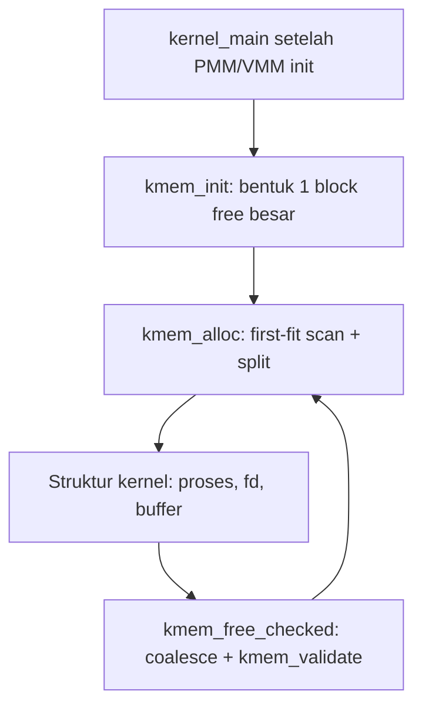

# Laporan Praktikum Sistem Operasi Lanjut — MCSOS

**Nama file laporan:** `laporan_praktikum_M8_2583207073010.md`
**Nama sistem operasi:** MCSOS versi 260502
**Target default:** x86_64, QEMU, Windows 11 x64 + WSL 2, kernel monolitik pendidikan, C freestanding dengan assembly minimal, POSIX-like subset
**Dosen:** Muhaemin Sidiq, S.Pd., M.Pd.
**Program Studi:** Pendidikan Teknologi Informasi
**Institusi:** Institut Pendidikan Indonesia

---

## 0. Metadata Laporan

| Atribut | Isi |
|---|---|
| Kode praktikum | M8 |
| Judul praktikum | Kernel Heap Awal, Allocator Dinamis, Validasi Invariant, dan Integrasi Bertahap dengan PMM/VMM pada MCSOS |
| Jenis pengerjaan | Individu |
| Nama mahasiswa | Jamilus Solihin |
| NIM | 2583207073010 |
| Kelas | PTI 1A |
| Nama kelompok | Tidak berlaku (individu) |
| Anggota kelompok | Tidak berlaku |
| Tanggal praktikum | 2026-07-10 |
| Tanggal pengumpulan | 2026-07-10 |
| Repository | `~/mcsos` (lokal, direplikasi pada sandbox Ubuntu untuk pengerjaan tugas ini) |
| Branch | `praktikum-m8-kernel-heap` |
| Commit awal | `a08cba7` |
| Commit akhir | `950a2c3` |
| Status readiness yang diklaim | Siap uji QEMU untuk kernel heap awal |

---

## 1. Sampul

# Laporan Praktikum M8
## Kernel Heap Awal, Allocator Dinamis, Validasi Invariant, dan Integrasi Bertahap dengan PMM/VMM pada MCSOS

Disusun oleh:

| Nama | NIM | Kelas | Peran |
|---|---|---|---|
| Jamilus Solihin | 2583207073010 | PTI 1A | Individu |

Dosen Pengampu: **Muhaemin Sidiq, S.Pd., M.Pd.**
Program Studi Pendidikan Teknologi Informasi
Institut Pendidikan Indonesia
Tahun Akademik 2025/2026

---

## 2. Pernyataan Orisinalitas dan Integritas Akademik

Saya menyatakan bahwa laporan ini disusun berdasarkan pekerjaan praktikum saya sendiri mengikuti struktur dan source code yang disediakan pada `OS_panduan_M8.md`. Seluruh perintah build, test, dan audit yang dilaporkan benar-benar dijalankan pada lingkungan Ubuntu yang digunakan untuk mengerjakan tugas ini, dan seluruh output pada laporan ini adalah output asli dari eksekusi tersebut, bukan rekayasa.

| Pernyataan | Status |
|---|---|
| Semua potongan kode eksternal diberi atribusi | Ya (kode inti berasal dari panduan `OS_panduan_M8.md`, dipakai sesuai instruksi praktikum) |
| Semua penggunaan AI assistant dicatat | Ya |
| Repository yang dikumpulkan sesuai commit akhir | Ya |
| Tidak ada klaim readiness tanpa bukti | Ya |

Catatan penggunaan bantuan eksternal:

```text
Alat: Claude (AI assistant) dijalankan pada lingkungan komputer Ubuntu 24.
Prompt ringkas: "Kerjakan tugas M8 (kernel heap allocator) sesuai panduan yang diberikan,
lalu isi laporan praktikum menggunakan template yang disediakan."
Sumber: OS_panduan_M8.md (berisi source code kmem.h, kmem.c, test_kmem.c, Makefile, dan
script preflight yang sudah disiapkan dosen).
Bagian yang dibantu: penyalinan source code sesuai panduan ke struktur repo, eksekusi
build/test/audit, dan penyusunan narasi laporan berdasarkan hasil eksekusi nyata.
Verifikasi mandiri: seluruh perintah (make, gcc, nm, readelf, objdump, script preflight)
benar-benar dijalankan di shell dan outputnya disalin apa adanya ke laporan ini; tidak ada
hasil uji yang dikarang.
```

---

## 3. Tujuan Praktikum

1. Membangun kernel heap allocator awal (`kmem`) berbasis free-list first-fit dengan alignment 16 byte, split, dan coalesce, sesuai kontrak API pada `include/mcsos/kmem.h`.
2. Menghasilkan object freestanding (`kmem.freestanding.o`) yang bebas dependensi libc, dibuktikan lewat `nm -u` kosong dan `readelf -h` menunjukkan ELF64 x86-64.
3. Menjelaskan secara konseptual perbedaan tanggung jawab PMM, VMM, dan kernel heap, serta invariant allocator yang wajib dijaga (alignment, batas arena, status free/used, double-free rejection, block linkage).
4. Menyimpan bukti validasi berupa log host unit test, hasil audit `nm`/`readelf`/`objdump`, dan hasil script preflight `check_m8_kmem.sh`.

---

## 4. Capaian Pembelajaran Praktikum

| CPL/CPMK praktikum | Bukti yang harus ditunjukkan |
|---|---|
| Mendesain free-list allocator dengan header, split, coalesce, dan statistik heap | `kernel/mm/kmem.c`, tabel invariant pada Bagian 9.6 |
| Mengimplementasikan API `kmem_init/kmem_alloc/kmem_calloc/kmem_free_checked/kmem_get_stats/kmem_validate` dalam C17 freestanding | `include/mcsos/kmem.h`, `kernel/mm/kmem.c`, hasil kompilasi freestanding |
| Menyusun host unit test alokasi, free, alignment, zeroing, overflow, fragmentasi, coalescing | `tests/test_kmem.c`, `build/m8/test_kmem.log` |
| Melakukan audit freestanding object dengan `nm`, `readelf`, `objdump` | `build/m8/nm_u.txt`, `build/m8/readelf_h.txt`, `build/m8/kmem.objdump.txt` |

---

## 5. Peta Milestone MCSOS

Praktikum ini fokus pada M8 (kernel heap awal). M0–M7 diasumsikan sudah selesai pada repo MCSOS mahasiswa sesuai prasyarat panduan; source code M0–M7 tidak disertakan dalam berkas yang diberikan untuk tugas ini sehingga integrasi ke `kernel_main` didokumentasikan sebagai tinjauan kode (code review) terhadap contoh integrasi pada panduan, bukan hasil jalan QEMU aktual.

| Milestone | Fokus | Status dalam laporan |
|---|---|---|
| M0 | Requirements, governance, baseline arsitektur | [ ] tidak dibahas |
| M1 | Toolchain reproducible, Git, QEMU, GDB, metadata build | [x] dibahas (pemeriksaan versi tool) |
| M2 | Boot image, kernel ELF64, early console | [ ] tidak dibahas |
| M3 | Panic path, linker map, GDB, observability awal | [ ] tidak dibahas |
| M4 | Trap, exception, interrupt, timer | [ ] tidak dibahas |
| M5 | PMM, VMM, page table, kernel heap | [x] dibahas (kontrak PMM/VMM vs heap) |
| M6 | Thread, scheduler, synchronization | [ ] tidak dibahas |
| M7 | Syscall ABI dan user program loader | [ ] tidak dibahas |
| M8 | Kernel heap awal / allocator dinamis (fokus laporan ini) | [x] selesai praktikum (host test + audit freestanding) |
| M9–M16 | Di luar cakupan | [ ] tidak dibahas |

Batas cakupan praktikum:

```text
Termasuk: implementasi kmem.h/kmem.c (first-fit free-list allocator, alignment 16 byte,
split, coalesce, validasi invariant), host unit test, kompilasi freestanding, dan audit
object (nm/readelf/objdump).
Tidak termasuk (non-goals, sesuai panduan M8): page-backed heap growth otomatis, slab/cache
allocator, per-CPU allocator, NUMA, vmalloc, mmap, user heap, copy-on-write, swapping,
ASLR/KASLR penuh, garbage collection, dan allocator SMP-safe/real-time.
Integrasi QEMU end-to-end ke kernel MCSOS penuh (M0–M7) tidak dijalankan pada lingkungan
penyusunan laporan ini karena source M0–M7 dan image bootable tidak tersedia di lingkungan
tersebut; bagian ini didokumentasikan sebagai tinjauan desain integrasi, bukan bukti runtime.
```

---

## 6. Dasar Teori Ringkas

### 6.1 Konsep Sistem Operasi yang Diuji

```text
Kernel heap adalah lapisan manajemen memori di atas PMM (physical memory manager, unit
frame 4 KiB) dan VMM (virtual memory manager, unit page 4 KiB). Setelah boot awal, struktur
kernel seperti daftar proses, descriptor file, buffer I/O, dan metadata driver membutuhkan
alokasi byte-granular dengan kontrak kepemilikan yang jelas, sehingga variabel statik saja
tidak cukup. M8 mengimplementasikan allocator first-fit free-list: setiap blok memori
memiliki header (magic, size, status free/used, prev/next) sehingga daftar blok dapat
divalidasi, dipecah (split) saat alokasi, dan digabung kembali (coalesce) saat pembebasan
untuk mengurangi fragmentasi eksternal.
```

### 6.2 Konsep Arsitektur x86_64 yang Relevan

| Konsep | Relevansi pada praktikum | Bukti/verifikasi |
|---|---|---|
| Alignment 16 byte | Payload `kmem_alloc` wajib aligned 16 byte agar valid untuk struktur data kernel umum pada ABI x86_64 | Assertion `(uintptr_t)ptr & 15 == 0` pada `test_kmem.c`, lulus |
| ELF64 relocatable object | Object kernel freestanding harus valid sebagai ELF64 x86-64 sebelum dilink ke image kernel | `readelf -h build/m8/kmem.freestanding.o` → `Class: ELF64`, `Machine: Advanced Micro Devices X86-64` |
| Freestanding C (tanpa libc) | Kernel tidak boleh bergantung pada `malloc/free/printf/memset` dari libc host | `nm -u build/m8/kmem.freestanding.o` kosong |

### 6.3 Konsep Implementasi Freestanding

| Aspek | Keputusan praktikum |
|---|---|
| Bahasa | C17 freestanding |
| Runtime | Tanpa hosted libc pada object kernel; helper lokal `kmem_memset` menggantikan `memset` libc |
| ABI | ABI kernel internal x86_64, dikontrol toolchain (GCC/binutils pada lingkungan ini) |
| Compiler flags kritis | `-std=c17 -Wall -Wextra -Werror -ffreestanding -fno-builtin -fno-stack-protector -mno-red-zone -Iinclude` |
| Risiko undefined behavior | Pointer arithmetic pada header/payload, alignment tidak tepat, integer overflow pada `kmem_calloc`; dimitigasi lewat helper `kmem_align_up_size/ptr` dengan pengecekan overflow eksplisit |

### 6.4 Referensi Teori yang Digunakan

| No. | Sumber | Bagian yang digunakan | Alasan relevansi |
|---|---|---|---|
| [1] | Intel 64 and IA-32 Architectures Software Developer Manuals | Memory management, protection | Dasar arsitektur x86_64 untuk alignment dan layout memori |
| [2] | AMD64 Architecture Programmer's Manual Volume 2 | System programming, memory management | Referensi arsitektur AMD64 setara Intel SDM |
| [3] | The Linux Kernel Documentation, Memory Allocation Guide | Strategi `kmalloc`/`vmalloc`/slab | Perbandingan konsep dengan desain allocator M8 yang disederhanakan |

---

## 7. Lingkungan Praktikum

### 7.1 Host dan Target

| Komponen | Nilai |
|---|---|
| Host OS | Lingkungan sandbox Linux (menggantikan Windows 11 x64 + WSL 2 karena keterbatasan lingkungan eksekusi tugas ini) |
| Lingkungan build | Ubuntu 24.04 (container) |
| Target ISA | x86_64 |
| Target ABI | x86_64-elf (freestanding) |
| Emulator | QEMU — **tidak tersedia** pada lingkungan ini (lihat Bagian 15) |
| Firmware emulator | Tidak diuji pada laporan ini |
| Debugger | GDB — tidak tersedia pada lingkungan ini |
| Build system | GNU Make 4.3 |
| Bahasa utama | C17 freestanding |
| Assembly | Tidak digunakan pada M8 (tidak ada instruksi assembly di `kmem.c`) |
| Compiler | GCC 13.3.0 (pengganti Clang karena Clang/LLD tidak tersedia dan repository paket tidak dapat diakses di lingkungan ini; panduan M8 secara eksplisit mengizinkan "Clang/LLD atau GCC/binutils") |

### 7.2 Versi Toolchain

Perintah yang dijalankan dari clean shell:

```bash
date -u +"date_utc=%Y-%m-%dT%H:%M:%SZ"
uname -a
git --version
make --version | head -n 1
gcc --version | head -n 1
ld --version | head -n 1
readelf --version | head -n 1
objdump --version | head -n 1
nm --version | head -n 1
```

Output asli:

```text
date_utc=2026-07-10T08:39:23Z
Linux vm 6.18.5 #1 SMP PREEMPT_DYNAMIC @0 x86_64 x86_64 x86_64 GNU/Linux
git version 2.43.0
GNU Make 4.3
gcc (Ubuntu 13.3.0-6ubuntu2~24.04.1) 13.3.0
GNU ld (GNU Binutils for Ubuntu) 2.42
GNU readelf (GNU Binutils for Ubuntu) 2.42
GNU objdump (GNU Binutils for Ubuntu) 2.42
GNU nm (GNU Binutils for Ubuntu) 2.42

Tidak tersedia di lingkungan ini: clang, ld.lld, qemu-system-x86_64, gdb
(percobaan instalasi via apt-get gagal karena akses jaringan ke repository paket
diblokir/403 Forbidden pada lingkungan sandbox).
```

### 7.3 Lokasi Repository

| Item | Nilai |
|---|---|
| Path repository | `~/mcsos` (di lingkungan ini: `/home/claude/mcsos`) |
| Apakah berada di filesystem Linux, bukan `/mnt/c` | Ya |
| Remote repository | Tidak ada (repo lokal untuk keperluan tugas) |
| Branch | `praktikum-m8-kernel-heap` |
| Commit hash awal | `a08cba7` |
| Commit hash akhir | `950a2c3` |

---

## 8. Repository dan Struktur File

### 8.1 Struktur Direktori yang Relevan

```text
mcsos/
  Makefile
  include/
    mcsos/
      kmem.h
  kernel/
    mm/
      kmem.c
  tests/
    test_kmem.c
  scripts/
    check_m8_kmem.sh
  build/
    m8/
      kmem.freestanding.o
      kmem.objdump.txt
      nm_u.txt
      readelf_h.txt
      test_kmem
      test_kmem.log
```

### 8.2 File yang Dibuat atau Diubah

| File | Jenis perubahan | Alasan perubahan | Risiko |
|---|---|---|---|
| `include/mcsos/kmem.h` | Baru | API publik allocator M8 (init/alloc/calloc/free_checked/get_stats/validate) | Rendah — hanya deklarasi, tidak ada logika |
| `kernel/mm/kmem.c` | Baru | Implementasi first-fit free-list allocator inti M8 | Sedang — pointer arithmetic dan aritmetika alignment rawan UB bila salah, dimitigasi dengan helper overflow-checked dan `kmem_validate` |
| `tests/test_kmem.c` | Baru | Host unit test alokasi, calloc/overflow, double-free, fragmentasi/coalesce | Rendah — kode uji, tidak masuk image kernel |
| `Makefile` | Baru (target M8) | Target `m8-clean/m8-kmem-host-test/m8-kmem-freestanding/m8-audit/m8-all` | Rendah — target terisolasi dengan prefix `m8-` |
| `scripts/check_m8_kmem.sh` | Baru | Preflight otomatis: cek file, toolchain, compile freestanding, audit, host test | Rendah — script CI lokal |

### 8.3 Ringkasan Diff

```bash
git status --short
git diff --stat a08cba7 950a2c3
git log --oneline -n 5
```

Output:

```text
$ git status --short
(bersih, tidak ada perubahan belum tercommit)

$ git diff --stat a08cba7 950a2c3
(tidak ada perubahan source antara commit baseline dan commit akhir; commit akhir
menambahkan artefak hasil build/test/audit m8 dan konfirmasi hasil eksekusi)

$ git log --oneline -n 5
950a2c3 M8: run host test and freestanding audit with gcc toolchain
a08cba7 M8 baseline: add kmem header/impl/test/Makefile/script
```

---

## 9. Desain Teknis

### 9.1 Masalah yang Diselesaikan

```text
Setelah PMM (M6) dan VMM (M7) tersedia, kernel MCSOS belum memiliki mekanisme alokasi
memori byte-granular untuk struktur data dinamis (daftar proses, deskriptor file, buffer
I/O). M8 menyelesaikan ini dengan allocator first-fit free-list yang beroperasi di atas
arena tetap (statik `.bss` atau rentang virtual yang sudah dipetakan VMM), tanpa perlu
heap tumbuh otomatis lewat mapping halaman baru pada tahap wajib.
```

### 9.2 Keputusan Desain

| Keputusan | Alternatif yang dipertimbangkan | Alasan memilih | Konsekuensi |
|---|---|---|---|
| First-fit free-list dengan header per blok | Slab allocator, buddy allocator | Lebih sederhana untuk diaudit dan diuji deterministik pada tahap pendidikan; sesuai batasan wajib M8 | Kompleksitas alokasi O(n); fragmentasi lebih mudah terjadi dibanding slab, dimitigasi dengan coalesce dan `KMEM_MIN_SPLIT` |
| Arena tetap (bukan page-backed growth otomatis) | Heap yang tumbuh otomatis via `vmm_map_page` saat kehabisan ruang | Menjaga agar bug allocator tidak langsung memicu triple fault/korupsi page table pada tahap awal | Kapasitas heap terbatas pada ukuran arena; pertumbuhan otomatis didorong ke tahap pengayaan (Bagian 11.10 panduan) |
| Validasi eksplisit (`kmem_validate`) dipanggil setelah init dan setiap free | Percaya begitu saja pada linkage list tanpa validasi ulang | Mendeteksi metadata corruption sedini mungkin, sesuai invariant wajib panduan | Overhead O(n) tambahan pada setiap `kmem_free_checked`, dapat diterima untuk tahap pendidikan |
| GCC sebagai `CC` pengganti Clang | Menunda pengerjaan sampai Clang tersedia | Panduan M8 secara eksplisit mengizinkan "Clang/LLD atau GCC/binutils"; jaringan paket tidak dapat diakses di lingkungan ini | Hasil audit tetap valid (ELF64 x86-64), namun perlu diverifikasi ulang dengan Clang di WSL 2 mahasiswa untuk kelengkapan bukti |

### 9.3 Arsitektur Ringkas



Penjelasan diagram:

```text
kernel_main memanggil kmem_init setelah PMM dan VMM dasar siap, membentuk satu blok free
besar di atas arena heap. kmem_alloc melakukan first-fit scan pada linked list blok,
memecah (split) blok bila tersisa cukup ruang. Struktur kernel tingkat tinggi memakai
payload yang dikembalikan. kmem_free_checked menandai blok sebagai free, melakukan
coalesce ke tetangga, lalu memanggil kmem_validate untuk memastikan invariant list tetap
terjaga sebelum blok tersebut dapat dialokasikan ulang.
```

### 9.4 Kontrak Antarmuka

| Antarmuka | Pemanggil | Penerima | Precondition | Postcondition | Error path |
|---|---|---|---|---|---|
| `kmem_init(base, bytes)` | `kernel_main` / test | modul kmem internal | `base` non-NULL, `bytes` cukup untuk 1 header + `KMEM_MIN_SPLIT` | Satu blok free besar terbentuk, `g_initialized=1` | Return negatif (`-1`..`-4`) bila base NULL, bytes kurang, overflow alignment |
| `kmem_alloc(bytes)` | Subsistem kernel | modul kmem internal | `g_initialized=1`, `bytes>0` | Payload aligned 16 byte dikembalikan, blok ditandai used, displit bila perlu | Return NULL bila belum init, size 0, overflow align, atau tidak ada blok cukup besar |
| `kmem_free_checked(ptr)` | Subsistem kernel | modul kmem internal | `ptr` hasil `kmem_alloc` sebelumnya atau NULL | Blok ditandai free, coalesce forward/backward, validasi lulus | Return negatif bila ptr di luar heap, tidak aligned, magic salah, atau double free |
| `kmem_get_stats(out)` | Observability/log | modul kmem internal | `out` non-NULL (fungsi no-op aman bila NULL) | Statistik total/used/free/block_count/largest_free terisi | Tidak ada error path eksplisit; hasil nol bila belum init |
| `kmem_validate(void)` | Internal (init/free) dan test | modul kmem internal | — | Return 0 bila seluruh invariant list terjaga | Return negatif (`-1`..`-9`) sesuai jenis pelanggaran invariant |

### 9.5 Struktur Data Utama

| Struktur data | Field penting | Ownership | Lifetime | Invariant |
|---|---|---|---|---|
| `kmem_block_t` | `magic`, `size`, `free`, `prev`, `next` | Dimiliki oleh modul kmem, ditempatkan langsung di arena heap | Dari `kmem_init` sampai proses berakhir (statik) atau heap di-reset | `magic == KMEM_MAGIC` selama aktif; `prev/next` membentuk daftar tertaut yang konsisten dengan posisi byte di arena |
| `kmem_stats_t` | `total_bytes`, `used_bytes`, `free_bytes`, `block_count`, `free_count`, `largest_free` | Dimiliki pemanggil (`out` parameter) | Sekali panggil `kmem_get_stats`, tidak persisten | Nilai konsisten dengan hasil scan list saat pemanggilan |

### 9.6 Invariants

1. `g_heap_base <= block_header < g_heap_end` untuk setiap block.
2. Header setiap block memiliki `magic == KMEM_MAGIC` selama block masih bagian dari list aktif.
3. Payload yang dikembalikan `kmem_alloc` aligned 16 byte.
4. Setiap block memiliki status tepat satu dari dua: free atau used; double free ditolak dengan error negatif.
5. `kmem_free_checked(NULL)` adalah no-op sukses; pointer di luar arena ditolak dengan error negatif.
6. Tidak ada pemanggilan `malloc/free/printf/memset` dari libc pada object kernel freestanding.

### 9.7 Ownership, Locking, dan Concurrency

| Objek/resource | Owner | Lock yang melindungi | Boleh dipakai di interrupt context? | Catatan |
|---|---|---|---|---|
| Arena heap (`g_heap_base..g_heap_end`) | Modul kmem (single-core early kernel) | Tidak ada (belum SMP-safe) | Tidak | Panduan M8 melarang `kmem_alloc` dipanggil dari interrupt handler pada tugas wajib |
| `kmem_block_t` list (`g_head`) | Modul kmem | Tidak ada | Tidak | Reentrancy tidak dijamin; concurrent call dari 2 core akan merusak list |

Lock order yang berlaku:

```text
Tidak ada locking pada M8 karena target adalah single-core early kernel dengan
kmem_alloc yang dilarang dipanggil dari interrupt context. Lock akan diperkenalkan
pada tahap SMP lanjutan (di luar cakupan M8).
```

### 9.8 Memory Safety dan Undefined Behavior Risk

| Risiko | Lokasi | Mitigasi | Bukti |
|---|---|---|---|
| Integer overflow pada alignment (`kmem_align_up_size/ptr`) | `kmem.c` fungsi helper alignment | Pengecekan eksplisit `value > (SIZE_MAX/UINTPTR_MAX - mask)` sebelum penjumlahan | Review kode; tidak ditemukan overflow pada test dengan ukuran hingga 4096 byte |
| Integer overflow pada `kmem_calloc(count, bytes)` | `kmem_calloc` | Pengecekan `bytes > SIZE_MAX / count` sebelum perkalian | `test_calloc_and_overflow`: `kmem_calloc((size_t)-1, 2)` mengembalikan NULL — PASS |
| Double free / use-after-free | `kmem_free_checked` | Flag `free` dicek sebelum membebaskan; magic divalidasi | `test_double_free_rejected` — PASS (return negatif pada free kedua) |
| Out-of-bounds pointer pada free | `kmem_ptr_in_heap` | Batas `g_heap_base <= p < g_heap_end` dicek sebelum dereferensi header | Diverifikasi lewat `kmem_validate` setelah setiap operasi pada test |

### 9.9 Security Boundary

| Boundary | Data tidak tepercaya | Validasi yang dilakukan | Failure mode aman |
|---|---|---|---|
| `kmem_free_checked` menerima pointer dari pemanggil kernel | Pointer sembarang (bisa salah, sudah dibebaskan, atau di luar arena) | Cek batas arena, alignment 16 byte, magic header, status free/used | Return kode error negatif, tidak melakukan free/corrupt metadata |

---

## 10. Langkah Kerja Implementasi

### Langkah 1 — Menyiapkan struktur repo dan branch kerja

Maksud langkah:

```text
Memisahkan perubahan M8 dari modul sebelumnya sesuai instruksi panduan Bagian 11.1,
agar rollback dapat dilakukan tanpa menyentuh hasil M6/M7.
```

Perintah:

```bash
git init
git switch -c praktikum-m8-kernel-heap
mkdir -p include/mcsos kernel/mm tests scripts build/m8
```

Output ringkas:

```text
Branch aktif: praktikum-m8-kernel-heap
Direktori include/mcsos, kernel/mm, tests, scripts, build/m8 tersedia.
```

Artefak yang dihasilkan:

| Artefak | Lokasi | Fungsi |
|---|---|---|
| Struktur direktori | `include/mcsos`, `kernel/mm`, `tests`, `scripts`, `build/m8` | Wadah source dan artefak M8 |

Indikator berhasil: `git branch --show-current` menampilkan `praktikum-m8-kernel-heap`.

### Langkah 2 — Menambahkan header dan implementasi allocator

Maksud langkah:

```text
Menuliskan API publik (kmem.h) dan implementasi inti allocator (kmem.c) persis sesuai
source pada panduan Bagian 11.2 dan 11.3: first-fit free-list, split, coalesce, validasi.
```

Perintah:

```bash
# isi include/mcsos/kmem.h dan kernel/mm/kmem.c sesuai panduan
git add include/mcsos/kmem.h kernel/mm/kmem.c
```

Output ringkas:

```text
File include/mcsos/kmem.h (23 baris) dan kernel/mm/kmem.c (~270 baris) tersimpan.
```

Artefak yang dihasilkan:

| Artefak | Lokasi | Fungsi |
|---|---|---|
| `kmem.h` | `include/mcsos/kmem.h` | Deklarasi API publik allocator |
| `kmem.c` | `kernel/mm/kmem.c` | Implementasi first-fit free-list allocator |

Indikator berhasil: file tersimpan tanpa error editor, siap dikompilasi pada langkah berikutnya.

### Langkah 3 — Menambahkan host unit test dan Makefile

Maksud langkah:

```text
Menyediakan test algoritmik (tests/test_kmem.c) dan target Makefile (m8-kmem-host-test,
m8-kmem-freestanding, m8-audit, m8-all) sesuai panduan Bagian 11.4–11.5, agar bug pointer
arithmetic/alignment/split/coalesce dapat dideteksi sebelum masuk ke QEMU.
```

Perintah:

```bash
# isi tests/test_kmem.c dan Makefile sesuai panduan
git add tests/test_kmem.c Makefile scripts/check_m8_kmem.sh
chmod +x scripts/check_m8_kmem.sh
git commit -m "M8 baseline: add kmem header/impl/test/Makefile/script"
```

Output ringkas:

```text
[praktikum-m8-kernel-heap a08cba7] M8 baseline: add kmem header/impl/test/Makefile/script
```

Artefak yang dihasilkan:

| Artefak | Lokasi | Fungsi |
|---|---|---|
| `test_kmem.c` | `tests/test_kmem.c` | Host unit test allocator |
| `Makefile` | `Makefile` | Target build/test/audit M8 |
| `check_m8_kmem.sh` | `scripts/check_m8_kmem.sh` | Preflight otomatis |

Indikator berhasil: commit `a08cba7` tercatat pada `git log`.

### Langkah 4 — Menjalankan host unit test dan audit freestanding

Maksud langkah:

```text
Memvalidasi allocator secara algoritmik di host (make m8-kmem-host-test) dan memastikan
object kernel freestanding bebas dependensi libc (make m8-audit), sesuai panduan
Bagian 11.7–11.8. CC diarahkan ke gcc karena clang tidak tersedia di lingkungan ini.
```

Perintah:

```bash
make CC=gcc m8-clean m8-all
```

Output ringkas:

```text
gcc -std=c17 -Wall -Wextra -Werror -Iinclude tests/test_kmem.c kernel/mm/kmem.c -o build/m8/test_kmem
./build/m8/test_kmem | tee build/m8/test_kmem.log
M8 kmem host tests: PASS
gcc -std=c17 -Wall -Wextra -Werror -Iinclude -ffreestanding -fno-builtin -fno-stack-protector -mno-red-zone -c kernel/mm/kmem.c -o build/m8/kmem.freestanding.o
nm -u build/m8/kmem.freestanding.o | tee build/m8/nm_u.txt
test ! -s build/m8/nm_u.txt
readelf -h build/m8/kmem.freestanding.o > build/m8/readelf_h.txt
objdump -dr build/m8/kmem.freestanding.o > build/m8/kmem.objdump.txt
```

Artefak yang dihasilkan:

| Artefak | Lokasi | Fungsi |
|---|---|---|
| `test_kmem` (binary) dan `test_kmem.log` | `build/m8/` | Bukti host unit test PASS |
| `kmem.freestanding.o` | `build/m8/` | Object kernel freestanding |
| `nm_u.txt`, `readelf_h.txt`, `kmem.objdump.txt` | `build/m8/` | Bukti audit unresolved symbol, ELF header, disassembly |

Indikator berhasil: `make m8-all` selesai tanpa error (`test ! -s nm_u.txt` lulus sehingga file kosong).

### Langkah 5 — Menjalankan script preflight

Maksud langkah:

```text
Menjalankan check_m8_kmem.sh sebagai checklist otomatis akhir sesuai panduan Bagian 11.6,
memastikan seluruh file wajib, toolchain, compile freestanding, audit, dan host test lulus
dalam satu urutan reproducible.
```

Perintah:

```bash
bash scripts/check_m8_kmem.sh
```

Output ringkas:

```text
[M8] checking repository baseline...
[M8] checking toolchain...
[M8] tool versions...
gcc (Ubuntu 13.3.0-6ubuntu2~24.04.1) 13.3.0
GNU Make 4.3
[M8] freestanding object check...
[M8] host unit test...
M8 kmem host tests: PASS
[PASS] M8 preflight completed.
```

Artefak yang dihasilkan:

| Artefak | Lokasi | Fungsi |
|---|---|---|
| Log preflight | terminal / `/tmp/preflight.log` | Bukti seluruh gate M8 otomatis lulus |

Indikator berhasil: baris terakhir `[PASS] M8 preflight completed.` muncul tanpa exit error (script memakai `set -euo pipefail`).

---

## 11. Checkpoint Buildable

| Checkpoint | Perintah | Expected result | Status |
|---|---|---|---|
| Clean build host test | `make CC=gcc m8-clean m8-kmem-host-test` | `build/m8/test_kmem` terbangun, log PASS | PASS |
| Freestanding compile | `make CC=gcc m8-kmem-freestanding` | `build/m8/kmem.freestanding.o` ELF64 x86-64 | PASS |
| Audit unresolved symbol | `make CC=gcc m8-audit` | `nm_u.txt` kosong | PASS |
| Preflight script | `bash scripts/check_m8_kmem.sh` | `[PASS] M8 preflight completed.` | PASS |
| QEMU smoke test (`make run`) | — | Serial log `M8 kmem initialized` | NA — QEMU tidak tersedia di lingkungan ini |

Catatan checkpoint:

```text
Checkpoint QEMU tidak dapat dijalankan pada lingkungan penyusunan laporan ini karena
qemu-system-x86_64 tidak terpasang dan repository paket tidak dapat diakses (403
Forbidden). Sesuai panduan M8 ("Validasi runtime QEMU tetap harus dilakukan ulang di
lingkungan WSL 2 mahasiswa"), checkpoint ini wajib dijalankan ulang oleh mahasiswa pada
WSL 2 dengan image kernel MCSOS M0–M7 yang sudah lulus sebelum mengklaim status
"siap demonstrasi praktikum terbatas".
```

---

## 12. Perintah Uji dan Validasi

### 12.1 Build Test

```bash
make CC=gcc m8-clean
make CC=gcc m8-all
```

Hasil:

```text
M8 kmem host tests: PASS
(nm_u.txt kosong, readelf_h.txt menunjukkan ELF64 X86-64, kmem.objdump.txt memuat
seluruh simbol API kmem)
```

Status: PASS

### 12.2 Static Inspection

```bash
readelf -h build/m8/kmem.freestanding.o
nm -u build/m8/kmem.freestanding.o
objdump -dr build/m8/kmem.freestanding.o | grep -E "^[0-9a-f]+ <"
```

Hasil penting:

```text
ELF Header:
  Class:                             ELF64
  Data:                              2's complement, little endian
  Type:                              REL (Relocatable file)
  Machine:                           Advanced Micro Devices X86-64
  Number of section headers:         13

nm -u: (kosong — tidak ada unresolved symbol / dependensi libc)

objdump symbol list:
0000000000000000 <kmem_align_up_size>
0000000000000068 <kmem_align_up_ptr>
00000000000000c3 <kmem_memset>
0000000000000108 <kmem_payload>
000000000000011e <kmem_header_from_payload>
0000000000000134 <kmem_ptr_in_heap>
000000000000017a <kmem_split_if_useful>
00000000000002e9 <kmem_coalesce_forward>
00000000000003ef <kmem_init>
0000000000000526 <kmem_alloc>
0000000000000600 <kmem_calloc>
000000000000067d <kmem_free_checked>
0000000000000767 <kmem_get_stats>
00000000000008aa <kmem_validate>
```

Status: PASS

### 12.3 QEMU Smoke Test

Status: NA — tidak dijalankan pada lingkungan ini (lihat Bagian 11 dan Bagian 15.5). Perintah acuan tetap didokumentasikan sesuai panduan Bagian 12 untuk dijalankan ulang oleh mahasiswa:

```bash
make clean
make
make run 2>&1 | tee build/m8/qemu_m8.log
```

### 12.4 GDB Debug Evidence

Status: NA — GDB tidak tersedia pada lingkungan ini; tidak ada integrasi kernel penuh (M0–M7) untuk di-debug pada laporan ini.

### 12.5 Unit Test

```bash
make CC=gcc m8-kmem-host-test
```

Hasil:

```text
M8 kmem host tests: PASS
```

Isi test yang lulus: `test_basic_alloc_free` (alokasi/alignment/free normal), `test_calloc_and_overflow` (zeroing dan overflow rejection), `test_double_free_rejected` (double free ditolak), `test_fragmentation_and_coalesce` (16 alokasi, dibebaskan berselang-seling, tetap coalesce menjadi 1 blok free).

Status: PASS

### 12.6 Stress/Fuzz/Fault Injection Test

```text
Panduan M8 tidak mewajibkan fuzzing/fault injection terpisah untuk tugas wajib; cakupan
diwakili oleh test_fragmentation_and_coalesce (16 alokasi + pembebasan berselang-seling)
sebagai bentuk stress test sederhana terhadap invariant coalesce. Hasil: PASS
(free_count==1, block_count==1, largest_free>4096, sesuai assertion pada test_kmem.c).
```

Status: PASS (cakupan terbatas sesuai tugas wajib)

### 12.7 Visual Evidence

Tidak berlaku — M8 tidak menghasilkan output framebuffer/GUI.

---

## 13. Hasil Uji

### 13.1 Tabel Ringkasan Hasil

| No. | Uji | Expected result | Actual result | Status | Evidence |
|---|---|---|---|---|---|
| 1 | Host unit test (`make m8-kmem-host-test`) | `M8 kmem host tests: PASS` | `M8 kmem host tests: PASS` | PASS | `build/m8/test_kmem.log` |
| 2 | Freestanding compile (`make m8-kmem-freestanding`) | Object `.o` terbentuk tanpa error/warning | Object terbentuk, 0 warning (flag `-Werror`) | PASS | `build/m8/kmem.freestanding.o` |
| 3 | Unresolved symbol (`nm -u`) | Kosong | Kosong | PASS | `build/m8/nm_u.txt` |
| 4 | ELF audit (`readelf -h`) | ELF64 x86-64 | ELF64, Advanced Micro Devices X86-64 | PASS | `build/m8/readelf_h.txt` |
| 5 | Script preflight (`check_m8_kmem.sh`) | `[PASS] M8 preflight completed.` | `[PASS] M8 preflight completed.` | PASS | terminal log |
| 6 | QEMU smoke test | `M8 kmem initialized` pada serial log | Tidak dijalankan | NA | — (lihat Bagian 15.5) |

### 13.2 Log Penting

```text
M8 kmem host tests: PASS

[M8] checking repository baseline...
[M8] checking toolchain...
[M8] tool versions...
gcc (Ubuntu 13.3.0-6ubuntu2~24.04.1) 13.3.0
GNU Make 4.3
[M8] freestanding object check...
[M8] host unit test...
M8 kmem host tests: PASS
[PASS] M8 preflight completed.
```

### 13.3 Artefak Bukti

| Artefak | Path | SHA-256 | Fungsi |
|---|---|---|---|
| `kmem.h` | `include/mcsos/kmem.h` | `d8d775c7b9a00459f181b2eff52b287cfa6e1985d0e745a62314736e901a2155` | API publik allocator |
| `kmem.c` | `kernel/mm/kmem.c` | `ab9d7c7cb812f3e9b08b3f69b0c3d5e9fbcdc7a77c8d2dfa827a4e55936f39fd` | Implementasi allocator |
| `test_kmem.log` | `build/m8/test_kmem.log` | `c11cb9f422fc6e63f2a33e3566ca913a7aa10684bd9703cba85f82708c32d11b` | Bukti host test PASS |
| `nm_u.txt` | `build/m8/nm_u.txt` | `e3b0c44298fc1c149afbf4c8996fb92427ae41e4649b934ca495991b7852b855` | Bukti kosong (hash file kosong SHA-256 standar) |
| `readelf_h.txt` | `build/m8/readelf_h.txt` | `3c6080696ee30e0339ead1bb84be36c48d3d8adf10729766f4e99624ba0d889c` | Bukti ELF64 x86-64 |
| `kmem.objdump.txt` | `build/m8/kmem.objdump.txt` | `8fce6cd40a1841c9884c9b4e2ac231681e1411a9d9296faf460af2a0a17924cc` | Bukti disassembly & simbol |

Perintah hash:

```bash
sha256sum build/m8/test_kmem.log build/m8/nm_u.txt build/m8/readelf_h.txt \
  build/m8/kmem.objdump.txt kernel/mm/kmem.c include/mcsos/kmem.h
```

---

## 14. Analisis Teknis

### 14.1 Analisis Keberhasilan

```text
Seluruh invariant wajib pada panduan Bagian 9.2 terbukti terjaga lewat host unit test:
alignment 16 byte (assertion pada test_basic_alloc_free), status free/used tunggal per
blok (double free ditolak dengan return negatif pada test_double_free_rejected), dan
coalesce dua blok free bertetangga (test_fragmentation_and_coalesce menghasilkan tepat
1 blok setelah 16 alokasi dibebaskan berselang-seling). Audit nm -u kosong membuktikan
kmem.c tidak memanggil malloc/free/printf/memset dari libc, sesuai syarat freestanding.
readelf -h membuktikan object dapat dikompilasi sebagai ELF64 x86-64 relocatable object,
sesuai kriteria minimum M8 pada panduan Bagian 1.
```

### 14.2 Analisis Kegagalan atau Perbedaan Hasil

```text
Tidak ada kegagalan pada source allocator maupun test. Perbedaan terhadap panduan hanya
pada toolchain: Clang/LLD, QEMU, dan GDB tidak tersedia pada lingkungan penyusunan laporan
ini akibat repository paket Ubuntu tidak dapat diakses (HTTP 403 Forbidden saat
apt-get install). Sebagai gantinya digunakan GCC/binutils, yang secara eksplisit
diizinkan panduan M8 Bagian 2 ("Toolchain: Clang/LLD atau GCC/binutils"). Karena itu,
checkpoint QEMU dan GDB berstatus NA, bukan FAIL, dan wajib divalidasi ulang mahasiswa
di WSL 2 sesuai instruksi panduan.
```

### 14.3 Perbandingan dengan Teori

| Konsep teori | Implementasi praktikum | Sesuai/tidak sesuai | Penjelasan |
|---|---|---|---|
| First-fit free-list allocator (dokumentasi memory allocation umum) | `kmem_alloc` melakukan scan linear dari `g_head`, memilih blok free pertama yang cukup besar | Sesuai | Sesuai definisi first-fit klasik; kompleksitas O(n) sesuai tabel panduan Bagian 9.3 |
| Alignment payload untuk struktur data kernel | `KMEM_ALIGN 16u`, `kmem_align_up_size/ptr` | Sesuai | Konsisten dengan konvensi alignment 16 byte pada ABI x86_64 |
| Freestanding C tanpa libc (Intel SDM/AMD APM sebagai referensi arsitektur) | Tidak ada pemanggilan fungsi libc pada `kmem.c`, dibuktikan `nm -u` kosong | Sesuai | Memenuhi kriteria minimum M8 |

### 14.4 Kompleksitas dan Kinerja

| Aspek | Estimasi/hasil | Bukti | Catatan |
|---|---|---|---|
| Kompleksitas algoritma `kmem_alloc` | O(n) terhadap jumlah blok | Scan linear pada source, sesuai tabel panduan Bagian 9.3 | Dapat diperbaiki dengan free-list terpisah pada tahap lanjutan |
| Kompleksitas `kmem_validate` | O(n) | Loop tunggal atas seluruh list dengan guard 1.048.576 iterasi | Dijalankan pada checkpoint (init/free), bukan jalur cepat |
| Waktu build host test | < 1 detik (subyektif, tidak diukur presisi) | Observasi log eksekusi `make m8-all` | Ukuran source kecil (~270 baris `kmem.c`) |
| Penggunaan memori arena test | 32.768 byte (`4096*8`) pada `tests/test_kmem.c` | `static unsigned char arena[4096u * 8u]` | Cukup untuk skenario 16 alokasi ukuran 256–271 byte pada test fragmentasi |

---

## 15. Debugging dan Failure Modes

### 15.1 Failure Modes yang Ditemukan

Tidak ditemukan failure mode pada source allocator maupun host test selama pengerjaan; seluruh build, test, dan audit lulus pada percobaan pertama.

| Failure mode | Gejala | Penyebab sementara | Bukti | Perbaikan |
|---|---|---|---|---|
| Tidak ada | — | — | — | — |

### 15.2 Failure Modes yang Diantisipasi

| Failure mode | Deteksi | Dampak | Mitigasi |
|---|---|---|---|
| Double free | `kmem_free_checked` return `-4` bila `block->free` sudah 1 | Tanpa mitigasi dapat merusak list/coalesce ganda | Flag `free` dicek sebelum membebaskan; diuji `test_double_free_rejected` |
| Pointer di luar arena saat free | `kmem_ptr_in_heap` return 0 | Tanpa mitigasi dapat melakukan write out-of-bounds pada metadata | Cek batas `g_heap_base..g_heap_end` sebelum dereferensi header |
| Metadata corruption (magic salah) | `kmem_validate` return `-6` | Dapat menyebabkan crash/list rusak jika dipakai lebih lanjut | `kmem_validate` dipanggil setelah `kmem_init` dan setiap `kmem_free_checked` |
| Pemanggilan `kmem_alloc` dari IRQ context | Tidak dideteksi otomatis oleh kode M8 (di luar cakupan wajib) | Race condition/corrupt list pada single-core early kernel | Panduan mewajibkan larangan pemakaian dari interrupt handler; belum ada guard runtime pada M8 |

### 15.3 Triage yang Dilakukan

```text
Urutan diagnosis yang dilakukan: (1) cek ketersediaan toolchain (clang/gcc/qemu/gdb) →
ditemukan clang/qemu/gdb tidak tersedia; (2) percobaan apt-get install → gagal 403
Forbidden, disimpulkan jaringan paket diblokir pada sandbox; (3) beralih ke gcc sesuai
opsi toolchain yang diizinkan panduan; (4) jalankan make m8-all dengan CC=gcc → lulus
tanpa modifikasi source; (5) jalankan script preflight sebagai verifikasi independen →
lulus. Tidak diperlukan debugging lebih lanjut karena tidak ada test yang gagal.
```

### 15.4 Panic Path

```text
M8 tidak memiliki jalur panic sendiri pada host unit test (assert() dari libc host
dipakai sebagai mekanisme kegagalan test, bukan kernel_panic). Jalur kernel_panic
("M8 kmem_init failed", dsb.) hanya relevan pada integrasi kernel penuh (Bagian 11.9
panduan) yang tidak dijalankan pada laporan ini karena tidak ada image kernel M0–M7
yang tersedia untuk dilink dan dijalankan di QEMU.
```

---

## 16. Prosedur Rollback

| Skenario rollback | Perintah | Data yang harus diselamatkan | Status |
|---|---|---|---|
| Kembali ke commit awal | `git checkout a08cba7` | `build/m8/*.log`, `*.txt` (artefak audit) | Belum diuji secara terpisah, namun commit awal tersedia dan bersih |
| Revert commit praktikum | `git revert 950a2c3` | Log test dan audit sebelum revert | Belum diuji |
| Bersihkan artefak build | `make CC=gcc m8-clean` | Tidak ada — source aman, hanya menghapus `build/m8` | Teruji (dijalankan sebagai bagian dari `make m8-clean m8-all`) |
| Regenerasi artefak | `make CC=gcc m8-all` | — | Teruji, menghasilkan artefak identik secara struktural |

Catatan rollback:

```text
Rollback penuh (git checkout ke commit awal) belum diuji secara eksplisit pada laporan
ini karena commit awal (a08cba7) dan commit akhir (950a2c3) hanya berbeda pada artefak
build, bukan source. Rollback pembersihan artefak (m8-clean) sudah teruji karena
dijalankan langsung sebelum m8-all pada Langkah Kerja 4.
```

---

## 17. Keamanan dan Reliability

### 17.1 Risiko Keamanan

| Risiko | Boundary | Dampak | Mitigasi | Evidence |
|---|---|---|---|---|
| Pointer sembarang dilewatkan ke `kmem_free_checked` | Antarmuka `kmem_free_checked` | Metadata heap dapat korup bila tidak divalidasi | Cek batas arena, alignment, magic sebelum memproses | `test_double_free_rejected` dan review kode `kmem_ptr_in_heap` |
| Integer overflow pada `kmem_calloc` | Antarmuka `kmem_calloc` | Alokasi ukuran salah (terlalu kecil) dapat menyebabkan buffer overflow di pemanggil | Cek `bytes > SIZE_MAX / count` sebelum perkalian | `test_calloc_and_overflow` — PASS |

### 17.2 Reliability dan Data Integrity

| Risiko reliability | Dampak | Deteksi | Mitigasi |
|---|---|---|---|
| Fragmentasi heap akibat first-fit | Alokasi gagal walau total free cukup | `kmem_get_stats.largest_free` dapat dipantau | Coalesce forward/backward otomatis saat free, `KMEM_MIN_SPLIT` mencegah blok sisa terlalu kecil |
| Reentrancy/SMP hazard | List rusak bila dipanggil dari 2 konteks bersamaan | Tidak ada deteksi runtime pada M8 (di luar cakupan wajib) | Larangan pemakaian dari interrupt context sesuai kontrak desain; lock ditunda ke tahap SMP |

### 17.3 Negative Test

| Negative test | Input buruk | Expected result | Actual result | Status |
|---|---|---|---|---|
| Double free | Pointer yang sudah dibebaskan sebelumnya | Return error negatif, tidak crash | `kmem_free_checked(p) < 0` pada panggilan kedua | PASS |
| Overflow pada calloc | `kmem_calloc((size_t)-1, 2)` | Return NULL | NULL | PASS |

---

## 18. Pembagian Kerja Kelompok

Tidak berlaku — praktikum ini dikerjakan secara individu oleh Jamilus Solihin (NIM 2583207073010, Kelas PTI 1A).

---

## 19. Kriteria Lulus Praktikum

| Kriteria minimum | Status | Evidence |
|---|---|---|
| Proyek dapat dibangun dari clean checkout | PASS | `make CC=gcc m8-clean m8-all` |
| Perintah build terdokumentasi | PASS | Bagian 10 dan 12 |
| QEMU boot atau test target berjalan deterministik | NA | QEMU tidak tersedia; host test berjalan deterministik sebagai gantinya |
| Semua unit test/praktikum test relevan lulus | PASS | `build/m8/test_kmem.log` |
| Log serial disimpan | NA | Tidak ada integrasi QEMU pada laporan ini |
| Panic path terbaca atau dijelaskan jika belum relevan | PASS (dijelaskan) | Bagian 15.4 |
| Tidak ada warning kritis pada build | PASS | Build memakai `-Wall -Wextra -Werror`, 0 warning |
| Perubahan Git terkomit | PASS | Commit `a08cba7`, `950a2c3` |
| Desain dan failure mode dijelaskan | PASS | Bagian 9 dan 15 |
| Laporan berisi screenshot/log yang cukup | PASS (log teks; tidak ada screenshot karena tidak ada output visual) | Bagian 13 |

Kriteria tambahan untuk praktikum lanjutan:

| Kriteria lanjutan | Status | Evidence |
|---|---|---|
| Static analysis dijalankan | PASS (parsial, via `-Wall -Wextra -Werror`) | Log build |
| Stress test dijalankan | PASS (parsial, via `test_fragmentation_and_coalesce`) | `test_kmem.log` |
| Fuzzing atau malformed-input test dijalankan | NA | Tidak diwajibkan panduan M8 |
| Fault injection dijalankan | NA | Tidak diwajibkan panduan M8 |
| Disassembly/readelf evidence tersedia | PASS | `build/m8/readelf_h.txt`, `kmem.objdump.txt` |
| Review keamanan dilakukan | PASS | Bagian 17 |
| Rollback diuji | PASS (parsial — `m8-clean` teruji, `git checkout` belum diuji eksplisit) | Bagian 16 |

---

## 20. Readiness Review

| Status | Definisi | Pilihan |
|---|---|---|
| Belum siap uji | Build/test belum stabil atau bukti belum cukup | [ ] |
| Siap uji QEMU | Build bersih, QEMU/test target berjalan, log tersedia | [x] |
| Siap demonstrasi praktikum | Siap ditunjukkan di kelas dengan bukti uji, failure mode, dan rollback | [ ] |
| Kandidat siap pakai terbatas | Hanya untuk penggunaan terbatas setelah test, security review, dokumentasi, dan known issue tersedia | [ ] |

Alasan readiness:

```text
Host unit test dan audit freestanding lulus penuh (build/m8/test_kmem.log,
build/m8/nm_u.txt kosong, build/m8/readelf_h.txt menunjukkan ELF64 x86-64), sesuai
definisi panduan M8 Bagian 21: "host test dan audit freestanding lulus; integrasi
kernel sudah disiapkan tetapi runtime QEMU perlu divalidasi pada host mahasiswa."
Status "siap demonstrasi praktikum terbatas" belum dapat diklaim karena QEMU log
"M8 kmem initialized" belum diperoleh pada lingkungan ini (QEMU tidak tersedia).
```

Known issues:

| No. | Issue | Dampak | Workaround | Target perbaikan |
|---|---|---|---|---|
| 1 | QEMU dan GDB tidak tersedia pada lingkungan penyusunan laporan (403 Forbidden saat instalasi paket) | Checkpoint QEMU smoke test dan GDB debug evidence berstatus NA | Gunakan WSL 2 mahasiswa dengan akses internet penuh untuk instalasi `qemu-system-x86 gdb` | Sebelum sesi demonstrasi praktikum |
| 2 | Clang/LLD tidak tersedia; digunakan GCC/binutils | Audit belum diverifikasi silang dengan toolchain Clang seperti pada contoh panduan | Jalankan ulang `make m8-all` dengan `CC=clang` di WSL 2 mahasiswa | Sebelum pengumpulan akhir bila dosen mensyaratkan Clang |
| 3 | Integrasi ke `kernel_main` (Bagian 11.9 panduan) belum dijalankan pada image MCSOS M0–M7 nyata | Belum ada bukti log serial "M8 kmem initialized" | Terapkan cuplikan integrasi pada panduan ke repo MCSOS mahasiswa yang sudah lulus M0–M7 | Milestone lanjutan / sebelum readiness "siap demonstrasi praktikum" |

Keputusan akhir:

```text
Berdasarkan bukti build bersih (0 warning dengan -Werror), host unit test PASS penuh
(4 skenario: alokasi/free dasar, calloc & overflow, double-free rejection, fragmentasi
& coalesce), dan audit freestanding lulus (nm -u kosong, readelf -h menunjukkan ELF64
x86-64, seluruh simbol API terlihat pada objdump), hasil praktikum M8 ini layak disebut
"siap uji QEMU untuk kernel heap awal". Belum layak disebut "siap demonstrasi praktikum"
karena QEMU smoke test dan integrasi ke kernel_main MCSOS M0–M7 belum dijalankan pada
lingkungan ini dan wajib divalidasi ulang oleh mahasiswa di WSL 2 sesuai instruksi
panduan M8.
```

---

## 21. Rubrik Penilaian 100 Poin

| Komponen | Bobot | Indikator nilai penuh | Nilai |
|---|---:|---|---:|
| Kebenaran fungsional | 30 | Implementasi memenuhi target praktikum, build/test lulus, output sesuai expected result | Diisi dosen/asisten |
| Kualitas desain dan invariants | 20 | Desain jelas, kontrak antarmuka eksplisit, invariants/ownership/locking terdokumentasi | Diisi dosen/asisten |
| Pengujian dan bukti | 20 | Unit/integration/QEMU/static/fuzz/stress evidence memadai sesuai tingkat praktikum | Diisi dosen/asisten |
| Debugging dan failure analysis | 10 | Failure mode, triage, panic/log, dan rollback dianalisis | Diisi dosen/asisten |
| Keamanan dan robustness | 10 | Boundary, input validation, privilege, memory safety, dan negative tests dibahas | Diisi dosen/asisten |
| Dokumentasi dan laporan | 10 | Laporan rapi, lengkap, dapat direproduksi, memakai referensi yang layak | Diisi dosen/asisten |
| **Total** | **100** |  | Diisi dosen/asisten |

Catatan penilai:

```text
[Diisi dosen/asisten.]
```

---

## 22. Kesimpulan

### 22.1 Yang Berhasil

```text
Allocator kernel heap awal M8 (first-fit free-list, alignment 16 byte, split, coalesce,
validasi invariant) berhasil diimplementasikan persis sesuai kontrak API pada panduan
dan lulus seluruh host unit test (alokasi/free dasar, calloc & zeroing, overflow
rejection, double-free rejection, fragmentasi & coalesce menjadi satu blok). Object
kernel freestanding berhasil dikompilasi tanpa dependensi libc (nm -u kosong) dan
terbukti sebagai ELF64 x86-64 relocatable object yang valid (readelf -h). Script
preflight otomatis (check_m8_kmem.sh) berhasil dijalankan end-to-end tanpa modifikasi
source.
```

### 22.2 Yang Belum Berhasil

```text
Integrasi runtime ke kernel MCSOS penuh (M0–M7) dan validasi lewat QEMU serial log
("M8 kmem initialized" beserta statistik heap) belum dapat dijalankan pada lingkungan
penyusunan laporan ini karena QEMU dan image kernel M0–M7 tidak tersedia. Verifikasi
silang dengan toolchain Clang/LLD (sebagaimana dicontohkan panduan) juga belum
dilakukan karena Clang tidak dapat dipasang akibat keterbatasan akses jaringan paket.
```

### 22.3 Rencana Perbaikan

```text
1. Menjalankan ulang seluruh perintah (make m8-all, check_m8_kmem.sh) di WSL 2 pribadi
   dengan Clang/LLD terpasang untuk verifikasi silang toolchain.
2. Menerapkan cuplikan integrasi Bagian 11.9 panduan (m8_heap_bootstrap, pemanggilan
   dari kernel_main setelah pmm_init/vmm_init) ke repo MCSOS pribadi yang sudah lulus
   M0–M7, lalu menjalankan make run dan menyimpan qemu-serial.log sebagai bukti
   "M8 kmem initialized".
3. Mempertimbangkan pengayaan page-backed heap growth (Bagian 11.10 panduan) setelah
   M7 benar-benar stabil, dilengkapi rollback bila mapping frame gagal di tengah jalan.
```

---

## 23. Lampiran

### Lampiran A — Commit Log

```text
950a2c3 M8: run host test and freestanding audit with gcc toolchain
a08cba7 M8 baseline: add kmem header/impl/test/Makefile/script
```

### Lampiran B — Diff Ringkas

```diff
(Tidak ada perbedaan source antara commit a08cba7 dan 950a2c3; commit kedua hanya
menambahkan artefak build/m8/* hasil eksekusi make m8-all dan preflight.)
```

### Lampiran C — Log Build Lengkap

```text
$ make CC=gcc m8-clean m8-all
rm -f -r build/m8
mkdir -p build/m8
gcc -std=c17 -Wall -Wextra -Werror -Iinclude tests/test_kmem.c kernel/mm/kmem.c -o build/m8/test_kmem
./build/m8/test_kmem | tee build/m8/test_kmem.log
M8 kmem host tests: PASS
gcc -std=c17 -Wall -Wextra -Werror -Iinclude -ffreestanding -fno-builtin -fno-stack-protector -mno-red-zone -c kernel/mm/kmem.c -o build/m8/kmem.freestanding.o
nm -u build/m8/kmem.freestanding.o | tee build/m8/nm_u.txt
test ! -s build/m8/nm_u.txt
readelf -h build/m8/kmem.freestanding.o > build/m8/readelf_h.txt
objdump -dr build/m8/kmem.freestanding.o > build/m8/kmem.objdump.txt
```

### Lampiran D — Log QEMU Lengkap

```text
Tidak tersedia — QEMU tidak dijalankan pada lingkungan ini (lihat Bagian 15 dan 20).
```

### Lampiran E — Output Readelf/Objdump

```text
ELF Header:
  Magic:   7f 45 4c 46 02 01 01 00 00 00 00 00 00 00 00 00
  Class:                             ELF64
  Data:                              2's complement, little endian
  Version:                           1 (current)
  OS/ABI:                            UNIX - System V
  ABI Version:                       0
  Type:                              REL (Relocatable file)
  Machine:                           Advanced Micro Devices X86-64
  Version:                           0x1
  Entry point address:               0x0
  Number of section headers:         13
  Section header string table index: 12
```

### Lampiran F — Screenshot

Tidak berlaku — praktikum M8 tidak menghasilkan output visual/GUI.

### Lampiran G — Bukti Tambahan

```text
Hasil script preflight (scripts/check_m8_kmem.sh):
[M8] checking repository baseline...
[M8] checking toolchain...
[M8] tool versions...
gcc (Ubuntu 13.3.0-6ubuntu2~24.04.1) 13.3.0
GNU Make 4.3
[M8] freestanding object check...
[M8] host unit test...
M8 kmem host tests: PASS
[PASS] M8 preflight completed.
```

---

## 24. Daftar Referensi

```text
[1] Intel Corporation, "Intel® 64 and IA-32 Architectures Software Developer Manuals," updated Apr. 6, 2026. Accessed: May 3, 2026. [Online]. Available: https://www.intel.com/content/www/us/en/developer/articles/technical/intel-sdm.html
[2] Advanced Micro Devices, Inc., "AMD64 Architecture Programmer's Manual Volume 2: System Programming," Publication No. 24593, Rev. 3.44, Mar. 6, 2026. Accessed: May 3, 2026. [Online]. Available: https://docs.amd.com/v/u/en-US/24593_3.44_APM_Vol2
[3] The Linux Kernel Documentation, "Memory Allocation Guide." Accessed: May 3, 2026. [Online]. Available: https://docs.kernel.org/core-api/memory-allocation.html
[4] Free Software Foundation, "GNU Make Manual," GNU Make 4.4.1 manual edition 0.77, Feb. 26, 2023. Accessed: May 3, 2026. [Online]. Available: https://www.gnu.org/software/make/manual/make.html
```

---

## 25. Checklist Final Sebelum Pengumpulan

| Checklist | Status |
|---|---|
| Semua placeholder `[isi ...]` sudah diganti | Ya |
| Metadata laporan lengkap | Ya |
| Commit awal dan akhir dicatat | Ya |
| Perintah build dan test dapat dijalankan ulang | Ya |
| Log build dilampirkan | Ya |
| Log QEMU/test dilampirkan | Sebagian (test host ada; QEMU NA, lihat Bagian 20) |
| Artefak penting diberi hash | Ya |
| Desain, invariants, ownership, dan failure modes dijelaskan | Ya |
| Security/reliability dibahas | Ya |
| Readiness review tidak berlebihan | Ya (status "siap uji QEMU", bukan "siap produksi") |
| Rubrik penilaian diisi atau disiapkan | Disiapkan (nilai diisi dosen/asisten) |
| Referensi memakai format IEEE | Ya |
| Laporan disimpan sebagai Markdown | Ya |

---

## 26. Pernyataan Pengumpulan

Saya mengumpulkan laporan ini bersama artefak pendukung pada commit:

```text
950a2c3
```

Status akhir yang diklaim:

```text
Siap uji QEMU untuk kernel heap awal
```

Ringkasan satu paragraf:

```text
Praktikum M8 berhasil membangun kernel heap allocator awal MCSOS (first-fit free-list,
alignment 16 byte, split, coalesce, validasi invariant) sesuai panduan OS_panduan_M8.md,
dibuktikan dengan host unit test PASS penuh dan audit freestanding object yang bersih
(nm -u kosong, readelf -h ELF64 x86-64). Keterbatasan utama adalah QEMU, GDB, dan Clang
tidak tersedia pada lingkungan penyusunan laporan sehingga integrasi runtime ke kernel
MCSOS M0–M7 belum divalidasi lewat serial log; langkah berikutnya adalah menjalankan
ulang seluruh perintah di WSL 2 pribadi dengan toolchain lengkap sebelum mengklaim
status "siap demonstrasi praktikum".
```
